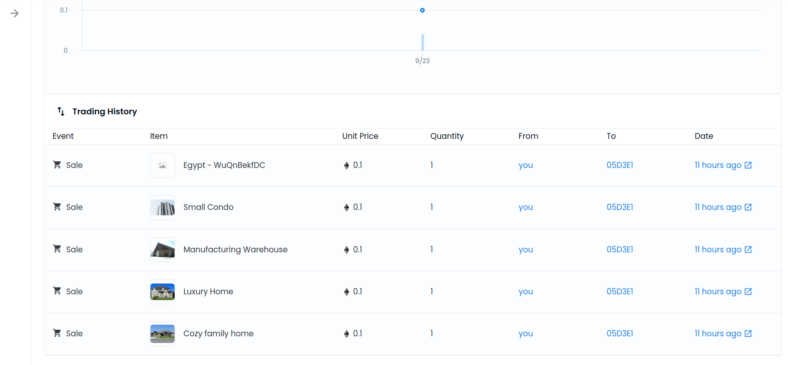

# Udacity Blockchain Capstone

The capstone will build upon the knowledge you have gained in the course in order to build a decentralized housing product. 

## Running the tests

To run the test it is needed to run ganache first with the follow command:  

```bash
$ ganache-cli
```

After that go to eth-contract into project folder and:

```bash
$ truffle test
```

This command will run all test configured.

## OpenSea Marketplace

Marketplace front page. 
OpenSea Address: https://testnets.opensea.io/collection/egypt-wuqnbekfdc


10 tokens was minted and listed on OpenSea Marketplace and 5 tokens was sold.

Buyer Address: 0x05D3e1415E04b4984F68d26CB7868B1E884F0167


## SolnSquareVerifier Contract Address

Contract Address: 0x40ca39F589D1dD95fFd62D61B91712A860367FE4


#### ABI
```
{
  "contractName": "SolnSquareVerifier",
  "abi": [
    {
      "inputs": [
        {
          "internalType": "address",
          "name": "verifierAddress",
          "type": "address"
        },
        {
          "internalType": "string",
          "name": "name",
          "type": "string"
        },
        {
          "internalType": "string",
          "name": "symbol",
          "type": "string"
        }
      ],
      "payable": false,
      "stateMutability": "nonpayable",
      "type": "constructor"
    },
    {
      "anonymous": false,
      "inputs": [
        {
          "components": [
            {
              "internalType": "uint256",
              "name": "tokenId",
              "type": "uint256"
            },
            {
              "internalType": "address",
              "name": "addr",
              "type": "address"
            }
          ],
          "indexed": false,
          "internalType": "struct SolnSquareVerifier.Solution",
          "name": "sol",
          "type": "tuple"
        }
      ],
      "name": "AddedSolution",
      "type": "event"
    },
    {
      "anonymous": false,
      "inputs": [
        {
          "indexed": true,
          "internalType": "address",
          "name": "owner",
          "type": "address"
        },
        {
          "indexed": true,
          "internalType": "address",
          "name": "approved",
          "type": "address"
        },
        {
          "indexed": true,
          "internalType": "uint256",
          "name": "tokenId",
          "type": "uint256"
        }
      ],
      "name": "Approval",
      "type": "event"
    },
    {
      "anonymous": false,
      "inputs": [
        {
          "indexed": true,
          "internalType": "address",
          "name": "owner",
          "type": "address"
        },
        {
          "indexed": true,
          "internalType": "address",
          "name": "operator",
          "type": "address"
        },
        {
          "indexed": false,
          "internalType": "bool",
          "name": "approved",
          "type": "bool"
        }
      ],
      "name": "ApprovalForAll",
      "type": "event"
    },
    {
      "anonymous": false,
      "inputs": [
        {
          "indexed": false,
          "internalType": "address",
          "name": "account",
          "type": "address"
        }
      ],
      "name": "Paused",
      "type": "event"
    },
    {
      "anonymous": false,
      "inputs": [
        {
          "indexed": true,
          "internalType": "address",
          "name": "from",
          "type": "address"
        },
        {
          "indexed": true,
          "internalType": "address",
          "name": "to",
          "type": "address"
        },
        {
          "indexed": true,
          "internalType": "uint256",
          "name": "tokenId",
          "type": "uint256"
        }
      ],
      "name": "Transfer",
      "type": "event"
    },
    {
      "anonymous": false,
      "inputs": [
        {
          "indexed": false,
          "internalType": "address",
          "name": "account",
          "type": "address"
        }
      ],
      "name": "Unpaused",
      "type": "event"
    },
    {
      "anonymous": false,
      "inputs": [],
      "name": "ownerShipTransfered",
      "type": "event"
    },
    {
      "constant": true,
      "inputs": [],
      "name": "Owner",
      "outputs": [
        {
          "internalType": "address",
          "name": "",
          "type": "address"
        }
      ],
      "payable": false,
      "stateMutability": "view",
      "type": "function"
    },
    {
      "constant": false,
      "inputs": [
        {
          "internalType": "bytes32",
          "name": "_myid",
          "type": "bytes32"
        },
        {
          "internalType": "string",
          "name": "_result",
          "type": "string"
        }
      ],
      "name": "__callback",
      "outputs": [],
      "payable": false,
      "stateMutability": "nonpayable",
      "type": "function"
    },
    {
      "constant": false,
      "inputs": [
        {
          "internalType": "bytes32",
          "name": "_myid",
          "type": "bytes32"
        },
        {
          "internalType": "string",
          "name": "_result",
          "type": "string"
        },
        {
          "internalType": "bytes",
          "name": "_proof",
          "type": "bytes"
        }
      ],
      "name": "__callback",
      "outputs": [],
      "payable": false,
      "stateMutability": "nonpayable",
      "type": "function"
    },
    {
      "constant": false,
      "inputs": [
        {
          "internalType": "address",
          "name": "to",
          "type": "address"
        },
        {
          "internalType": "uint256",
          "name": "tokenId",
          "type": "uint256"
        }
      ],
      "name": "approve",
      "outputs": [],
      "payable": false,
      "stateMutability": "nonpayable",
      "type": "function"
    },
    {
      "constant": true,
      "inputs": [
        {
          "internalType": "address",
          "name": "owner",
          "type": "address"
        }
      ],
      "name": "balanceOf",
      "outputs": [
        {
          "internalType": "uint256",
          "name": "",
          "type": "uint256"
        }
      ],
      "payable": false,
      "stateMutability": "view",
      "type": "function"
    },
    {
      "constant": true,
      "inputs": [],
      "name": "baseTokenURI",
      "outputs": [
        {
          "internalType": "string",
          "name": "",
          "type": "string"
        }
      ],
      "payable": false,
      "stateMutability": "view",
      "type": "function"
    },
    {
      "constant": true,
      "inputs": [
        {
          "internalType": "uint256",
          "name": "tokenId",
          "type": "uint256"
        }
      ],
      "name": "getApproved",
      "outputs": [
        {
          "internalType": "address",
          "name": "",
          "type": "address"
        }
      ],
      "payable": false,
      "stateMutability": "view",
      "type": "function"
    },
    {
      "constant": true,
      "inputs": [
        {
          "internalType": "address",
          "name": "owner",
          "type": "address"
        },
        {
          "internalType": "address",
          "name": "operator",
          "type": "address"
        }
      ],
      "name": "isApprovedForAll",
      "outputs": [
        {
          "internalType": "bool",
          "name": "",
          "type": "bool"
        }
      ],
      "payable": false,
      "stateMutability": "view",
      "type": "function"
    },
    {
      "constant": false,
      "inputs": [
        {
          "internalType": "address",
          "name": "to",
          "type": "address"
        },
        {
          "internalType": "uint256",
          "name": "tokenId",
          "type": "uint256"
        }
      ],
      "name": "mint",
      "outputs": [
        {
          "internalType": "bool",
          "name": "",
          "type": "bool"
        }
      ],
      "payable": false,
      "stateMutability": "nonpayable",
      "type": "function"
    },
    {
      "constant": true,
      "inputs": [],
      "name": "name",
      "outputs": [
        {
          "internalType": "string",
          "name": "",
          "type": "string"
        }
      ],
      "payable": false,
      "stateMutability": "view",
      "type": "function"
    },
    {
      "constant": true,
      "inputs": [
        {
          "internalType": "uint256",
          "name": "tokenId",
          "type": "uint256"
        }
      ],
      "name": "ownerOf",
      "outputs": [
        {
          "internalType": "address",
          "name": "",
          "type": "address"
        }
      ],
      "payable": false,
      "stateMutability": "view",
      "type": "function"
    },
    {
      "constant": true,
      "inputs": [],
      "name": "paused",
      "outputs": [
        {
          "internalType": "bool",
          "name": "",
          "type": "bool"
        }
      ],
      "payable": false,
      "stateMutability": "view",
      "type": "function"
    },
    {
      "constant": false,
      "inputs": [
        {
          "internalType": "address",
          "name": "from",
          "type": "address"
        },
        {
          "internalType": "address",
          "name": "to",
          "type": "address"
        },
        {
          "internalType": "uint256",
          "name": "tokenId",
          "type": "uint256"
        }
      ],
      "name": "safeTransferFrom",
      "outputs": [],
      "payable": false,
      "stateMutability": "nonpayable",
      "type": "function"
    },
    {
      "constant": false,
      "inputs": [
        {
          "internalType": "address",
          "name": "from",
          "type": "address"
        },
        {
          "internalType": "address",
          "name": "to",
          "type": "address"
        },
        {
          "internalType": "uint256",
          "name": "tokenId",
          "type": "uint256"
        },
        {
          "internalType": "bytes",
          "name": "_data",
          "type": "bytes"
        }
      ],
      "name": "safeTransferFrom",
      "outputs": [],
      "payable": false,
      "stateMutability": "nonpayable",
      "type": "function"
    },
    {
      "constant": false,
      "inputs": [
        {
          "internalType": "address",
          "name": "to",
          "type": "address"
        },
        {
          "internalType": "bool",
          "name": "approved",
          "type": "bool"
        }
      ],
      "name": "setApprovalForAll",
      "outputs": [],
      "payable": false,
      "stateMutability": "nonpayable",
      "type": "function"
    },
    {
      "constant": false,
      "inputs": [],
      "name": "setPaused",
      "outputs": [],
      "payable": false,
      "stateMutability": "nonpayable",
      "type": "function"
    },
    {
      "constant": true,
      "inputs": [
        {
          "internalType": "bytes4",
          "name": "interfaceId",
          "type": "bytes4"
        }
      ],
      "name": "supportsInterface",
      "outputs": [
        {
          "internalType": "bool",
          "name": "",
          "type": "bool"
        }
      ],
      "payable": false,
      "stateMutability": "view",
      "type": "function"
    },
    {
      "constant": true,
      "inputs": [],
      "name": "symbol",
      "outputs": [
        {
          "internalType": "string",
          "name": "",
          "type": "string"
        }
      ],
      "payable": false,
      "stateMutability": "view",
      "type": "function"
    },
    {
      "constant": true,
      "inputs": [
        {
          "internalType": "uint256",
          "name": "index",
          "type": "uint256"
        }
      ],
      "name": "tokenByIndex",
      "outputs": [
        {
          "internalType": "uint256",
          "name": "",
          "type": "uint256"
        }
      ],
      "payable": false,
      "stateMutability": "view",
      "type": "function"
    },
    {
      "constant": true,
      "inputs": [
        {
          "internalType": "address",
          "name": "owner",
          "type": "address"
        },
        {
          "internalType": "uint256",
          "name": "index",
          "type": "uint256"
        }
      ],
      "name": "tokenOfOwnerByIndex",
      "outputs": [
        {
          "internalType": "uint256",
          "name": "",
          "type": "uint256"
        }
      ],
      "payable": false,
      "stateMutability": "view",
      "type": "function"
    },
    {
      "constant": true,
      "inputs": [
        {
          "internalType": "uint256",
          "name": "tokenId",
          "type": "uint256"
        }
      ],
      "name": "tokenURI",
      "outputs": [
        {
          "internalType": "string",
          "name": "",
          "type": "string"
        }
      ],
      "payable": false,
      "stateMutability": "view",
      "type": "function"
    },
    {
      "constant": true,
      "inputs": [],
      "name": "totalSupply",
      "outputs": [
        {
          "internalType": "uint256",
          "name": "",
          "type": "uint256"
        }
      ],
      "payable": false,
      "stateMutability": "view",
      "type": "function"
    },
    {
      "constant": false,
      "inputs": [
        {
          "internalType": "address",
          "name": "from",
          "type": "address"
        },
        {
          "internalType": "address",
          "name": "to",
          "type": "address"
        },
        {
          "internalType": "uint256",
          "name": "tokenId",
          "type": "uint256"
        }
      ],
      "name": "transferFrom",
      "outputs": [],
      "payable": false,
      "stateMutability": "nonpayable",
      "type": "function"
    },
    {
      "constant": false,
      "inputs": [
        {
          "internalType": "address",
          "name": "newOwner",
          "type": "address"
        }
      ],
      "name": "transferOwnership",
      "outputs": [],
      "payable": false,
      "stateMutability": "nonpayable",
      "type": "function"
    },
    {
      "constant": false,
      "inputs": [
        {
          "internalType": "address",
          "name": "addr",
          "type": "address"
        },
        {
          "internalType": "uint256",
          "name": "tokenId",
          "type": "uint256"
        },
        {
          "components": [
            {
              "components": [
                {
                  "internalType": "uint256",
                  "name": "X",
                  "type": "uint256"
                },
                {
                  "internalType": "uint256",
                  "name": "Y",
                  "type": "uint256"
                }
              ],
              "internalType": "struct Pairing.G1Point",
              "name": "a",
              "type": "tuple"
            },
            {
              "components": [
                {
                  "internalType": "uint256[2]",
                  "name": "X",
                  "type": "uint256[2]"
                },
                {
                  "internalType": "uint256[2]",
                  "name": "Y",
                  "type": "uint256[2]"
                }
              ],
              "internalType": "struct Pairing.G2Point",
              "name": "b",
              "type": "tuple"
            },
            {
              "components": [
                {
                  "internalType": "uint256",
                  "name": "X",
                  "type": "uint256"
                },
                {
                  "internalType": "uint256",
                  "name": "Y",
                  "type": "uint256"
                }
              ],
              "internalType": "struct Pairing.G1Point",
              "name": "c",
              "type": "tuple"
            }
          ],
          "internalType": "struct SquareVerifier.Proof",
          "name": "proof",
          "type": "tuple"
        },
        {
          "internalType": "uint256[2]",
          "name": "input",
          "type": "uint256[2]"
        }
      ],
      "name": "addSolution",
      "outputs": [
        {
          "internalType": "bool",
          "name": "",
          "type": "bool"
        }
      ],
      "payable": false,
      "stateMutability": "nonpayable",
      "type": "function"
    },
    {
      "constant": false,
      "inputs": [
        {
          "internalType": "address",
          "name": "addr",
          "type": "address"
        },
        {
          "internalType": "uint256",
          "name": "tokenId",
          "type": "uint256"
        },
        {
          "components": [
            {
              "components": [
                {
                  "internalType": "uint256",
                  "name": "X",
                  "type": "uint256"
                },
                {
                  "internalType": "uint256",
                  "name": "Y",
                  "type": "uint256"
                }
              ],
              "internalType": "struct Pairing.G1Point",
              "name": "a",
              "type": "tuple"
            },
            {
              "components": [
                {
                  "internalType": "uint256[2]",
                  "name": "X",
                  "type": "uint256[2]"
                },
                {
                  "internalType": "uint256[2]",
                  "name": "Y",
                  "type": "uint256[2]"
                }
              ],
              "internalType": "struct Pairing.G2Point",
              "name": "b",
              "type": "tuple"
            },
            {
              "components": [
                {
                  "internalType": "uint256",
                  "name": "X",
                  "type": "uint256"
                },
                {
                  "internalType": "uint256",
                  "name": "Y",
                  "type": "uint256"
                }
              ],
              "internalType": "struct Pairing.G1Point",
              "name": "c",
              "type": "tuple"
            }
          ],
          "internalType": "struct SquareVerifier.Proof",
          "name": "proof",
          "type": "tuple"
        },
        {
          "internalType": "uint256[2]",
          "name": "input",
          "type": "uint256[2]"
        }
      ],
      "name": "mintToken",
      "outputs": [],
      "payable": false,
      "stateMutability": "nonpayable",
      "type": "function"
    }
  ],
  "metadata": "{\"compiler\":{\"version\":\"0.5.16+commit.9c3226ce\"},\"language\":\"Solidity\",\"output\":{\"abi\":[{\"inputs\":[{\"internalType\":\"address\",\"name\":\"verifierAddress\",\"type\":\"address\"},{\"internalType\":\"string\",\"name\":\"name\",\"type\":\"string\"},{\"internalType\":\"string\",\"name\":\"symbol\",\"type\":\"string\"}],\"payable\":false,\"stateMutability\":\"nonpayable\",\"type\":\"constructor\"},{\"anonymous\":false,\"inputs\":[{\"components\":[{\"internalType\":\"uint256\",\"name\":\"tokenId\",\"type\":\"uint256\"},{\"internalType\":\"address\",\"name\":\"addr\",\"type\":\"address\"}],\"indexed\":false,\"internalType\":\"struct SolnSquareVerifier.Solution\",\"name\":\"sol\",\"type\":\"tuple\"}],\"name\":\"AddedSolution\",\"type\":\"event\"},{\"anonymous\":false,\"inputs\":[{\"indexed\":true,\"internalType\":\"address\",\"name\":\"owner\",\"type\":\"address\"},{\"indexed\":true,\"internalType\":\"address\",\"name\":\"approved\",\"type\":\"address\"},{\"indexed\":true,\"internalType\":\"uint256\",\"name\":\"tokenId\",\"type\":\"uint256\"}],\"name\":\"Approval\",\"type\":\"event\"},{\"anonymous\":false,\"inputs\":[{\"indexed\":true,\"internalType\":\"address\",\"name\":\"owner\",\"type\":\"address\"},{\"indexed\":true,\"internalType\":\"address\",\"name\":\"operator\",\"type\":\"address\"},{\"indexed\":false,\"internalType\":\"bool\",\"name\":\"approved\",\"type\":\"bool\"}],\"name\":\"ApprovalForAll\",\"type\":\"event\"},{\"anonymous\":false,\"inputs\":[{\"indexed\":false,\"internalType\":\"address\",\"name\":\"account\",\"type\":\"address\"}],\"name\":\"Paused\",\"type\":\"event\"},{\"anonymous\":false,\"inputs\":[{\"indexed\":true,\"internalType\":\"address\",\"name\":\"from\",\"type\":\"address\"},{\"indexed\":true,\"internalType\":\"address\",\"name\":\"to\",\"type\":\"address\"},{\"indexed\":true,\"internalType\":\"uint256\",\"name\":\"tokenId\",\"type\":\"uint256\"}],\"name\":\"Transfer\",\"type\":\"event\"},{\"anonymous\":false,\"inputs\":[{\"indexed\":false,\"internalType\":\"address\",\"name\":\"account\",\"type\":\"address\"}],\"name\":\"Unpaused\",\"type\":\"event\"},{\"anonymous\":false,\"inputs\":[],\"name\":\"ownerShipTransfered\",\"type\":\"event\"},{\"constant\":true,\"inputs\":[],\"name\":\"Owner\",\"outputs\":[{\"internalType\":\"address\",\"name\":\"\",\"type\":\"address\"}],\"payable\":false,\"stateMutability\":\"view\",\"type\":\"function\"},{\"constant\":false,\"inputs\":[{\"internalType\":\"bytes32\",\"name\":\"_myid\",\"type\":\"bytes32\"},{\"internalType\":\"string\",\"name\":\"_result\",\"type\":\"string\"}],\"name\":\"__callback\",\"outputs\":[],\"payable\":false,\"stateMutability\":\"nonpayable\",\"type\":\"function\"},{\"constant\":false,\"inputs\":[{\"internalType\":\"bytes32\",\"name\":\"_myid\",\"type\":\"bytes32\"},{\"internalType\":\"string\",\"name\":\"_result\",\"type\":\"string\"},{\"internalType\":\"bytes\",\"name\":\"_proof\",\"type\":\"bytes\"}],\"name\":\"__callback\",\"outputs\":[],\"payable\":false,\"stateMutability\":\"nonpayable\",\"type\":\"function\"},{\"constant\":false,\"inputs\":[{\"internalType\":\"address\",\"name\":\"addr\",\"type\":\"address\"},{\"internalType\":\"uint256\",\"name\":\"tokenId\",\"type\":\"uint256\"},{\"components\":[{\"components\":[{\"internalType\":\"uint256\",\"name\":\"X\",\"type\":\"uint256\"},{\"internalType\":\"uint256\",\"name\":\"Y\",\"type\":\"uint256\"}],\"internalType\":\"struct Pairing.G1Point\",\"name\":\"a\",\"type\":\"tuple\"},{\"components\":[{\"internalType\":\"uint256[2]\",\"name\":\"X\",\"type\":\"uint256[2]\"},{\"internalType\":\"uint256[2]\",\"name\":\"Y\",\"type\":\"uint256[2]\"}],\"internalType\":\"struct Pairing.G2Point\",\"name\":\"b\",\"type\":\"tuple\"},{\"components\":[{\"internalType\":\"uint256\",\"name\":\"X\",\"type\":\"uint256\"},{\"internalType\":\"uint256\",\"name\":\"Y\",\"type\":\"uint256\"}],\"internalType\":\"struct Pairing.G1Point\",\"name\":\"c\",\"type\":\"tuple\"}],\"internalType\":\"struct SquareVerifier.Proof\",\"name\":\"proof\",\"type\":\"tuple\"},{\"internalType\":\"uint256[2]\",\"name\":\"input\",\"type\":\"uint256[2]\"}],\"name\":\"addSolution\",\"outputs\":[{\"internalType\":\"bool\",\"name\":\"\",\"type\":\"bool\"}],\"payable\":false,\"stateMutability\":\"nonpayable\",\"type\":\"function\"},{\"constant\":false,\"inputs\":[{\"internalType\":\"address\",\"name\":\"to\",\"type\":\"address\"},{\"internalType\":\"uint256\",\"name\":\"tokenId\",\"type\":\"uint256\"}],\"name\":\"approve\",\"outputs\":[],\"payable\":false,\"stateMutability\":\"nonpayable\",\"type\":\"function\"},{\"constant\":true,\"inputs\":[{\"internalType\":\"address\",\"name\":\"owner\",\"type\":\"address\"}],\"name\":\"balanceOf\",\"outputs\":[{\"internalType\":\"uint256\",\"name\":\"\",\"type\":\"uint256\"}],\"payable\":false,\"stateMutability\":\"view\",\"type\":\"function\"},{\"constant\":true,\"inputs\":[],\"name\":\"baseTokenURI\",\"outputs\":[{\"internalType\":\"string\",\"name\":\"\",\"type\":\"string\"}],\"payable\":false,\"stateMutability\":\"view\",\"type\":\"function\"},{\"constant\":true,\"inputs\":[{\"internalType\":\"uint256\",\"name\":\"tokenId\",\"type\":\"uint256\"}],\"name\":\"getApproved\",\"outputs\":[{\"internalType\":\"address\",\"name\":\"\",\"type\":\"address\"}],\"payable\":false,\"stateMutability\":\"view\",\"type\":\"function\"},{\"constant\":true,\"inputs\":[{\"internalType\":\"address\",\"name\":\"owner\",\"type\":\"address\"},{\"internalType\":\"address\",\"name\":\"operator\",\"type\":\"address\"}],\"name\":\"isApprovedForAll\",\"outputs\":[{\"internalType\":\"bool\",\"name\":\"\",\"type\":\"bool\"}],\"payable\":false,\"stateMutability\":\"view\",\"type\":\"function\"},{\"constant\":false,\"inputs\":[{\"internalType\":\"address\",\"name\":\"to\",\"type\":\"address\"},{\"internalType\":\"uint256\",\"name\":\"tokenId\",\"type\":\"uint256\"}],\"name\":\"mint\",\"outputs\":[{\"internalType\":\"bool\",\"name\":\"\",\"type\":\"bool\"}],\"payable\":false,\"stateMutability\":\"nonpayable\",\"type\":\"function\"},{\"constant\":false,\"inputs\":[{\"internalType\":\"address\",\"name\":\"addr\",\"type\":\"address\"},{\"internalType\":\"uint256\",\"name\":\"tokenId\",\"type\":\"uint256\"},{\"components\":[{\"components\":[{\"internalType\":\"uint256\",\"name\":\"X\",\"type\":\"uint256\"},{\"internalType\":\"uint256\",\"name\":\"Y\",\"type\":\"uint256\"}],\"internalType\":\"struct Pairing.G1Point\",\"name\":\"a\",\"type\":\"tuple\"},{\"components\":[{\"internalType\":\"uint256[2]\",\"name\":\"X\",\"type\":\"uint256[2]\"},{\"internalType\":\"uint256[2]\",\"name\":\"Y\",\"type\":\"uint256[2]\"}],\"internalType\":\"struct Pairing.G2Point\",\"name\":\"b\",\"type\":\"tuple\"},{\"components\":[{\"internalType\":\"uint256\",\"name\":\"X\",\"type\":\"uint256\"},{\"internalType\":\"uint256\",\"name\":\"Y\",\"type\":\"uint256\"}],\"internalType\":\"struct Pairing.G1Point\",\"name\":\"c\",\"type\":\"tuple\"}],\"internalType\":\"struct SquareVerifier.Proof\",\"name\":\"proof\",\"type\":\"tuple\"},{\"internalType\":\"uint256[2]\",\"name\":\"input\",\"type\":\"uint256[2]\"}],\"name\":\"mintToken\",\"outputs\":[],\"payable\":false,\"stateMutability\":\"nonpayable\",\"type\":\"function\"},{\"constant\":true,\"inputs\":[],\"name\":\"name\",\"outputs\":[{\"internalType\":\"string\",\"name\":\"\",\"type\":\"string\"}],\"payable\":false,\"stateMutability\":\"view\",\"type\":\"function\"},{\"constant\":true,\"inputs\":[{\"internalType\":\"uint256\",\"name\":\"tokenId\",\"type\":\"uint256\"}],\"name\":\"ownerOf\",\"outputs\":[{\"internalType\":\"address\",\"name\":\"\",\"type\":\"address\"}],\"payable\":false,\"stateMutability\":\"view\",\"type\":\"function\"},{\"constant\":true,\"inputs\":[],\"name\":\"paused\",\"outputs\":[{\"internalType\":\"bool\",\"name\":\"\",\"type\":\"bool\"}],\"payable\":false,\"stateMutability\":\"view\",\"type\":\"function\"},{\"constant\":false,\"inputs\":[{\"internalType\":\"address\",\"name\":\"from\",\"type\":\"address\"},{\"internalType\":\"address\",\"name\":\"to\",\"type\":\"address\"},{\"internalType\":\"uint256\",\"name\":\"tokenId\",\"type\":\"uint256\"}],\"name\":\"safeTransferFrom\",\"outputs\":[],\"payable\":false,\"stateMutability\":\"nonpayable\",\"type\":\"function\"},{\"constant\":false,\"inputs\":[{\"internalType\":\"address\",\"name\":\"from\",\"type\":\"address\"},{\"internalType\":\"address\",\"name\":\"to\",\"type\":\"address\"},{\"internalType\":\"uint256\",\"name\":\"tokenId\",\"type\":\"uint256\"},{\"internalType\":\"bytes\",\"name\":\"_data\",\"type\":\"bytes\"}],\"name\":\"safeTransferFrom\",\"outputs\":[],\"payable\":false,\"stateMutability\":\"nonpayable\",\"type\":\"function\"},{\"constant\":false,\"inputs\":[{\"internalType\":\"address\",\"name\":\"to\",\"type\":\"address\"},{\"internalType\":\"bool\",\"name\":\"approved\",\"type\":\"bool\"}],\"name\":\"setApprovalForAll\",\"outputs\":[],\"payable\":false,\"stateMutability\":\"nonpayable\",\"type\":\"function\"},{\"constant\":false,\"inputs\":[],\"name\":\"setPaused\",\"outputs\":[],\"payable\":false,\"stateMutability\":\"nonpayable\",\"type\":\"function\"},{\"constant\":true,\"inputs\":[{\"internalType\":\"bytes4\",\"name\":\"interfaceId\",\"type\":\"bytes4\"}],\"name\":\"supportsInterface\",\"outputs\":[{\"internalType\":\"bool\",\"name\":\"\",\"type\":\"bool\"}],\"payable\":false,\"stateMutability\":\"view\",\"type\":\"function\"},{\"constant\":true,\"inputs\":[],\"name\":\"symbol\",\"outputs\":[{\"internalType\":\"string\",\"name\":\"\",\"type\":\"string\"}],\"payable\":false,\"stateMutability\":\"view\",\"type\":\"function\"},{\"constant\":true,\"inputs\":[{\"internalType\":\"uint256\",\"name\":\"index\",\"type\":\"uint256\"}],\"name\":\"tokenByIndex\",\"outputs\":[{\"internalType\":\"uint256\",\"name\":\"\",\"type\":\"uint256\"}],\"payable\":false,\"stateMutability\":\"view\",\"type\":\"function\"},{\"constant\":true,\"inputs\":[{\"internalType\":\"address\",\"name\":\"owner\",\"type\":\"address\"},{\"internalType\":\"uint256\",\"name\":\"index\",\"type\":\"uint256\"}],\"name\":\"tokenOfOwnerByIndex\",\"outputs\":[{\"internalType\":\"uint256\",\"name\":\"\",\"type\":\"uint256\"}],\"payable\":false,\"stateMutability\":\"view\",\"type\":\"function\"},{\"constant\":true,\"inputs\":[{\"internalType\":\"uint256\",\"name\":\"tokenId\",\"type\":\"uint256\"}],\"name\":\"tokenURI\",\"outputs\":[{\"internalType\":\"string\",\"name\":\"\",\"type\":\"string\"}],\"payable\":false,\"stateMutability\":\"view\",\"type\":\"function\"},{\"constant\":true,\"inputs\":[],\"name\":\"totalSupply\",\"outputs\":[{\"internalType\":\"uint256\",\"name\":\"\",\"type\":\"uint256\"}],\"payable\":false,\"stateMutability\":\"view\",\"type\":\"function\"},{\"constant\":false,\"inputs\":[{\"internalType\":\"address\",\"name\":\"from\",\"type\":\"address\"},{\"internalType\":\"address\",\"name\":\"to\",\"type\":\"address\"},{\"internalType\":\"uint256\",\"name\":\"tokenId\",\"type\":\"uint256\"}],\"name\":\"transferFrom\",\"outputs\":[],\"payable\":false,\"stateMutability\":\"nonpayable\",\"type\":\"function\"},{\"constant\":false,\"inputs\":[{\"internalType\":\"address\",\"name\":\"newOwner\",\"type\":\"address\"}],\"name\":\"transferOwnership\",\"outputs\":[],\"payable\":false,\"stateMutability\":\"nonpayable\",\"type\":\"function\"}],\"devdoc\":{\"methods\":{\"isApprovedForAll(address,address)\":{\"details\":\"Tells whether an operator is approved by a given owner\",\"params\":{\"operator\":\"operator address which you want to query the approval of\",\"owner\":\"owner address which you want to query the approval of\"},\"return\":\"bool whether the given operator is approved by the given owner\"},\"paused()\":{\"details\":\"Returns true if the contract is paused, and false otherwise.\"},\"setApprovalForAll(address,bool)\":{\"details\":\"Sets or unsets the approval of a given operator An operator is allowed to transfer all tokens of the sender on their behalf\",\"params\":{\"approved\":\"representing the status of the approval to be set\",\"to\":\"operator address to set the approval\"}},\"setPaused()\":{\"details\":\"Create a public setter using the inherited onlyOwner modifier\"},\"supportsInterface(bytes4)\":{\"details\":\"implement supportsInterface(bytes4) using a lookup table\"},\"tokenByIndex(uint256)\":{\"details\":\"Gets the token ID at a given index of all the tokens in this contract Reverts if the index is greater or equal to the total number of tokens\",\"params\":{\"index\":\"uint256 representing the index to be accessed of the tokens list\"},\"return\":\"uint256 token ID at the given index of the tokens list\"},\"tokenOfOwnerByIndex(address,uint256)\":{\"details\":\"Gets the token ID at a given index of the tokens list of the requested owner\",\"params\":{\"index\":\"uint256 representing the index to be accessed of the requested tokens list\",\"owner\":\"address owning the tokens list to be accessed\"},\"return\":\"uint256 token ID at the given index of the tokens list owned by the requested address\"},\"totalSupply()\":{\"details\":\"Gets the total amount of tokens stored by the contract\",\"return\":\"uint256 representing the total amount of tokens\"}}},\"userdoc\":{\"methods\":{}}},\"settings\":{\"compilationTarget\":{\"project:/contracts/SolnSquareVerifier.sol\":\"SolnSquareVerifier\"},\"evmVersion\":\"istanbul\",\"libraries\":{},\"optimizer\":{\"enabled\":false,\"runs\":200},\"remappings\":[]},\"sources\":{\"openzeppelin-solidity/contracts/drafts/Counters.sol\":{\"keccak256\":\"0x5be8533c5950173dc2b77b75108fae6e6c5449aedadde3385ba457394aad2384\",\"urls\":[\"bzz-raw://d429fb04f5b31d909dc759d0f88e28055b80b4dd43e5def4dffc947fa0609229\",\"dweb:/ipfs/QmaY9idX5CwLLtjjTQAdiiaDSrncgafkatUZXTbbajpz8b\"]},\"openzeppelin-solidity/contracts/math/SafeMath.sol\":{\"keccak256\":\"0x640b6dee7a4b830bdfd52b5031a07fc2b12209f5b2e29e5d364a7d37f69d8076\",\"urls\":[\"bzz-raw://31113152e1ddb78fe7a4197f247591ca894e93f916867beb708d8e747b6cc74f\",\"dweb:/ipfs/QmbZaJyXdpsYGykVhHH9qpVGQg9DGCxE2QufbCUy3daTgq\"]},\"openzeppelin-solidity/contracts/token/ERC721/IERC721Receiver.sol\":{\"keccak256\":\"0x042048c375daca04b31e31c91bbae912b84b5eb818c4e31b2deb530fd2305342\",\"urls\":[\"bzz-raw://d877a87c5e29b9ffca3e334378058c051a4e012fd3635039681003a9376baf1f\",\"dweb:/ipfs/QmR45snf93cFXtB71TZcmoGy9DbcMha8CqgkDKaLvhjXZK\"]},\"openzeppelin-solidity/contracts/utils/Address.sol\":{\"keccak256\":\"0x1a8e5072509c5ea7365eb1d48030b9be865140c8fb779968da0a459a0e174a11\",\"urls\":[\"bzz-raw://03335b7b07c7c8c8d613cfdd8ec39a0b5ec133ee510bf2fe6cc5a496767bef4b\",\"dweb:/ipfs/Qmebp4nzPja645c9yXSdJkGq96oU3am3LUnG2K3R7XxyKf\"]},\"project:/contracts/ERC721Mintable.sol\":{\"keccak256\":\"0x10ca62c4647f08345e50967f702beb6655e986d4c07d29133a77afe9ec1f9208\",\"urls\":[\"bzz-raw://e9c16ec5f834c120e9a685f79f858afa2819e9ae8135fce4662217c882cccc3a\",\"dweb:/ipfs/QmTPQAw55TtEWrFgDZn9E18NE2PYazV1BJtpNHz4zLYCXX\"]},\"project:/contracts/Oraclize.sol\":{\"keccak256\":\"0x764e30ced94c4d7ce600f4c682cfb18532829cfc452ea3b03d163265c5d38d90\",\"urls\":[\"bzz-raw://45e5d4977a72ff9de6729457827a43b2db1c6a405528c19c70590e46713ebea2\",\"dweb:/ipfs/QmVwuip9Setx52n4pJjNWiqDqjUuquQRRQxg1iFyGFuzKV\"]},\"project:/contracts/SolnSquareVerifier.sol\":{\"keccak256\":\"0x0abea34d58633a8b46fe51cacf357911fd97835b04475712231c40ddc1bbb14d\",\"urls\":[\"bzz-raw://d5dedf3a75c5bb81ab822d5165a8d4c1c6e4b996f888474a0db41e00df4d57a2\",\"dweb:/ipfs/Qmbnup4bZEuSbeMgyxS2p6AENe72R69jTrNdpv99McZdy8\"]},\"project:/contracts/SquareVerifier.sol\":{\"keccak256\":\"0xfab01cd57300ea0ebd333c438fab672ca11bdd273e8fb8c47f478db80a711a81\",\"urls\":[\"bzz-raw://83f261fd65469107367a21b2f5f3c255a5821bf2ff12b8da8683af5813776dd7\",\"dweb:/ipfs/QmYnR521e1w8Wujx1JWF4bpTzXTegAZusLwkKPZLMhAqzh\"]}},\"version\":1}",
  "bytecode": "0x60806040523480156200001157600080fd5b5060405162003f3038038062003f30833981810160405262000037919081019062000397565b818181816040518060600160405280603f815260200162003ef1603f9139336000806101000a81548173ffffffffffffffffffffffffffffffffffffffff021916908373ffffffffffffffffffffffffffffffffffffffff1602179055507f097505f2321a0d6f95f8a9d1fc668f0988247ea0fde8b50bd0516c8da54599af60405160405180910390a160008060146101000a81548160ff021916908315150217905550620000f36301ffc9a760e01b620001d560201b60201c565b6200010b6380ac58cd60e01b620001d560201b60201c565b6200012363780e9d6360e01b620001d560201b60201c565b82600f90805190602001906200013b92919062000275565b5081601090805190602001906200015492919062000275565b5080601190805190602001906200016d92919062000275565b5062000186635b5e139f60e01b620001d560201b60201c565b505050505082601360006101000a81548173ffffffffffffffffffffffffffffffffffffffff021916908373ffffffffffffffffffffffffffffffffffffffff160217905550505050620004fe565b63ffffffff60e01b817bffffffffffffffffffffffffffffffffffffffffffffffffffffffff191614156200020957600080fd5b6001806000837bffffffffffffffffffffffffffffffffffffffffffffffffffffffff19167bffffffffffffffffffffffffffffffffffffffffffffffffffffffff1916815260200190815260200160002060006101000a81548160ff02191690831515021790555050565b828054600181600116156101000203166002900490600052602060002090601f016020900481019282601f10620002b857805160ff1916838001178555620002e9565b82800160010185558215620002e9579182015b82811115620002e8578251825591602001919060010190620002cb565b5b509050620002f89190620002fc565b5090565b6200032191905b808211156200031d57600081600090555060010162000303565b5090565b90565b6000815190506200033581620004e4565b92915050565b600082601f8301126200034d57600080fd5b8151620003646200035e826200044d565b6200041f565b915080825260208301602083018583830111156200038157600080fd5b6200038e838284620004ae565b50505092915050565b600080600060608486031215620003ad57600080fd5b6000620003bd8682870162000324565b935050602084015167ffffffffffffffff811115620003db57600080fd5b620003e9868287016200033b565b925050604084015167ffffffffffffffff8111156200040757600080fd5b62000415868287016200033b565b9150509250925092565b6000604051905081810181811067ffffffffffffffff821117156200044357600080fd5b8060405250919050565b600067ffffffffffffffff8211156200046557600080fd5b601f19601f8301169050602081019050919050565b600062000487826200048e565b9050919050565b600073ffffffffffffffffffffffffffffffffffffffff82169050919050565b60005b83811015620004ce578082015181840152602081019050620004b1565b83811115620004de576000848401525b50505050565b620004ef816200047a565b8114620004fb57600080fd5b50565b6139e3806200050e6000396000f3fe608060405234801561001057600080fd5b506004361061018e5760003560e01c80634f6ccce7116100de578063b4a99a4e11610097578063d547cfb711610071578063d547cfb7146104a7578063e985e9c5146104c5578063f2aa0683146104f5578063f2fde38b146105115761018e565b8063b4a99a4e1461043d578063b88d4fde1461045b578063c87b56dd146104775761018e565b80634f6ccce7146103555780635c975abb146103855780636352211e146103a357806370a08231146103d357806395d89b4114610403578063a22cb465146104215761018e565b806327dc297e1161014b57806338bbfa501161012557806338bbfa50146102bd57806339ad7272146102d957806340c10f191461030957806342842e0e146103395761018e565b806327dc297e146102675780632f745c591461028357806337a66d85146102b35761018e565b806301ffc9a71461019357806306fdde03146101c3578063081812fc146101e1578063095ea7b31461021157806318160ddd1461022d57806323b872dd1461024b575b600080fd5b6101ad60048036036101a89190810190612c52565b61052d565b6040516101ba9190613462565b60405180910390f35b6101cb610595565b6040516101d8919061347d565b60405180910390f35b6101fb60048036036101f69190810190612ca4565b610637565b60405161020891906133e0565b60405180910390f35b61022b60048036036102269190810190612ab5565b6106bc565b005b610235610869565b60405161024291906136a5565b60405180910390f35b610265600480360361026091908101906129af565b610876565b005b610281600480360361027c9190810190612b7f565b610899565b005b61029d60048036036102989190810190612ab5565b6108dc565b6040516102aa91906136a5565b60405180910390f35b6102bb61094f565b005b6102d760048036036102d29190810190612bd3565b6109ce565b005b6102f360048036036102ee9190810190612af1565b6109d3565b6040516103009190613462565b60405180910390f35b610323600480360361031e9190810190612ab5565b610c6d565b6040516103309190613462565b60405180910390f35b610353600480360361034e91908101906129af565b610d45565b005b61036f600480360361036a9190810190612ca4565b610d65565b60405161037c91906136a5565b60405180910390f35b61038d610d99565b60405161039a9190613462565b60405180910390f35b6103bd60048036036103b89190810190612ca4565b610daf565b6040516103ca91906133e0565b60405180910390f35b6103ed60048036036103e8919081019061294a565b610e61565b6040516103fa91906136a5565b60405180910390f35b61040b610f20565b604051610418919061347d565b60405180910390f35b61043b60048036036104369190810190612a79565b610fc2565b005b6104456110f8565b60405161045291906133e0565b60405180910390f35b610475600480360361047091908101906129fe565b611121565b005b610491600480360361048c9190810190612ca4565b611147565b60405161049e919061347d565b60405180910390f35b6104af61120e565b6040516104bc919061347d565b60405180910390f35b6104df60048036036104da9190810190612973565b6112b0565b6040516104ec9190613462565b60405180910390f35b61050f600480360361050a9190810190612af1565b611344565b005b61052b6004803603610526919081019061294a565b61136d565b005b600060016000837bffffffffffffffffffffffffffffffffffffffffffffffffffffffff19167bffffffffffffffffffffffffffffffffffffffffffffffffffffffff1916815260200190815260200160002060009054906101000a900460ff169050919050565b6060600f8054600181600116156101000203166002900480601f01602080910402602001604051908101604052809291908181526020018280546001816001161561010002031660029004801561062d5780601f106106025761010080835404028352916020019161062d565b820191906000526020600020905b81548152906001019060200180831161061057829003601f168201915b5050505050905090565b600061064282611495565b610681576040517f08c379a0000000000000000000000000000000000000000000000000000000008152600401610678906134df565b60405180910390fd5b6003600083815260200190815260200160002060009054906101000a900473ffffffffffffffffffffffffffffffffffffffff169050919050565b60006106c782610daf565b90508073ffffffffffffffffffffffffffffffffffffffff168373ffffffffffffffffffffffffffffffffffffffff161415610738576040517f08c379a000000000000000000000000000000000000000000000000000000000815260040161072f9061351f565b60405180910390fd5b8073ffffffffffffffffffffffffffffffffffffffff163373ffffffffffffffffffffffffffffffffffffffff161480610778575061077781336112b0565b5b6107b7576040517f08c379a00000000000000000000000000000000000000000000000000000000081526004016107ae906134bf565b60405180910390fd5b826003600084815260200190815260200160002060006101000a81548173ffffffffffffffffffffffffffffffffffffffff021916908373ffffffffffffffffffffffffffffffffffffffff160217905550818373ffffffffffffffffffffffffffffffffffffffff168273ffffffffffffffffffffffffffffffffffffffff167f8c5be1e5ebec7d5bd14f71427d1e84f3dd0314c0f7b2291e5b200ac8c7c3b92560405160405180910390a4505050565b6000600880549050905090565b6108803382611507565b61088957600080fd5b61089483838361159c565b505050565b6108d8828260006040519080825280601f01601f1916602001820160405280156108d25781602001600182028038833980820191505090505b506109ce565b5050565b60006108e783610e61565b82106108f257600080fd5b600660008473ffffffffffffffffffffffffffffffffffffffff1673ffffffffffffffffffffffffffffffffffffffff168152602001908152602001600020828154811061093c57fe5b9060005260206000200154905092915050565b3373ffffffffffffffffffffffffffffffffffffffff1661096e6110f8565b73ffffffffffffffffffffffffffffffffffffffff16146109c4576040517f08c379a00000000000000000000000000000000000000000000000000000000081526004016109bb9061349f565b60405180910390fd5b6109cc6115c0565b565b505050565b6000828260156000826040516020016109ec91906133c5565b60405160208183030381529060405280519060200120815260200190815260200160002060009054906101000a900460ff1615610a5e576040517f08c379a0000000000000000000000000000000000000000000000000000000008152600401610a559061361f565b60405180910390fd5b600084604051602001610a7191906133c5565b6040516020818303038152906040528051906020012090506000601360009054906101000a900473ffffffffffffffffffffffffffffffffffffffff1673ffffffffffffffffffffffffffffffffffffffff166343cd76fc88886040518363ffffffff1660e01b8152600401610ae892919061365f565b602060405180830381600087803b158015610b0257600080fd5b505af1158015610b16573d6000803e3d6000fd5b505050506040513d601f19601f82011682018060405250610b3a9190810190612b56565b90508015610c5e5760016015600084815260200190815260200160002060006101000a81548160ff021916908315150217905550610b7661252d565b60405180604001604052808a81526020018b73ffffffffffffffffffffffffffffffffffffffff168152509050601481908060018154018082558091505090600182039060005260206000209060020201600090919290919091506000820151816000015560208201518160010160006101000a81548173ffffffffffffffffffffffffffffffffffffffff021916908373ffffffffffffffffffffffffffffffffffffffff1602179055505050507f2e6e13348cfa3512792f4a60dffe98d2e296d31247b87a12885a64b169deb7b781604051610c54919061368a565b60405180910390a1505b80945050505050949350505050565b60003373ffffffffffffffffffffffffffffffffffffffff16610c8e6110f8565b73ffffffffffffffffffffffffffffffffffffffff1614610ce4576040517f08c379a0000000000000000000000000000000000000000000000000000000008152600401610cdb9061349f565b60405180910390fd5b610cec610d99565b15610d2c576040517f08c379a0000000000000000000000000000000000000000000000000000000008152600401610d239061355f565b60405180910390fd5b610d36838361165c565b610d3f8261167d565b92915050565b610d6083838360405180602001604052806000815250611121565b505050565b6000610d6f610869565b8210610d7a57600080fd5b60088281548110610d8757fe5b90600052602060002001549050919050565b60008060149054906101000a900460ff16905090565b6000806002600084815260200190815260200160002060009054906101000a900473ffffffffffffffffffffffffffffffffffffffff169050600073ffffffffffffffffffffffffffffffffffffffff168173ffffffffffffffffffffffffffffffffffffffff161415610e58576040517f08c379a0000000000000000000000000000000000000000000000000000000008152600401610e4f9061357f565b60405180910390fd5b80915050919050565b60008073ffffffffffffffffffffffffffffffffffffffff168273ffffffffffffffffffffffffffffffffffffffff161415610ed2576040517f08c379a0000000000000000000000000000000000000000000000000000000008152600401610ec9906134ff565b60405180910390fd5b610f19600460008473ffffffffffffffffffffffffffffffffffffffff1673ffffffffffffffffffffffffffffffffffffffff16815260200190815260200160002061179b565b9050919050565b606060108054600181600116156101000203166002900480601f016020809104026020016040519081016040528092919081815260200182805460018160011615610100020316600290048015610fb85780601f10610f8d57610100808354040283529160200191610fb8565b820191906000526020600020905b815481529060010190602001808311610f9b57829003601f168201915b5050505050905090565b3373ffffffffffffffffffffffffffffffffffffffff168273ffffffffffffffffffffffffffffffffffffffff161415610ffb57600080fd5b80600560003373ffffffffffffffffffffffffffffffffffffffff1673ffffffffffffffffffffffffffffffffffffffff16815260200190815260200160002060008473ffffffffffffffffffffffffffffffffffffffff1673ffffffffffffffffffffffffffffffffffffffff16815260200190815260200160002060006101000a81548160ff0219169083151502179055508173ffffffffffffffffffffffffffffffffffffffff163373ffffffffffffffffffffffffffffffffffffffff167f17307eab39ab6107e8899845ad3d59bd9653f200f220920489ca2b5937696c31836040516110ec9190613462565b60405180910390a35050565b60008060009054906101000a900473ffffffffffffffffffffffffffffffffffffffff16905090565b61112c848484610876565b611138848484846117a9565b61114157600080fd5b50505050565b606061115282611495565b61115b57600080fd5b601260008381526020019081526020016000208054600181600116156101000203166002900480601f0160208091040260200160405190810160405280929190818152602001828054600181600116156101000203166002900480156112025780601f106111d757610100808354040283529160200191611202565b820191906000526020600020905b8154815290600101906020018083116111e557829003601f168201915b50505050509050919050565b606060118054600181600116156101000203166002900480601f0160208091040260200160405190810160405280929190818152602001828054600181600116156101000203166002900480156112a65780601f1061127b576101008083540402835291602001916112a6565b820191906000526020600020905b81548152906001019060200180831161128957829003601f168201915b5050505050905090565b6000600560008473ffffffffffffffffffffffffffffffffffffffff1673ffffffffffffffffffffffffffffffffffffffff16815260200190815260200160002060008373ffffffffffffffffffffffffffffffffffffffff1673ffffffffffffffffffffffffffffffffffffffff16815260200190815260200160002060009054906101000a900460ff16905092915050565b6000611352858585856109d3565b90508015611366576113648585610c6d565b505b5050505050565b3373ffffffffffffffffffffffffffffffffffffffff1661138c6110f8565b73ffffffffffffffffffffffffffffffffffffffff16146113e2576040517f08c379a00000000000000000000000000000000000000000000000000000000081526004016113d99061349f565b60405180910390fd5b600073ffffffffffffffffffffffffffffffffffffffff168173ffffffffffffffffffffffffffffffffffffffff161415611452576040517f08c379a00000000000000000000000000000000000000000000000000000000081526004016114499061359f565b60405180910390fd5b806000806101000a81548173ffffffffffffffffffffffffffffffffffffffff021916908373ffffffffffffffffffffffffffffffffffffffff16021790555050565b6000806002600084815260200190815260200160002060009054906101000a900473ffffffffffffffffffffffffffffffffffffffff169050600073ffffffffffffffffffffffffffffffffffffffff168173ffffffffffffffffffffffffffffffffffffffff161415915050919050565b60008061151383610daf565b90508073ffffffffffffffffffffffffffffffffffffffff168473ffffffffffffffffffffffffffffffffffffffff16148061158257508373ffffffffffffffffffffffffffffffffffffffff1661156a84610637565b73ffffffffffffffffffffffffffffffffffffffff16145b80611593575061159281856112b0565b5b91505092915050565b6115a78383836118c0565b6115b18382611ab0565b6115bb8282611c4e565b505050565b6115c8610d99565b15611608576040517f08c379a00000000000000000000000000000000000000000000000000000000081526004016115ff9061355f565b60405180910390fd5b6001600060146101000a81548160ff0219169083151502179055507f62e78cea01bee320cd4e420270b5ea74000d11b0c9f74754ebdbfc544b05a2583360405161165291906133fb565b60405180910390a1565b6116668282611d15565b6116708282611c4e565b61167981611ec7565b5050565b61168681611495565b6116c5576040517f08c379a00000000000000000000000000000000000000000000000000000000081526004016116bc906135bf565b60405180910390fd5b61177160118054600181600116156101000203166002900480601f01602080910402602001604051908101604052809291908181526020018280546001816001161561010002031660029004801561175e5780601f106117335761010080835404028352916020019161175e565b820191906000526020600020905b81548152906001019060200180831161174157829003601f168201915b505050505061176c83611f13565b612040565b60126000838152602001908152602001600020908051906020019061179792919061255d565b5050565b600081600001549050919050565b60006117ca8473ffffffffffffffffffffffffffffffffffffffff16612084565b6117d757600190506118b8565b60008473ffffffffffffffffffffffffffffffffffffffff1663150b7a02338887876040518563ffffffff1660e01b81526004016118189493929190613416565b602060405180830381600087803b15801561183257600080fd5b505af1158015611846573d6000803e3d6000fd5b505050506040513d601f19601f8201168201806040525061186a9190810190612c7b565b905063150b7a0260e01b7bffffffffffffffffffffffffffffffffffffffffffffffffffffffff1916817bffffffffffffffffffffffffffffffffffffffffffffffffffffffff1916149150505b949350505050565b60006118cb82610daf565b90508373ffffffffffffffffffffffffffffffffffffffff168173ffffffffffffffffffffffffffffffffffffffff161461193b576040517f08c379a0000000000000000000000000000000000000000000000000000000008152600401611932906135ff565b60405180910390fd5b600073ffffffffffffffffffffffffffffffffffffffff168373ffffffffffffffffffffffffffffffffffffffff1614156119ab576040517f08c379a00000000000000000000000000000000000000000000000000000000081526004016119a29061353f565b60405180910390fd5b6119b4826120cf565b6119fb600460008373ffffffffffffffffffffffffffffffffffffffff1673ffffffffffffffffffffffffffffffffffffffff16815260200190815260200160002061218d565b60006002600084815260200190815260200160002060006101000a81548173ffffffffffffffffffffffffffffffffffffffff021916908373ffffffffffffffffffffffffffffffffffffffff16021790555081600073ffffffffffffffffffffffffffffffffffffffff168273ffffffffffffffffffffffffffffffffffffffff167fddf252ad1be2c89b69c2b068fc378daa952ba7f163c4a11628f55a4df523b3ef60405160405180910390a450505050565b6000611b086001600660008673ffffffffffffffffffffffffffffffffffffffff1673ffffffffffffffffffffffffffffffffffffffff168152602001908152602001600020805490506121b090919063ffffffff16565b9050600060076000848152602001908152602001600020549050818114611bf5576000600660008673ffffffffffffffffffffffffffffffffffffffff1673ffffffffffffffffffffffffffffffffffffffff1681526020019081526020016000208381548110611b7557fe5b9060005260206000200154905080600660008773ffffffffffffffffffffffffffffffffffffffff1673ffffffffffffffffffffffffffffffffffffffff1681526020019081526020016000208381548110611bcd57fe5b9060005260206000200181905550816007600083815260200190815260200160002081905550505b600660008573ffffffffffffffffffffffffffffffffffffffff1673ffffffffffffffffffffffffffffffffffffffff168152602001908152602001600020805480919060019003611c4791906125dd565b5050505050565b600660008373ffffffffffffffffffffffffffffffffffffffff1673ffffffffffffffffffffffffffffffffffffffff168152602001908152602001600020805490506007600083815260200190815260200160002081905550600660008373ffffffffffffffffffffffffffffffffffffffff1673ffffffffffffffffffffffffffffffffffffffff1681526020019081526020016000208190806001815401808255809150509060018203906000526020600020016000909192909190915055505050565b600073ffffffffffffffffffffffffffffffffffffffff168273ffffffffffffffffffffffffffffffffffffffff161415611d85576040517f08c379a0000000000000000000000000000000000000000000000000000000008152600401611d7c9061363f565b60405180910390fd5b611d8e81611495565b15611dce576040517f08c379a0000000000000000000000000000000000000000000000000000000008152600401611dc5906135df565b60405180910390fd5b816002600083815260200190815260200160002060006101000a81548173ffffffffffffffffffffffffffffffffffffffff021916908373ffffffffffffffffffffffffffffffffffffffff160217905550611e67600460008473ffffffffffffffffffffffffffffffffffffffff1673ffffffffffffffffffffffffffffffffffffffff1681526020019081526020016000206121fa565b808273ffffffffffffffffffffffffffffffffffffffff16600073ffffffffffffffffffffffffffffffffffffffff167fddf252ad1be2c89b69c2b068fc378daa952ba7f163c4a11628f55a4df523b3ef60405160405180910390a45050565b6008805490506009600083815260200190815260200160002081905550600881908060018154018082558091505090600182039060005260206000200160009091929091909150555050565b60606000821415611f5b576040518060400160405280600181526020017f3000000000000000000000000000000000000000000000000000000000000000815250905061203b565b600082905060005b60008214611f85578080600101915050600a8281611f7d57fe5b049150611f63565b6060816040519080825280601f01601f191660200182016040528015611fba5781602001600182028038833980820191505090505b50905060006001830390505b6000861461203357600a8681611fd857fe5b0660300160f81b82828060019003935081518110611ff257fe5b60200101907effffffffffffffffffffffffffffffffffffffffffffffffffffffffffffff1916908160001a905350600a868161202b57fe5b049550611fc6565b819450505050505b919050565b606061207c8383604051806020016040528060008152506040518060200160405280600081525060405180602001604052806000815250612210565b905092915050565b60008060007fc5d2460186f7233c927e7db2dcc703c0e500b653ca82273b7bfad8045d85a47060001b9050833f91508082141580156120c657506000801b8214155b92505050919050565b600073ffffffffffffffffffffffffffffffffffffffff166003600083815260200190815260200160002060009054906101000a900473ffffffffffffffffffffffffffffffffffffffff1673ffffffffffffffffffffffffffffffffffffffff161461218a5760006003600083815260200190815260200160002060006101000a81548173ffffffffffffffffffffffffffffffffffffffff021916908373ffffffffffffffffffffffffffffffffffffffff1602179055505b50565b6121a5600182600001546121b090919063ffffffff16565b816000018190555050565b60006121f283836040518060400160405280601e81526020017f536166654d6174683a207375627472616374696f6e206f766572666c6f7700008152506124d2565b905092915050565b6001816000016000828254019250508190555050565b6060808690506060869050606086905060608690506060869050606081518351855187518951010101016040519080825280601f01601f19166020018201604052801561226c5781602001600182028038833980820191505090505b509050606081905060008090506000809050600090505b88518110156122f15788818151811061229857fe5b602001015160f81c60f81b8383806001019450815181106122b557fe5b60200101907effffffffffffffffffffffffffffffffffffffffffffffffffffffffffffff1916908160001a9053508080600101915050612283565b600090505b87518110156123645787818151811061230b57fe5b602001015160f81c60f81b83838060010194508151811061232857fe5b60200101907effffffffffffffffffffffffffffffffffffffffffffffffffffffffffffff1916908160001a90535080806001019150506122f6565b600090505b86518110156123d75786818151811061237e57fe5b602001015160f81c60f81b83838060010194508151811061239b57fe5b60200101907effffffffffffffffffffffffffffffffffffffffffffffffffffffffffffff1916908160001a9053508080600101915050612369565b600090505b855181101561244a578581815181106123f157fe5b602001015160f81c60f81b83838060010194508151811061240e57fe5b60200101907effffffffffffffffffffffffffffffffffffffffffffffffffffffffffffff1916908160001a90535080806001019150506123dc565b600090505b84518110156124bd5784818151811061246457fe5b602001015160f81c60f81b83838060010194508151811061248157fe5b60200101907effffffffffffffffffffffffffffffffffffffffffffffffffffffffffffff1916908160001a905350808060010191505061244f565b82995050505050505050505095945050505050565b600083831115829061251a576040517f08c379a0000000000000000000000000000000000000000000000000000000008152600401612511919061347d565b60405180910390fd5b5060008385039050809150509392505050565b604051806040016040528060008152602001600073ffffffffffffffffffffffffffffffffffffffff1681525090565b828054600181600116156101000203166002900490600052602060002090601f016020900481019282601f1061259e57805160ff19168380011785556125cc565b828001600101855582156125cc579182015b828111156125cb5782518255916020019190600101906125b0565b5b5090506125d99190612609565b5090565b815481835581811115612604578183600052602060002091820191016126039190612609565b5b505050565b61262b91905b8082111561262757600081600090555060010161260f565b5090565b90565b60008135905061263d8161392d565b92915050565b600082601f83011261265457600080fd5b6002612667612662826136ed565b6136c0565b9150818385602084028201111561267d57600080fd5b60005b838110156126ad57816126938882612935565b845260208401935060208301925050600181019050612680565b5050505092915050565b600082601f8301126126c857600080fd5b60026126db6126d68261370f565b6136c0565b915081838560208402820111156126f157600080fd5b60005b8381101561272157816127078882612935565b8452602084019350602083019250506001810190506126f4565b5050505092915050565b60008135905061273a81613944565b92915050565b60008151905061274f81613944565b92915050565b6000813590506127648161395b565b92915050565b60008135905061277981613972565b92915050565b60008151905061278e81613972565b92915050565b600082601f8301126127a557600080fd5b81356127b86127b382613731565b6136c0565b915080825260208301602083018583830111156127d457600080fd5b6127df8382846138da565b50505092915050565b600082601f8301126127f957600080fd5b813561280c6128078261375d565b6136c0565b9150808252602083016020830185838301111561282857600080fd5b6128338382846138da565b50505092915050565b60006040828403121561284e57600080fd5b61285860406136c0565b9050600061286884828501612935565b600083015250602061287c84828501612935565b60208301525092915050565b60006080828403121561289a57600080fd5b6128a460406136c0565b905060006128b484828501612643565b60008301525060406128c884828501612643565b60208301525092915050565b600061010082840312156128e757600080fd5b6128f160606136c0565b905060006129018482850161283c565b600083015250604061291584828501612888565b60208301525060c06129298482850161283c565b60408301525092915050565b60008135905061294481613989565b92915050565b60006020828403121561295c57600080fd5b600061296a8482850161262e565b91505092915050565b6000806040838503121561298657600080fd5b60006129948582860161262e565b92505060206129a58582860161262e565b9150509250929050565b6000806000606084860312156129c457600080fd5b60006129d28682870161262e565b93505060206129e38682870161262e565b92505060406129f486828701612935565b9150509250925092565b60008060008060808587031215612a1457600080fd5b6000612a228782880161262e565b9450506020612a338782880161262e565b9350506040612a4487828801612935565b925050606085013567ffffffffffffffff811115612a6157600080fd5b612a6d87828801612794565b91505092959194509250565b60008060408385031215612a8c57600080fd5b6000612a9a8582860161262e565b9250506020612aab8582860161272b565b9150509250929050565b60008060408385031215612ac857600080fd5b6000612ad68582860161262e565b9250506020612ae785828601612935565b9150509250929050565b6000806000806101808587031215612b0857600080fd5b6000612b168782880161262e565b9450506020612b2787828801612935565b9350506040612b38878288016128d4565b925050610140612b4a878288016126b7565b91505092959194509250565b600060208284031215612b6857600080fd5b6000612b7684828501612740565b91505092915050565b60008060408385031215612b9257600080fd5b6000612ba085828601612755565b925050602083013567ffffffffffffffff811115612bbd57600080fd5b612bc9858286016127e8565b9150509250929050565b600080600060608486031215612be857600080fd5b6000612bf686828701612755565b935050602084013567ffffffffffffffff811115612c1357600080fd5b612c1f868287016127e8565b925050604084013567ffffffffffffffff811115612c3c57600080fd5b612c4886828701612794565b9150509250925092565b600060208284031215612c6457600080fd5b6000612c728482850161276a565b91505092915050565b600060208284031215612c8d57600080fd5b6000612c9b8482850161277f565b91505092915050565b600060208284031215612cb657600080fd5b6000612cc484828501612935565b91505092915050565b6000612cd98383613398565b60208301905092915050565b6000612cf183836133b6565b60208301905092915050565b612d06816138a4565b82525050565b612d1581613826565b82525050565b612d2481613826565b82525050565b612d33816137a8565b612d3d81846137ee565b9250612d4882613793565b8060005b83811015612d79578151612d608782612ccd565b9650612d6b836137d6565b925050600181019050612d4c565b505050505050565b612d8a816137a8565b612d9481846137f9565b9250612d9f82613793565b8060005b83811015612dd0578151612db78782612ce5565b9650612dc2836137d6565b925050600181019050612da3565b505050505050565b612de18161379d565b612deb81846137e3565b9250612df682613789565b8060005b83811015612e27578151612e0e8782612ccd565b9650612e19836137c9565b925050600181019050612dfa565b505050505050565b612e3881613838565b82525050565b6000612e49826137b3565b612e538185613804565b9350612e638185602086016138e9565b612e6c8161391c565b840191505092915050565b6000612e82826137be565b612e8c8185613815565b9350612e9c8185602086016138e9565b612ea58161391c565b840191505092915050565b6000612ebd601783613815565b91507f43616c6c6572206973206e6f7420746865206f776e65720000000000000000006000830152602082019050919050565b6000612efd603083613815565b91507f617070726f76652063616c6c6572206973206e6f74206f776e6572206e6f722060008301527f617070726f76656420666f7220616c6c000000000000000000000000000000006020830152604082019050919050565b6000612f63602483613815565b91507f617070726f76656420717565727920666f72206e6f6e6578697374656e74207460008301527f6f6b656e000000000000000000000000000000000000000000000000000000006020830152604082019050919050565b6000612fc9602283613815565b91507f62616c616e636520717565727920666f7220746865207a65726f20616464726560008301527f73730000000000000000000000000000000000000000000000000000000000006020830152604082019050919050565b600061302f601983613815565b91507f617070726f76616c20746f2063757272656e74206f776e6572000000000000006000830152602082019050919050565b600061306f601d83613815565b91507f6e6577206f776e657220697320746865207a65726f20616464726573730000006000830152602082019050919050565b60006130af601083613815565b91507f5061757361626c653a20706175736564000000000000000000000000000000006000830152602082019050919050565b60006130ef602183613815565b91507f6f776e657220717565727920666f72206e6f6e6578697374656e7420746f6b6560008301527f6e000000000000000000000000000000000000000000000000000000000000006020830152604082019050919050565b6000613155601d83613815565b91507f4e6577206f776e657220697320746865207a65726f20616464726573730000006000830152602082019050919050565b6000613195601c83613815565b91507f55524920736574206f66206e6f6e6578697374656e7420746f6b656e000000006000830152602082019050919050565b60006131d5601483613815565b91507f746f6b656e20616c7265616479206d696e7465640000000000000000000000006000830152602082019050919050565b6000613215601d83613815565b91507f6275726e206f6620746f6b656e2074686174206973206e6f74206f776e0000006000830152602082019050919050565b6000613255601a83613815565b91507f536f6c7574696f6e20616c7265616479207375626d69747465640000000000006000830152602082019050919050565b6000613295601883613815565b91507f6d696e7420746f20746865207a65726f206164647265737300000000000000006000830152602082019050919050565b6040820160008201516132de6000850182613398565b5060208201516132f16020850182613398565b50505050565b60808201600082015161330d6000850182612dd8565b5060208201516133206040850182612dd8565b50505050565b6101008201600082015161333d60008501826132c8565b50602082015161335060408501826132f7565b50604082015161336360c08501826132c8565b50505050565b60408201600082015161337f6000850182613398565b5060208201516133926020850182612d0c565b50505050565b6133a18161389a565b82525050565b6133b08161389a565b82525050565b6133bf8161389a565b82525050565b60006133d18284612d81565b60408201915081905092915050565b60006020820190506133f56000830184612d1b565b92915050565b60006020820190506134106000830184612cfd565b92915050565b600060808201905061342b6000830187612cfd565b6134386020830186612d1b565b61344560408301856133a7565b81810360608301526134578184612e3e565b905095945050505050565b60006020820190506134776000830184612e2f565b92915050565b600060208201905081810360008301526134978184612e77565b905092915050565b600060208201905081810360008301526134b881612eb0565b9050919050565b600060208201905081810360008301526134d881612ef0565b9050919050565b600060208201905081810360008301526134f881612f56565b9050919050565b6000602082019050818103600083015261351881612fbc565b9050919050565b6000602082019050818103600083015261353881613022565b9050919050565b6000602082019050818103600083015261355881613062565b9050919050565b60006020820190508181036000830152613578816130a2565b9050919050565b60006020820190508181036000830152613598816130e2565b9050919050565b600060208201905081810360008301526135b881613148565b9050919050565b600060208201905081810360008301526135d881613188565b9050919050565b600060208201905081810360008301526135f8816131c8565b9050919050565b6000602082019050818103600083015261361881613208565b9050919050565b6000602082019050818103600083015261363881613248565b9050919050565b6000602082019050818103600083015261365881613288565b9050919050565b6000610140820190506136756000830185613326565b613683610100830184612d2a565b9392505050565b600060408201905061369f6000830184613369565b92915050565b60006020820190506136ba60008301846133a7565b92915050565b6000604051905081810181811067ffffffffffffffff821117156136e357600080fd5b8060405250919050565b600067ffffffffffffffff82111561370457600080fd5b602082029050919050565b600067ffffffffffffffff82111561372657600080fd5b602082029050919050565b600067ffffffffffffffff82111561374857600080fd5b601f19601f8301169050602081019050919050565b600067ffffffffffffffff82111561377457600080fd5b601f19601f8301169050602081019050919050565b6000819050919050565b6000819050919050565b600060029050919050565b600060029050919050565b600081519050919050565b600081519050919050565b6000602082019050919050565b6000602082019050919050565b600081905092915050565b600081905092915050565b600081905092915050565b600082825260208201905092915050565b600082825260208201905092915050565b60006138318261387a565b9050919050565b60008115159050919050565b6000819050919050565b60007fffffffff0000000000000000000000000000000000000000000000000000000082169050919050565b600073ffffffffffffffffffffffffffffffffffffffff82169050919050565b6000819050919050565b60006138af826138b6565b9050919050565b60006138c1826138c8565b9050919050565b60006138d38261387a565b9050919050565b82818337600083830152505050565b60005b838110156139075780820151818401526020810190506138ec565b83811115613916576000848401525b50505050565b6000601f19601f8301169050919050565b61393681613826565b811461394157600080fd5b50565b61394d81613838565b811461395857600080fd5b50565b61396481613844565b811461396f57600080fd5b50565b61397b8161384e565b811461398657600080fd5b50565b6139928161389a565b811461399d57600080fd5b5056fea365627a7a7231582034a3923cfb08bc6b8479fdd531c4c0c6c7975f083042e0a001f378cd4cd8a7766c6578706572696d656e74616cf564736f6c6343000510004068747470733a2f2f73332d75732d776573742d322e616d617a6f6e6177732e636f6d2f756461636974792d626c6f636b636861696e2f63617073746f6e652f",
  "deployedBytecode": "0x608060405234801561001057600080fd5b506004361061018e5760003560e01c80634f6ccce7116100de578063b4a99a4e11610097578063d547cfb711610071578063d547cfb7146104a7578063e985e9c5146104c5578063f2aa0683146104f5578063f2fde38b146105115761018e565b8063b4a99a4e1461043d578063b88d4fde1461045b578063c87b56dd146104775761018e565b80634f6ccce7146103555780635c975abb146103855780636352211e146103a357806370a08231146103d357806395d89b4114610403578063a22cb465146104215761018e565b806327dc297e1161014b57806338bbfa501161012557806338bbfa50146102bd57806339ad7272146102d957806340c10f191461030957806342842e0e146103395761018e565b806327dc297e146102675780632f745c591461028357806337a66d85146102b35761018e565b806301ffc9a71461019357806306fdde03146101c3578063081812fc146101e1578063095ea7b31461021157806318160ddd1461022d57806323b872dd1461024b575b600080fd5b6101ad60048036036101a89190810190612c52565b61052d565b6040516101ba9190613462565b60405180910390f35b6101cb610595565b6040516101d8919061347d565b60405180910390f35b6101fb60048036036101f69190810190612ca4565b610637565b60405161020891906133e0565b60405180910390f35b61022b60048036036102269190810190612ab5565b6106bc565b005b610235610869565b60405161024291906136a5565b60405180910390f35b610265600480360361026091908101906129af565b610876565b005b610281600480360361027c9190810190612b7f565b610899565b005b61029d60048036036102989190810190612ab5565b6108dc565b6040516102aa91906136a5565b60405180910390f35b6102bb61094f565b005b6102d760048036036102d29190810190612bd3565b6109ce565b005b6102f360048036036102ee9190810190612af1565b6109d3565b6040516103009190613462565b60405180910390f35b610323600480360361031e9190810190612ab5565b610c6d565b6040516103309190613462565b60405180910390f35b610353600480360361034e91908101906129af565b610d45565b005b61036f600480360361036a9190810190612ca4565b610d65565b60405161037c91906136a5565b60405180910390f35b61038d610d99565b60405161039a9190613462565b60405180910390f35b6103bd60048036036103b89190810190612ca4565b610daf565b6040516103ca91906133e0565b60405180910390f35b6103ed60048036036103e8919081019061294a565b610e61565b6040516103fa91906136a5565b60405180910390f35b61040b610f20565b604051610418919061347d565b60405180910390f35b61043b60048036036104369190810190612a79565b610fc2565b005b6104456110f8565b60405161045291906133e0565b60405180910390f35b610475600480360361047091908101906129fe565b611121565b005b610491600480360361048c9190810190612ca4565b611147565b60405161049e919061347d565b60405180910390f35b6104af61120e565b6040516104bc919061347d565b60405180910390f35b6104df60048036036104da9190810190612973565b6112b0565b6040516104ec9190613462565b60405180910390f35b61050f600480360361050a9190810190612af1565b611344565b005b61052b6004803603610526919081019061294a565b61136d565b005b600060016000837bffffffffffffffffffffffffffffffffffffffffffffffffffffffff19167bffffffffffffffffffffffffffffffffffffffffffffffffffffffff1916815260200190815260200160002060009054906101000a900460ff169050919050565b6060600f8054600181600116156101000203166002900480601f01602080910402602001604051908101604052809291908181526020018280546001816001161561010002031660029004801561062d5780601f106106025761010080835404028352916020019161062d565b820191906000526020600020905b81548152906001019060200180831161061057829003601f168201915b5050505050905090565b600061064282611495565b610681576040517f08c379a0000000000000000000000000000000000000000000000000000000008152600401610678906134df565b60405180910390fd5b6003600083815260200190815260200160002060009054906101000a900473ffffffffffffffffffffffffffffffffffffffff169050919050565b60006106c782610daf565b90508073ffffffffffffffffffffffffffffffffffffffff168373ffffffffffffffffffffffffffffffffffffffff161415610738576040517f08c379a000000000000000000000000000000000000000000000000000000000815260040161072f9061351f565b60405180910390fd5b8073ffffffffffffffffffffffffffffffffffffffff163373ffffffffffffffffffffffffffffffffffffffff161480610778575061077781336112b0565b5b6107b7576040517f08c379a00000000000000000000000000000000000000000000000000000000081526004016107ae906134bf565b60405180910390fd5b826003600084815260200190815260200160002060006101000a81548173ffffffffffffffffffffffffffffffffffffffff021916908373ffffffffffffffffffffffffffffffffffffffff160217905550818373ffffffffffffffffffffffffffffffffffffffff168273ffffffffffffffffffffffffffffffffffffffff167f8c5be1e5ebec7d5bd14f71427d1e84f3dd0314c0f7b2291e5b200ac8c7c3b92560405160405180910390a4505050565b6000600880549050905090565b6108803382611507565b61088957600080fd5b61089483838361159c565b505050565b6108d8828260006040519080825280601f01601f1916602001820160405280156108d25781602001600182028038833980820191505090505b506109ce565b5050565b60006108e783610e61565b82106108f257600080fd5b600660008473ffffffffffffffffffffffffffffffffffffffff1673ffffffffffffffffffffffffffffffffffffffff168152602001908152602001600020828154811061093c57fe5b9060005260206000200154905092915050565b3373ffffffffffffffffffffffffffffffffffffffff1661096e6110f8565b73ffffffffffffffffffffffffffffffffffffffff16146109c4576040517f08c379a00000000000000000000000000000000000000000000000000000000081526004016109bb9061349f565b60405180910390fd5b6109cc6115c0565b565b505050565b6000828260156000826040516020016109ec91906133c5565b60405160208183030381529060405280519060200120815260200190815260200160002060009054906101000a900460ff1615610a5e576040517f08c379a0000000000000000000000000000000000000000000000000000000008152600401610a559061361f565b60405180910390fd5b600084604051602001610a7191906133c5565b6040516020818303038152906040528051906020012090506000601360009054906101000a900473ffffffffffffffffffffffffffffffffffffffff1673ffffffffffffffffffffffffffffffffffffffff166343cd76fc88886040518363ffffffff1660e01b8152600401610ae892919061365f565b602060405180830381600087803b158015610b0257600080fd5b505af1158015610b16573d6000803e3d6000fd5b505050506040513d601f19601f82011682018060405250610b3a9190810190612b56565b90508015610c5e5760016015600084815260200190815260200160002060006101000a81548160ff021916908315150217905550610b7661252d565b60405180604001604052808a81526020018b73ffffffffffffffffffffffffffffffffffffffff168152509050601481908060018154018082558091505090600182039060005260206000209060020201600090919290919091506000820151816000015560208201518160010160006101000a81548173ffffffffffffffffffffffffffffffffffffffff021916908373ffffffffffffffffffffffffffffffffffffffff1602179055505050507f2e6e13348cfa3512792f4a60dffe98d2e296d31247b87a12885a64b169deb7b781604051610c54919061368a565b60405180910390a1505b80945050505050949350505050565b60003373ffffffffffffffffffffffffffffffffffffffff16610c8e6110f8565b73ffffffffffffffffffffffffffffffffffffffff1614610ce4576040517f08c379a0000000000000000000000000000000000000000000000000000000008152600401610cdb9061349f565b60405180910390fd5b610cec610d99565b15610d2c576040517f08c379a0000000000000000000000000000000000000000000000000000000008152600401610d239061355f565b60405180910390fd5b610d36838361165c565b610d3f8261167d565b92915050565b610d6083838360405180602001604052806000815250611121565b505050565b6000610d6f610869565b8210610d7a57600080fd5b60088281548110610d8757fe5b90600052602060002001549050919050565b60008060149054906101000a900460ff16905090565b6000806002600084815260200190815260200160002060009054906101000a900473ffffffffffffffffffffffffffffffffffffffff169050600073ffffffffffffffffffffffffffffffffffffffff168173ffffffffffffffffffffffffffffffffffffffff161415610e58576040517f08c379a0000000000000000000000000000000000000000000000000000000008152600401610e4f9061357f565b60405180910390fd5b80915050919050565b60008073ffffffffffffffffffffffffffffffffffffffff168273ffffffffffffffffffffffffffffffffffffffff161415610ed2576040517f08c379a0000000000000000000000000000000000000000000000000000000008152600401610ec9906134ff565b60405180910390fd5b610f19600460008473ffffffffffffffffffffffffffffffffffffffff1673ffffffffffffffffffffffffffffffffffffffff16815260200190815260200160002061179b565b9050919050565b606060108054600181600116156101000203166002900480601f016020809104026020016040519081016040528092919081815260200182805460018160011615610100020316600290048015610fb85780601f10610f8d57610100808354040283529160200191610fb8565b820191906000526020600020905b815481529060010190602001808311610f9b57829003601f168201915b5050505050905090565b3373ffffffffffffffffffffffffffffffffffffffff168273ffffffffffffffffffffffffffffffffffffffff161415610ffb57600080fd5b80600560003373ffffffffffffffffffffffffffffffffffffffff1673ffffffffffffffffffffffffffffffffffffffff16815260200190815260200160002060008473ffffffffffffffffffffffffffffffffffffffff1673ffffffffffffffffffffffffffffffffffffffff16815260200190815260200160002060006101000a81548160ff0219169083151502179055508173ffffffffffffffffffffffffffffffffffffffff163373ffffffffffffffffffffffffffffffffffffffff167f17307eab39ab6107e8899845ad3d59bd9653f200f220920489ca2b5937696c31836040516110ec9190613462565b60405180910390a35050565b60008060009054906101000a900473ffffffffffffffffffffffffffffffffffffffff16905090565b61112c848484610876565b611138848484846117a9565b61114157600080fd5b50505050565b606061115282611495565b61115b57600080fd5b601260008381526020019081526020016000208054600181600116156101000203166002900480601f0160208091040260200160405190810160405280929190818152602001828054600181600116156101000203166002900480156112025780601f106111d757610100808354040283529160200191611202565b820191906000526020600020905b8154815290600101906020018083116111e557829003601f168201915b50505050509050919050565b606060118054600181600116156101000203166002900480601f0160208091040260200160405190810160405280929190818152602001828054600181600116156101000203166002900480156112a65780601f1061127b576101008083540402835291602001916112a6565b820191906000526020600020905b81548152906001019060200180831161128957829003601f168201915b5050505050905090565b6000600560008473ffffffffffffffffffffffffffffffffffffffff1673ffffffffffffffffffffffffffffffffffffffff16815260200190815260200160002060008373ffffffffffffffffffffffffffffffffffffffff1673ffffffffffffffffffffffffffffffffffffffff16815260200190815260200160002060009054906101000a900460ff16905092915050565b6000611352858585856109d3565b90508015611366576113648585610c6d565b505b5050505050565b3373ffffffffffffffffffffffffffffffffffffffff1661138c6110f8565b73ffffffffffffffffffffffffffffffffffffffff16146113e2576040517f08c379a00000000000000000000000000000000000000000000000000000000081526004016113d99061349f565b60405180910390fd5b600073ffffffffffffffffffffffffffffffffffffffff168173ffffffffffffffffffffffffffffffffffffffff161415611452576040517f08c379a00000000000000000000000000000000000000000000000000000000081526004016114499061359f565b60405180910390fd5b806000806101000a81548173ffffffffffffffffffffffffffffffffffffffff021916908373ffffffffffffffffffffffffffffffffffffffff16021790555050565b6000806002600084815260200190815260200160002060009054906101000a900473ffffffffffffffffffffffffffffffffffffffff169050600073ffffffffffffffffffffffffffffffffffffffff168173ffffffffffffffffffffffffffffffffffffffff161415915050919050565b60008061151383610daf565b90508073ffffffffffffffffffffffffffffffffffffffff168473ffffffffffffffffffffffffffffffffffffffff16148061158257508373ffffffffffffffffffffffffffffffffffffffff1661156a84610637565b73ffffffffffffffffffffffffffffffffffffffff16145b80611593575061159281856112b0565b5b91505092915050565b6115a78383836118c0565b6115b18382611ab0565b6115bb8282611c4e565b505050565b6115c8610d99565b15611608576040517f08c379a00000000000000000000000000000000000000000000000000000000081526004016115ff9061355f565b60405180910390fd5b6001600060146101000a81548160ff0219169083151502179055507f62e78cea01bee320cd4e420270b5ea74000d11b0c9f74754ebdbfc544b05a2583360405161165291906133fb565b60405180910390a1565b6116668282611d15565b6116708282611c4e565b61167981611ec7565b5050565b61168681611495565b6116c5576040517f08c379a00000000000000000000000000000000000000000000000000000000081526004016116bc906135bf565b60405180910390fd5b61177160118054600181600116156101000203166002900480601f01602080910402602001604051908101604052809291908181526020018280546001816001161561010002031660029004801561175e5780601f106117335761010080835404028352916020019161175e565b820191906000526020600020905b81548152906001019060200180831161174157829003601f168201915b505050505061176c83611f13565b612040565b60126000838152602001908152602001600020908051906020019061179792919061255d565b5050565b600081600001549050919050565b60006117ca8473ffffffffffffffffffffffffffffffffffffffff16612084565b6117d757600190506118b8565b60008473ffffffffffffffffffffffffffffffffffffffff1663150b7a02338887876040518563ffffffff1660e01b81526004016118189493929190613416565b602060405180830381600087803b15801561183257600080fd5b505af1158015611846573d6000803e3d6000fd5b505050506040513d601f19601f8201168201806040525061186a9190810190612c7b565b905063150b7a0260e01b7bffffffffffffffffffffffffffffffffffffffffffffffffffffffff1916817bffffffffffffffffffffffffffffffffffffffffffffffffffffffff1916149150505b949350505050565b60006118cb82610daf565b90508373ffffffffffffffffffffffffffffffffffffffff168173ffffffffffffffffffffffffffffffffffffffff161461193b576040517f08c379a0000000000000000000000000000000000000000000000000000000008152600401611932906135ff565b60405180910390fd5b600073ffffffffffffffffffffffffffffffffffffffff168373ffffffffffffffffffffffffffffffffffffffff1614156119ab576040517f08c379a00000000000000000000000000000000000000000000000000000000081526004016119a29061353f565b60405180910390fd5b6119b4826120cf565b6119fb600460008373ffffffffffffffffffffffffffffffffffffffff1673ffffffffffffffffffffffffffffffffffffffff16815260200190815260200160002061218d565b60006002600084815260200190815260200160002060006101000a81548173ffffffffffffffffffffffffffffffffffffffff021916908373ffffffffffffffffffffffffffffffffffffffff16021790555081600073ffffffffffffffffffffffffffffffffffffffff168273ffffffffffffffffffffffffffffffffffffffff167fddf252ad1be2c89b69c2b068fc378daa952ba7f163c4a11628f55a4df523b3ef60405160405180910390a450505050565b6000611b086001600660008673ffffffffffffffffffffffffffffffffffffffff1673ffffffffffffffffffffffffffffffffffffffff168152602001908152602001600020805490506121b090919063ffffffff16565b9050600060076000848152602001908152602001600020549050818114611bf5576000600660008673ffffffffffffffffffffffffffffffffffffffff1673ffffffffffffffffffffffffffffffffffffffff1681526020019081526020016000208381548110611b7557fe5b9060005260206000200154905080600660008773ffffffffffffffffffffffffffffffffffffffff1673ffffffffffffffffffffffffffffffffffffffff1681526020019081526020016000208381548110611bcd57fe5b9060005260206000200181905550816007600083815260200190815260200160002081905550505b600660008573ffffffffffffffffffffffffffffffffffffffff1673ffffffffffffffffffffffffffffffffffffffff168152602001908152602001600020805480919060019003611c4791906125dd565b5050505050565b600660008373ffffffffffffffffffffffffffffffffffffffff1673ffffffffffffffffffffffffffffffffffffffff168152602001908152602001600020805490506007600083815260200190815260200160002081905550600660008373ffffffffffffffffffffffffffffffffffffffff1673ffffffffffffffffffffffffffffffffffffffff1681526020019081526020016000208190806001815401808255809150509060018203906000526020600020016000909192909190915055505050565b600073ffffffffffffffffffffffffffffffffffffffff168273ffffffffffffffffffffffffffffffffffffffff161415611d85576040517f08c379a0000000000000000000000000000000000000000000000000000000008152600401611d7c9061363f565b60405180910390fd5b611d8e81611495565b15611dce576040517f08c379a0000000000000000000000000000000000000000000000000000000008152600401611dc5906135df565b60405180910390fd5b816002600083815260200190815260200160002060006101000a81548173ffffffffffffffffffffffffffffffffffffffff021916908373ffffffffffffffffffffffffffffffffffffffff160217905550611e67600460008473ffffffffffffffffffffffffffffffffffffffff1673ffffffffffffffffffffffffffffffffffffffff1681526020019081526020016000206121fa565b808273ffffffffffffffffffffffffffffffffffffffff16600073ffffffffffffffffffffffffffffffffffffffff167fddf252ad1be2c89b69c2b068fc378daa952ba7f163c4a11628f55a4df523b3ef60405160405180910390a45050565b6008805490506009600083815260200190815260200160002081905550600881908060018154018082558091505090600182039060005260206000200160009091929091909150555050565b60606000821415611f5b576040518060400160405280600181526020017f3000000000000000000000000000000000000000000000000000000000000000815250905061203b565b600082905060005b60008214611f85578080600101915050600a8281611f7d57fe5b049150611f63565b6060816040519080825280601f01601f191660200182016040528015611fba5781602001600182028038833980820191505090505b50905060006001830390505b6000861461203357600a8681611fd857fe5b0660300160f81b82828060019003935081518110611ff257fe5b60200101907effffffffffffffffffffffffffffffffffffffffffffffffffffffffffffff1916908160001a905350600a868161202b57fe5b049550611fc6565b819450505050505b919050565b606061207c8383604051806020016040528060008152506040518060200160405280600081525060405180602001604052806000815250612210565b905092915050565b60008060007fc5d2460186f7233c927e7db2dcc703c0e500b653ca82273b7bfad8045d85a47060001b9050833f91508082141580156120c657506000801b8214155b92505050919050565b600073ffffffffffffffffffffffffffffffffffffffff166003600083815260200190815260200160002060009054906101000a900473ffffffffffffffffffffffffffffffffffffffff1673ffffffffffffffffffffffffffffffffffffffff161461218a5760006003600083815260200190815260200160002060006101000a81548173ffffffffffffffffffffffffffffffffffffffff021916908373ffffffffffffffffffffffffffffffffffffffff1602179055505b50565b6121a5600182600001546121b090919063ffffffff16565b816000018190555050565b60006121f283836040518060400160405280601e81526020017f536166654d6174683a207375627472616374696f6e206f766572666c6f7700008152506124d2565b905092915050565b6001816000016000828254019250508190555050565b6060808690506060869050606086905060608690506060869050606081518351855187518951010101016040519080825280601f01601f19166020018201604052801561226c5781602001600182028038833980820191505090505b509050606081905060008090506000809050600090505b88518110156122f15788818151811061229857fe5b602001015160f81c60f81b8383806001019450815181106122b557fe5b60200101907effffffffffffffffffffffffffffffffffffffffffffffffffffffffffffff1916908160001a9053508080600101915050612283565b600090505b87518110156123645787818151811061230b57fe5b602001015160f81c60f81b83838060010194508151811061232857fe5b60200101907effffffffffffffffffffffffffffffffffffffffffffffffffffffffffffff1916908160001a90535080806001019150506122f6565b600090505b86518110156123d75786818151811061237e57fe5b602001015160f81c60f81b83838060010194508151811061239b57fe5b60200101907effffffffffffffffffffffffffffffffffffffffffffffffffffffffffffff1916908160001a9053508080600101915050612369565b600090505b855181101561244a578581815181106123f157fe5b602001015160f81c60f81b83838060010194508151811061240e57fe5b60200101907effffffffffffffffffffffffffffffffffffffffffffffffffffffffffffff1916908160001a90535080806001019150506123dc565b600090505b84518110156124bd5784818151811061246457fe5b602001015160f81c60f81b83838060010194508151811061248157fe5b60200101907effffffffffffffffffffffffffffffffffffffffffffffffffffffffffffff1916908160001a905350808060010191505061244f565b82995050505050505050505095945050505050565b600083831115829061251a576040517f08c379a0000000000000000000000000000000000000000000000000000000008152600401612511919061347d565b60405180910390fd5b5060008385039050809150509392505050565b604051806040016040528060008152602001600073ffffffffffffffffffffffffffffffffffffffff1681525090565b828054600181600116156101000203166002900490600052602060002090601f016020900481019282601f1061259e57805160ff19168380011785556125cc565b828001600101855582156125cc579182015b828111156125cb5782518255916020019190600101906125b0565b5b5090506125d99190612609565b5090565b815481835581811115612604578183600052602060002091820191016126039190612609565b5b505050565b61262b91905b8082111561262757600081600090555060010161260f565b5090565b90565b60008135905061263d8161392d565b92915050565b600082601f83011261265457600080fd5b6002612667612662826136ed565b6136c0565b9150818385602084028201111561267d57600080fd5b60005b838110156126ad57816126938882612935565b845260208401935060208301925050600181019050612680565b5050505092915050565b600082601f8301126126c857600080fd5b60026126db6126d68261370f565b6136c0565b915081838560208402820111156126f157600080fd5b60005b8381101561272157816127078882612935565b8452602084019350602083019250506001810190506126f4565b5050505092915050565b60008135905061273a81613944565b92915050565b60008151905061274f81613944565b92915050565b6000813590506127648161395b565b92915050565b60008135905061277981613972565b92915050565b60008151905061278e81613972565b92915050565b600082601f8301126127a557600080fd5b81356127b86127b382613731565b6136c0565b915080825260208301602083018583830111156127d457600080fd5b6127df8382846138da565b50505092915050565b600082601f8301126127f957600080fd5b813561280c6128078261375d565b6136c0565b9150808252602083016020830185838301111561282857600080fd5b6128338382846138da565b50505092915050565b60006040828403121561284e57600080fd5b61285860406136c0565b9050600061286884828501612935565b600083015250602061287c84828501612935565b60208301525092915050565b60006080828403121561289a57600080fd5b6128a460406136c0565b905060006128b484828501612643565b60008301525060406128c884828501612643565b60208301525092915050565b600061010082840312156128e757600080fd5b6128f160606136c0565b905060006129018482850161283c565b600083015250604061291584828501612888565b60208301525060c06129298482850161283c565b60408301525092915050565b60008135905061294481613989565b92915050565b60006020828403121561295c57600080fd5b600061296a8482850161262e565b91505092915050565b6000806040838503121561298657600080fd5b60006129948582860161262e565b92505060206129a58582860161262e565b9150509250929050565b6000806000606084860312156129c457600080fd5b60006129d28682870161262e565b93505060206129e38682870161262e565b92505060406129f486828701612935565b9150509250925092565b60008060008060808587031215612a1457600080fd5b6000612a228782880161262e565b9450506020612a338782880161262e565b9350506040612a4487828801612935565b925050606085013567ffffffffffffffff811115612a6157600080fd5b612a6d87828801612794565b91505092959194509250565b60008060408385031215612a8c57600080fd5b6000612a9a8582860161262e565b9250506020612aab8582860161272b565b9150509250929050565b60008060408385031215612ac857600080fd5b6000612ad68582860161262e565b9250506020612ae785828601612935565b9150509250929050565b6000806000806101808587031215612b0857600080fd5b6000612b168782880161262e565b9450506020612b2787828801612935565b9350506040612b38878288016128d4565b925050610140612b4a878288016126b7565b91505092959194509250565b600060208284031215612b6857600080fd5b6000612b7684828501612740565b91505092915050565b60008060408385031215612b9257600080fd5b6000612ba085828601612755565b925050602083013567ffffffffffffffff811115612bbd57600080fd5b612bc9858286016127e8565b9150509250929050565b600080600060608486031215612be857600080fd5b6000612bf686828701612755565b935050602084013567ffffffffffffffff811115612c1357600080fd5b612c1f868287016127e8565b925050604084013567ffffffffffffffff811115612c3c57600080fd5b612c4886828701612794565b9150509250925092565b600060208284031215612c6457600080fd5b6000612c728482850161276a565b91505092915050565b600060208284031215612c8d57600080fd5b6000612c9b8482850161277f565b91505092915050565b600060208284031215612cb657600080fd5b6000612cc484828501612935565b91505092915050565b6000612cd98383613398565b60208301905092915050565b6000612cf183836133b6565b60208301905092915050565b612d06816138a4565b82525050565b612d1581613826565b82525050565b612d2481613826565b82525050565b612d33816137a8565b612d3d81846137ee565b9250612d4882613793565b8060005b83811015612d79578151612d608782612ccd565b9650612d6b836137d6565b925050600181019050612d4c565b505050505050565b612d8a816137a8565b612d9481846137f9565b9250612d9f82613793565b8060005b83811015612dd0578151612db78782612ce5565b9650612dc2836137d6565b925050600181019050612da3565b505050505050565b612de18161379d565b612deb81846137e3565b9250612df682613789565b8060005b83811015612e27578151612e0e8782612ccd565b9650612e19836137c9565b925050600181019050612dfa565b505050505050565b612e3881613838565b82525050565b6000612e49826137b3565b612e538185613804565b9350612e638185602086016138e9565b612e6c8161391c565b840191505092915050565b6000612e82826137be565b612e8c8185613815565b9350612e9c8185602086016138e9565b612ea58161391c565b840191505092915050565b6000612ebd601783613815565b91507f43616c6c6572206973206e6f7420746865206f776e65720000000000000000006000830152602082019050919050565b6000612efd603083613815565b91507f617070726f76652063616c6c6572206973206e6f74206f776e6572206e6f722060008301527f617070726f76656420666f7220616c6c000000000000000000000000000000006020830152604082019050919050565b6000612f63602483613815565b91507f617070726f76656420717565727920666f72206e6f6e6578697374656e74207460008301527f6f6b656e000000000000000000000000000000000000000000000000000000006020830152604082019050919050565b6000612fc9602283613815565b91507f62616c616e636520717565727920666f7220746865207a65726f20616464726560008301527f73730000000000000000000000000000000000000000000000000000000000006020830152604082019050919050565b600061302f601983613815565b91507f617070726f76616c20746f2063757272656e74206f776e6572000000000000006000830152602082019050919050565b600061306f601d83613815565b91507f6e6577206f776e657220697320746865207a65726f20616464726573730000006000830152602082019050919050565b60006130af601083613815565b91507f5061757361626c653a20706175736564000000000000000000000000000000006000830152602082019050919050565b60006130ef602183613815565b91507f6f776e657220717565727920666f72206e6f6e6578697374656e7420746f6b6560008301527f6e000000000000000000000000000000000000000000000000000000000000006020830152604082019050919050565b6000613155601d83613815565b91507f4e6577206f776e657220697320746865207a65726f20616464726573730000006000830152602082019050919050565b6000613195601c83613815565b91507f55524920736574206f66206e6f6e6578697374656e7420746f6b656e000000006000830152602082019050919050565b60006131d5601483613815565b91507f746f6b656e20616c7265616479206d696e7465640000000000000000000000006000830152602082019050919050565b6000613215601d83613815565b91507f6275726e206f6620746f6b656e2074686174206973206e6f74206f776e0000006000830152602082019050919050565b6000613255601a83613815565b91507f536f6c7574696f6e20616c7265616479207375626d69747465640000000000006000830152602082019050919050565b6000613295601883613815565b91507f6d696e7420746f20746865207a65726f206164647265737300000000000000006000830152602082019050919050565b6040820160008201516132de6000850182613398565b5060208201516132f16020850182613398565b50505050565b60808201600082015161330d6000850182612dd8565b5060208201516133206040850182612dd8565b50505050565b6101008201600082015161333d60008501826132c8565b50602082015161335060408501826132f7565b50604082015161336360c08501826132c8565b50505050565b60408201600082015161337f6000850182613398565b5060208201516133926020850182612d0c565b50505050565b6133a18161389a565b82525050565b6133b08161389a565b82525050565b6133bf8161389a565b82525050565b60006133d18284612d81565b60408201915081905092915050565b60006020820190506133f56000830184612d1b565b92915050565b60006020820190506134106000830184612cfd565b92915050565b600060808201905061342b6000830187612cfd565b6134386020830186612d1b565b61344560408301856133a7565b81810360608301526134578184612e3e565b905095945050505050565b60006020820190506134776000830184612e2f565b92915050565b600060208201905081810360008301526134978184612e77565b905092915050565b600060208201905081810360008301526134b881612eb0565b9050919050565b600060208201905081810360008301526134d881612ef0565b9050919050565b600060208201905081810360008301526134f881612f56565b9050919050565b6000602082019050818103600083015261351881612fbc565b9050919050565b6000602082019050818103600083015261353881613022565b9050919050565b6000602082019050818103600083015261355881613062565b9050919050565b60006020820190508181036000830152613578816130a2565b9050919050565b60006020820190508181036000830152613598816130e2565b9050919050565b600060208201905081810360008301526135b881613148565b9050919050565b600060208201905081810360008301526135d881613188565b9050919050565b600060208201905081810360008301526135f8816131c8565b9050919050565b6000602082019050818103600083015261361881613208565b9050919050565b6000602082019050818103600083015261363881613248565b9050919050565b6000602082019050818103600083015261365881613288565b9050919050565b6000610140820190506136756000830185613326565b613683610100830184612d2a565b9392505050565b600060408201905061369f6000830184613369565b92915050565b60006020820190506136ba60008301846133a7565b92915050565b6000604051905081810181811067ffffffffffffffff821117156136e357600080fd5b8060405250919050565b600067ffffffffffffffff82111561370457600080fd5b602082029050919050565b600067ffffffffffffffff82111561372657600080fd5b602082029050919050565b600067ffffffffffffffff82111561374857600080fd5b601f19601f8301169050602081019050919050565b600067ffffffffffffffff82111561377457600080fd5b601f19601f8301169050602081019050919050565b6000819050919050565b6000819050919050565b600060029050919050565b600060029050919050565b600081519050919050565b600081519050919050565b6000602082019050919050565b6000602082019050919050565b600081905092915050565b600081905092915050565b600081905092915050565b600082825260208201905092915050565b600082825260208201905092915050565b60006138318261387a565b9050919050565b60008115159050919050565b6000819050919050565b60007fffffffff0000000000000000000000000000000000000000000000000000000082169050919050565b600073ffffffffffffffffffffffffffffffffffffffff82169050919050565b6000819050919050565b60006138af826138b6565b9050919050565b60006138c1826138c8565b9050919050565b60006138d38261387a565b9050919050565b82818337600083830152505050565b60005b838110156139075780820151818401526020810190506138ec565b83811115613916576000848401525b50505050565b6000601f19601f8301169050919050565b61393681613826565b811461394157600080fd5b50565b61394d81613838565b811461395857600080fd5b50565b61396481613844565b811461396f57600080fd5b50565b61397b8161384e565b811461398657600080fd5b50565b6139928161389a565b811461399d57600080fd5b5056fea365627a7a7231582034a3923cfb08bc6b8479fdd531c4c0c6c7975f083042e0a001f378cd4cd8a7766c6578706572696d656e74616cf564736f6c63430005100040",
  "sourceMap": "500:1988:7:-;;;913:170;8:9:-1;5:2;;;30:1;27;20:12;5:2;913:170:7;;;;;;;;;;;;;;;;;;;;;;;;1007:4;1013:6;23410:4:4;23416:6;21165:292;;;;;;;;;;;;;;;;;1023:10;1014:6;;:19;;;;;;;;;;;;;;;;;;1048:21;;;;;;;;;;2377:5;2367:7;;:15;;;;;;;;;;;;;;;;;;3926:40;3523:10;3945:20;;3926:18;;;:40;;:::i;:::-;6072;5946:10;6091:20;;6072:18;;;:40;;:::i;:::-;13870:51;13476:10;13889:31;;13870:18;;;:51;;:::i;:::-;21314:4;21306:5;:12;;;;;;;;;;;;:::i;:::-;;21338:6;21328:7;:16;;;;;;;;;;;;:::i;:::-;;21370:12;21354:13;:28;;;;;;;;;;;;:::i;:::-;;21401:49;20976:10;21420:29;;21401:18;;;:49;;:::i;:::-;21165:292;;;23332:174;;1060:15:7;1038:10;;:38;;;;;;;;;;;;;;;;;;913:170;;;500:1988;;4276:158:4;4366:10;4351:25;;:11;:25;;;;;4343:34;;;;;;4423:4;4387:20;:33;4408:11;4387:33;;;;;;;;;;;;;;;;;;:40;;;;;;;;;;;;;;;;;;4276:158;:::o;500:1988:7:-;;;;;;;;;;;;;;;;;;;;;;;;;;;;;;;;;;;;;;;;;;;;;;;;;;;;;;;;;;;;;;;;;;;;;;;;;;;;;;;;;;;;;;;;;;;;;;:::i;:::-;;;:::o;:::-;;;;;;;;;;;;;;;;;;;;;;;;;;;:::o;5:134:-1:-;;89:6;83:13;74:22;;101:33;128:5;101:33;;;68:71;;;;;147:444;;260:3;253:4;245:6;241:17;237:27;227:2;;278:1;275;268:12;227:2;308:6;302:13;330:65;345:49;387:6;345:49;;;330:65;;;321:74;;415:6;408:5;401:21;451:4;443:6;439:17;484:4;477:5;473:16;519:3;510:6;505:3;501:16;498:25;495:2;;;536:1;533;526:12;495:2;546:39;578:6;573:3;568;546:39;;;220:371;;;;;;;;599:733;;;;768:2;756:9;747:7;743:23;739:32;736:2;;;784:1;781;774:12;736:2;819:1;836:64;892:7;883:6;872:9;868:22;836:64;;;826:74;;798:108;958:2;947:9;943:18;937:25;982:18;974:6;971:30;968:2;;;1014:1;1011;1004:12;968:2;1034:74;1100:7;1091:6;1080:9;1076:22;1034:74;;;1024:84;;916:198;1166:2;1155:9;1151:18;1145:25;1190:18;1182:6;1179:30;1176:2;;;1222:1;1219;1212:12;1176:2;1242:74;1308:7;1299:6;1288:9;1284:22;1242:74;;;1232:84;;1124:198;730:602;;;;;;1339:256;;1401:2;1395:9;1385:19;;1439:4;1431:6;1427:17;1538:6;1526:10;1523:22;1502:18;1490:10;1487:34;1484:62;1481:2;;;1559:1;1556;1549:12;1481:2;1579:10;1575:2;1568:22;1379:216;;;;;1602:322;;1746:18;1738:6;1735:30;1732:2;;;1778:1;1775;1768:12;1732:2;1845:4;1841:9;1834:4;1826:6;1822:17;1818:33;1810:41;;1909:4;1903;1899:15;1891:23;;1669:255;;;;1931:91;;1993:24;2011:5;1993:24;;;1982:35;;1976:46;;;;2029:121;;2102:42;2095:5;2091:54;2080:65;;2074:76;;;;2158:268;2223:1;2230:101;2244:6;2241:1;2238:13;2230:101;;;2320:1;2315:3;2311:11;2305:18;2301:1;2296:3;2292:11;2285:39;2266:2;2263:1;2259:10;2254:15;;2230:101;;;2346:6;2343:1;2340:13;2337:2;;;2411:1;2402:6;2397:3;2393:16;2386:27;2337:2;2207:219;;;;;2434:117;2503:24;2521:5;2503:24;;;2496:5;2493:35;2483:2;;2542:1;2539;2532:12;2483:2;2477:74;;500:1988:7;;;;;;;",
  "deployedSourceMap": "500:1988:7:-;;;;8:9:-1;5:2;;;30:1;27;20:12;5:2;500:1988:7;;;;;;;;;;;;;;;;;;;;;;;;;;;;;;;;;;;;;;;;;;;;;;;;;;;;;;;;;;;;;;;;;;;;;;;;;;;;;;;;;;;;;;;;;;;;;;;;;;;;;;;;;;;;;;;;;;;;;;;;;;;;;;;;;;;;;;;;;;;;;;;;;;;;;;;;;;;;;;;;;;;;;;;;;;;;;;;;;;;;;;;;4064:133:4;;;;;;;;;;;;;;;;:::i;:::-;;;;;;;;;;;;;;;;21544:83;;;:::i;:::-;;;;;;;;;;;;;;;;7505:235;;;;;;;;;;;;;;;;:::i;:::-;;;;;;;;;;;;;;;;6834:665;;;;;;;;;;;;;;;;:::i;:::-;;14635:94;;;:::i;:::-;;;;;;;;;;;;;;;;8717:180;;;;;;;;;;;;;;;;:::i;:::-;;14840:122:6;;;;;;;;;;;;;;;;:::i;:::-;;14301:182:4;;;;;;;;;;;;;;;;:::i;:::-;;;;;;;;;;;;;;;;2485:63;;;:::i;:::-;;14968:166:6;;;;;;;;;;;;;;;;:::i;:::-;;1476:535:7;;;;;;;;;;;;;;;;:::i;:::-;;;;;;;;;;;;;;;;23512:159:4;;;;;;;;;;;;;;;;:::i;:::-;;;;;;;;;;;;;;;;8903:132;;;;;;;;;;;;;;;;:::i;:::-;;15066:148;;;;;;;;;;;;;;;;:::i;:::-;;;;;;;;;;;;;;;;2644:77;;;:::i;:::-;;;;;;;;;;;;;;;;6493:268;;;;;;;;;;;;;;;;:::i;:::-;;;;;;;;;;;;;;;;6125:362;;;;;;;;;;;;;;;;:::i;:::-;;;;;;;;;;;;;;;;21633:87;;;:::i;:::-;;;;;;;;;;;;;;;;8032:213;;;;;;;;;;;;;;;;:::i;:::-;;900:75;;;:::i;:::-;;;;;;;;;;;;;;;;9041:211;;;;;;;;;;;;;;;;:::i;:::-;;21831:151;;;;;;;;;;;;;;;;:::i;:::-;;;;;;;;;;;;;;;;21726:99;;;:::i;:::-;;;;;;;;;;;;;;;;8566:145;;;;;;;;;;;;;;;;:::i;:::-;;;;;;;;;;;;;;;;2226:260:7;;;;;;;;;;;;;;;;:::i;:::-;;1195:308:4;;;;;;;;;;;;;;;;:::i;:::-;;4064:133;4134:4;4157:20;:33;4178:11;4157:33;;;;;;;;;;;;;;;;;;;;;;;;;;;4150:40;;4064:133;;;:::o;21544:83::-;21583:13;21615:5;21608:12;;;;;;;;;;;;;;;;;;;;;;;;;;;;;;;;;;;;;;;;;;;;;;;;;;;;;;;;;;;;;;;;;;;;;;;;;;;;;;;;;;;;;;;;;;;;;;;;;;;;;;;;;;;;;;;;;;;;;;;;;21544:83;:::o;7505:235::-;7564:7;7635:16;7643:7;7635;:16::i;:::-;7627:65;;;;;;;;;;;;;;;;;;;;;;7709:15;:24;7725:7;7709:24;;;;;;;;;;;;;;;;;;;;;7702:31;;7505:235;;;:::o;6834:665::-;6983:13;6999:16;7007:7;6999;:16::i;:::-;6983:32;;7039:5;7033:11;;:2;:11;;;;7025:49;;;;;;;;;;;;;;;;;;;;;;7211:5;7197:19;;:10;:19;;;:58;;;;7220:35;7237:5;7244:10;7220:16;:35::i;:::-;7197:58;7189:131;;;;;;;;;;;;;;;;;;;;;;7410:2;7383:15;:24;7399:7;7383:24;;;;;;;;;;;;:29;;;;;;;;;;;;;;;;;;7484:7;7480:2;7464:28;;7473:5;7464:28;;;;;;;;;;;;6834:665;;;:::o;14635:94::-;14679:7;14705:10;:17;;;;14698:24;;14635:94;:::o;8717:180::-;8807:39;8826:10;8838:7;8807:18;:39::i;:::-;8799:48;;;;;;8858:32;8872:4;8878:2;8882:7;8858:13;:32::i;:::-;8717:180;;;:::o;14840:122:6:-;14915:40;14926:5;14933:7;14952:1;14942:12;;;;;;;;;;;;;;;;;;;;;;;;;29:1:-1;21:6;17:14;116:4;104:10;96:6;87:34;147:4;139:6;135:17;125:27;;0:156;14942:12:6;;;;14915:10;:40::i;:::-;14840:122;;:::o;14301:182:4:-;14381:7;14416:16;14426:5;14416:9;:16::i;:::-;14408:5;:24;14400:33;;;;;;14450:12;:19;14463:5;14450:19;;;;;;;;;;;;;;;14470:5;14450:26;;;;;;;;;;;;;;;;14443:33;;14301:182;;;;:::o;2485:63::-;1130:10;1119:21;;:7;:5;:7::i;:::-;:21;;;1111:57;;;;;;;;;;;;;;;;;;;;;;2533:8;:6;:8::i;:::-;2485:63::o;14968:166:6:-;;;;:::o;1476:535:7:-;1628:4;1598:5;1605;1367:18;:54;1413:5;1396:23;;;;;;;;;;;;49:4:-1;39:7;30;26:21;22:32;13:7;6:49;1396:23:7;;;1386:34;;;;;;1367:54;;;;;;;;;;;;;;;;;;;;;1366:55;1358:94;;;;;;;;;;;;;;;;;;;;;;1644:11;1685:5;1668:23;;;;;;;;;;;;49:4:-1;39:7;30;26:21;22:32;13:7;6:49;1668:23:7;;;1658:34;;;;;;1644:48;;1702:13;1718:10;;;;;;;;;;;:19;;;1738:5;1745;1718:33;;;;;;;;;;;;;;;;;;;;;;;;;;;;;;8:9:-1;5:2;;;30:1;27;20:12;5:2;1718:33:7;;;;8:9:-1;5:2;;;45:16;42:1;39;24:38;77:16;74:1;67:27;5:2;1718:33:7;;;;;;;101:4:-1;97:9;90:4;84;80:15;76:31;69:5;65:43;126:6;120:4;113:20;0:138;1718:33:7;;;;;;;;;1702:49;;1766:8;1762:217;;;1816:4;1790:18;:23;1809:3;1790:23;;;;;;;;;;;;:30;;;;;;;;;;;;;;;;;;1834:24;;:::i;:::-;1861:23;;;;;;;;1870:7;1861:23;;;;1879:4;1861:23;;;;;1834:50;;1898:13;1917:8;1898:28;;39:1:-1;33:3;27:10;23:18;57:10;52:3;45:23;79:10;72:17;;0:93;1898:28:7;;;;;;;;;;;;;;;;;;;;;;;;;;;;;;;;;;;;;;;;;;;;;;;;;;;;;;;;;;;;1945:23;1959:8;1945:23;;;;;;;;;;;;;;;1762:217;;1996:8;1989:15;;;;1476:535;;;;;;;;:::o;23512:159:4:-;23594:4;1130:10;1119:21;;:7;:5;:7::i;:::-;:21;;;1111:57;;;;;;;;;;;;;;;;;;;;;;2875:8;:6;:8::i;:::-;2874:9;2866:38;;;;;;;;;;;;;;;;;;;;;;23609:24;23621:2;23625:7;23609:11;:24::i;:::-;23643:21;23656:7;23643:12;:21::i;:::-;23512:159;;;;:::o;8903:132::-;8989:39;9006:4;9012:2;9016:7;8989:39;;;;;;;;;;;;:16;:39::i;:::-;8903:132;;;:::o;15066:148::-;15124:7;15159:13;:11;:13::i;:::-;15151:5;:21;15143:30;;;;;;15190:10;15201:5;15190:17;;;;;;;;;;;;;;;;15183:24;;15066:148;;;:::o;2644:77::-;2684:4;2707:7;;;;;;;;;;;2700:14;;2644:77;:::o;6493:268::-;6548:7;6621:13;6637:11;:20;6649:7;6637:20;;;;;;;;;;;;;;;;;;;;;6621:36;;6692:1;6675:19;;:5;:19;;;;6667:65;;;;;;;;;;;;;;;;;;;;;;6749:5;6742:12;;;6493:268;;;:::o;6125:362::-;6180:7;6387:1;6370:19;;:5;:19;;;;6362:66;;;;;;;;;;;;;;;;;;;;;;6445:34;:17;:24;6463:5;6445:24;;;;;;;;;;;;;;;:32;:34::i;:::-;6438:41;;6125:362;;;:::o;21633:87::-;21674:13;21706:7;21699:14;;;;;;;;;;;;;;;;;;;;;;;;;;;;;;;;;;;;;;;;;;;;;;;;;;;;;;;;;;;;;;;;;;;;;;;;;;;;;;;;;;;;;;;;;;;;;;;;;;;;;;;;;;;;;;;;;;;;;;;;;21633:87;:::o;8032:213::-;8117:10;8111:16;;:2;:16;;;;8103:25;;;;;;8175:8;8138:18;:30;8157:10;8138:30;;;;;;;;;;;;;;;:34;8169:2;8138:34;;;;;;;;;;;;;;;;:45;;;;;;;;;;;;;;;;;;8225:2;8198:40;;8213:10;8198:40;;;8229:8;8198:40;;;;;;;;;;;;;;;8032:213;;:::o;900:75::-;937:7;962:6;;;;;;;;;;;955:13;;900:75;:::o;9041:211::-;9147:31;9160:4;9166:2;9170:7;9147:12;:31::i;:::-;9196:48;9219:4;9225:2;9229:7;9238:5;9196:22;:48::i;:::-;9188:57;;;;;;9041:211;;;;:::o;21831:151::-;21889:13;21922:16;21930:7;21922;:16::i;:::-;21914:25;;;;;;21956:10;:19;21967:7;21956:19;;;;;;;;;;;21949:26;;;;;;;;;;;;;;;;;;;;;;;;;;;;;;;;;;;;;;;;;;;;;;;;;;;;;;;;;;;;;;;;;;;;;;;;;;;;;;;;;;;;;;;;;;;;;;;;;;;;;;;;;;;;;;;;;;;;;;;;;21831:151;;;:::o;21726:99::-;21773:13;21805;21798:20;;;;;;;;;;;;;;;;;;;;;;;;;;;;;;;;;;;;;;;;;;;;;;;;;;;;;;;;;;;;;;;;;;;;;;;;;;;;;;;;;;;;;;;;;;;;;;;;;;;;;;;;;;;;;;;;;;;;;;;;;21726:99;:::o;8566:145::-;8646:4;8669:18;:25;8688:5;8669:25;;;;;;;;;;;;;;;:35;8695:8;8669:35;;;;;;;;;;;;;;;;;;;;;;;;;8662:42;;8566:145;;;;:::o;2226:260:7:-;2350:13;2366:40;2378:4;2384:7;2393:5;2400;2366:11;:40::i;:::-;2350:56;;2420:8;2416:64;;;2444:25;2455:4;2461:7;2444:10;:25::i;:::-;;2416:64;2226:260;;;;;:::o;1195:308:4:-;1130:10;1119:21;;:7;:5;:7::i;:::-;:21;;;1111:57;;;;;;;;;;;;;;;;;;;;;;1433:1;1413:22;;:8;:22;;;;1405:64;;;;;;;;;;;;;;;;;;;;;;1488:8;1479:6;;:17;;;;;;;;;;;;;;;;;;1195:308;:::o;9446:152::-;9503:4;9519:13;9535:11;:20;9547:7;9535:20;;;;;;;;;;;;;;;;;;;;;9519:36;;9589:1;9572:19;;:5;:19;;;;9565:26;;;9446:152;;;:::o;9958:246::-;10043:4;10059:13;10075:16;10083:7;10075;:16::i;:::-;10059:32;;10120:5;10109:16;;:7;:16;;;:51;;;;10153:7;10129:31;;:20;10141:7;10129:11;:20::i;:::-;:31;;;10109:51;:87;;;;10164:32;10181:5;10188:7;10164:16;:32::i;:::-;10109:87;10101:96;;;9958:246;;;;:::o;15589:239::-;15674:38;15694:4;15700:2;15704:7;15674:19;:38::i;:::-;15723:47;15756:4;15762:7;15723:32;:47::i;:::-;15781:40;15809:2;15813:7;15781:27;:40::i;:::-;15589:239;;;:::o;3177:106::-;2875:8;:6;:8::i;:::-;2874:9;2866:38;;;;;;;;;;;;;;;;;;;;;;3239:4;3229:7;;:14;;;;;;;;;;;;;;;;;;3258:18;3265:10;3258:18;;;;;;;;;;;;;;;3177:106::o;16083:196::-;16146:24;16158:2;16162:7;16146:11;:24::i;:::-;16181:40;16209:2;16213:7;16181:27;:40::i;:::-;16232;16264:7;16232:31;:40::i;:::-;16083:196;;:::o;22464:202::-;22532:17;22540:8;22532:7;:17::i;:::-;22524:58;;;;;;;;;;;;;;;;;;;;;;22615:44;22625:13;22615:44;;;;;;;;;;;;;;;;;;;;;;;;;;;;;;;;;;;;;;;;;;;;;;;;;;;;;;;;;;;;;;;;;;;;;;;;;;;;;;;;;;;;;;;;;;;;;;;;;;;;;;;;;;;;;;;;;;;;;;;22640:18;22649:8;22640;:18::i;:::-;22615:9;:44::i;:::-;22592:10;:20;22603:8;22592:20;;;;;;;;;;;:67;;;;;;;;;;;;:::i;:::-;;22464:202;:::o;1065:112:0:-;1130:7;1156;:14;;;1149:21;;1065:112;;;:::o;12321:347:4:-;12442:4;12467:15;:2;:13;;;:15::i;:::-;12462:58;;12505:4;12498:11;;;;12462:58;12530:13;12562:2;12546:36;;;12583:10;12595:4;12601:7;12610:5;12546:70;;;;;;;;;;;;;;;;;;;;;;;;;;;;;;;;8:9:-1;5:2;;;30:1;27;20:12;5:2;12546:70:4;;;;8:9:-1;5:2;;;45:16;42:1;39;24:38;77:16;74:1;67:27;5:2;12546:70:4;;;;;;;101:4:-1;97:9;90:4;84;80:15;76:31;69:5;65:43;126:6;120:4;113:20;0:138;12546:70:4;;;;;;;;;12530:86;;5079:10;12644:16;;12634:26;;;:6;:26;;;;12626:35;;;12321:347;;;;;;;:::o;11069:724::-;11155:13;11171:16;11179:7;11171;:16::i;:::-;11155:32;;11284:4;11275:13;;:5;:13;;;11267:55;;;;;;;;;;;;;;;;;;;;;;11423:1;11409:16;;:2;:16;;;;11401:58;;;;;;;;;;;;;;;;;;;;;;11510:23;11525:7;11510:14;:23::i;:::-;11619:36;:17;:24;11637:5;11619:24;;;;;;;;;;;;;;;:34;:36::i;:::-;11696:1;11665:11;:20;11677:7;11665:20;;;;;;;;;;;;:33;;;;;;;;;;;;;;;;;;11778:7;11774:1;11750:36;;11759:5;11750:36;;;;;;;;;;;;11069:724;;;;:::o;18055:1128::-;18317:22;18342:32;18372:1;18342:12;:18;18355:4;18342:18;;;;;;;;;;;;;;;:25;;;;:29;;:32;;;;:::i;:::-;18317:57;;18384:18;18405:17;:26;18423:7;18405:26;;;;;;;;;;;;18384:47;;18549:14;18535:10;:28;18531:323;;18579:19;18601:12;:18;18614:4;18601:18;;;;;;;;;;;;;;;18620:14;18601:34;;;;;;;;;;;;;;;;18579:56;;18683:11;18650:12;:18;18663:4;18650:18;;;;;;;;;;;;;;;18669:10;18650:30;;;;;;;;;;;;;;;:44;;;;18799:10;18766:17;:30;18784:11;18766:30;;;;;;;;;;;:43;;;;18531:323;;18940:12;:18;18953:4;18940:18;;;;;;;;;;;;;;;:27;;;;;;;;;;;;:::i;:::-;;18055:1128;;;;:::o;16901:183::-;17014:12;:16;17027:2;17014:16;;;;;;;;;;;;;;;:23;;;;16985:17;:26;17003:7;16985:26;;;;;;;;;;;:52;;;;17047:12;:16;17060:2;17047:16;;;;;;;;;;;;;;;17069:7;17047:30;;39:1:-1;33:3;27:10;23:18;57:10;52:3;45:23;79:10;72:17;;0:93;17047:30:4;;;;;;;;;;;;;;;;;;;;;;16901:183;;:::o;10361:509::-;10530:1;10516:16;;:2;:16;;;;10508:53;;;;;;;;;;;;;;;;;;;;;;10580:16;10588:7;10580;:16::i;:::-;10579:17;10571:50;;;;;;;;;;;;;;;;;;;;;;10733:2;10710:11;:20;10722:7;10710:20;;;;;;;;;;;;:25;;;;;;;;;;;;;;;;;;10745:33;:17;:21;10763:2;10745:21;;;;;;;;;;;;;;;:31;:33::i;:::-;10855:7;10851:2;10830:33;;10847:1;10830:33;;;;;;;;;;;;10361:509;;:::o;17279:161::-;17382:10;:17;;;;17355:15;:24;17371:7;17355:24;;;;;;;;;;;:44;;;;17409:10;17425:7;17409:24;;39:1:-1;33:3;27:10;23:18;57:10;52:3;45:23;79:10;72:17;;0:93;17409:24:4;;;;;;;;;;;;;;;;;;;;;;17279:161;:::o;43310:465:6:-;43360:27;43409:1;43403:2;:7;43399:48;;;43426:10;;;;;;;;;;;;;;;;;;;;;43399:48;43456:6;43465:2;43456:11;;43477:8;43495:66;43507:1;43502;:6;43495:66;;43524:5;;;;;;;43548:2;43543:7;;;;;;;;;43495:66;;;43570:17;43600:3;43590:14;;;;;;;;;;;;;;;;;;;;;;;;;29:1:-1;21:6;17:14;116:4;104:10;96:6;87:34;147:4;139:6;135:17;125:27;;0:156;43590:14:6;;;;43570:34;;43614:6;43629:1;43623:3;:7;43614:16;;43640:100;43653:1;43647:2;:7;43640:100;;43703:2;43698;:7;;;;;;43693:2;:12;43682:25;;43670:4;43675:3;;;;;;;43670:9;;;;;;;;;;;:37;;;;;;;;;;;43727:2;43721:8;;;;;;;;;43640:100;;;43763:4;43749:19;;;;;;43310:465;;;;:::o;39751:166::-;39829:33;39881:29;39891:2;39895;39881:29;;;;;;;;;;;;;;;;;;;;;;;;;;;;;;;;;;;;:9;:29::i;:::-;39874:36;;39751:166;;;;:::o;686:610:3:-;746:4;1004:16;1030:19;1052:66;1030:88;;;;1219:7;1207:20;1195:32;;1258:11;1246:8;:23;;:42;;;;;1285:3;1273:15;;:8;:15;;1246:42;1238:51;;;;686:610;;;:::o;12749:171:4:-;12848:1;12812:38;;:15;:24;12828:7;12812:24;;;;;;;;;;;;;;;;;;;;;:38;;;12808:106;;12901:1;12866:15;:24;12882:7;12866:24;;;;;;;;;;;;:37;;;;;;;;;;;;;;;;;;12808:106;12749:171;:::o;1367:108:0:-;1447:21;1466:1;1447:7;:14;;;:18;;:21;;;;:::i;:::-;1430:7;:14;;:38;;;;1367:108;:::o;1274:134:1:-;1332:7;1358:43;1362:1;1365;1358:43;;;;;;;;;;;;;;;;;:3;:43::i;:::-;1351:50;;1274:134;;;;:::o;1183:178:0:-;1353:1;1335:7;:14;;;:19;;;;;;;;;;;1183:178;:::o;40321:1020:6:-;40453:33;40498:16;40523:2;40498:28;;40536:16;40561:2;40536:28;;40574:16;40599:2;40574:28;;40612:16;40637:2;40612:28;;40650:16;40675:2;40650:28;;40688:19;40773:3;:10;40760:3;:10;40747:3;:10;40734:3;:10;40721:3;:10;:23;:36;:49;:62;40710:74;;;;;;;;;;;;;;;;;;;;;;;;;29:1:-1;21:6;17:14;116:4;104:10;96:6;87:34;147:4;139:6;135:17;125:27;;0:156;40710:74:6;;;;40688:96;;40794:19;40822:5;40794:34;;40838:6;40847:1;40838:10;;40858:6;40867:1;40858:10;;40887:1;40883:5;;40878:78;40894:3;:10;40890:1;:14;40878:78;;;40939:3;40943:1;40939:6;;;;;;;;;;;;;;;;40925;40932:3;;;;;;40925:11;;;;;;;;;;;:20;;;;;;;;;;;40906:3;;;;;;;40878:78;;;40974:1;40970:5;;40965:78;40981:3;:10;40977:1;:14;40965:78;;;41026:3;41030:1;41026:6;;;;;;;;;;;;;;;;41012;41019:3;;;;;;41012:11;;;;;;;;;;;:20;;;;;;;;;;;40993:3;;;;;;;40965:78;;;41061:1;41057:5;;41052:78;41068:3;:10;41064:1;:14;41052:78;;;41113:3;41117:1;41113:6;;;;;;;;;;;;;;;;41099;41106:3;;;;;;41099:11;;;;;;;;;;;:20;;;;;;;;;;;41080:3;;;;;;;41052:78;;;41148:1;41144:5;;41139:78;41155:3;:10;41151:1;:14;41139:78;;;41200:3;41204:1;41200:6;;;;;;;;;;;;;;;;41186;41193:3;;;;;;41186:11;;;;;;;;;;;:20;;;;;;;;;;;41167:3;;;;;;;41139:78;;;41235:1;41231:5;;41226:78;41242:3;:10;41238:1;:14;41226:78;;;41287:3;41291:1;41287:6;;;;;;;;;;;;;;;;41273;41280:3;;;;;;41273:11;;;;;;;;;;;:20;;;;;;;;;;;41254:3;;;;;;;41226:78;;;41327:6;41313:21;;;;;;;;;;;40321:1020;;;;;;;:::o;1732:187:1:-;1818:7;1850:1;1845;:6;;1853:12;1837:29;;;;;;;;;;;;;;;;;;;;;;;;;1876:9;1892:1;1888;:5;1876:17;;1911:1;1904:8;;;1732:187;;;;;:::o;500:1988:7:-;;;;;;;;;;;;;;;;;;;;;:::o;:::-;;;;;;;;;;;;;;;;;;;;;;;;;;;;;;;;;;;;;;;;;;;;;;;;;;;;;;;;;;;;;;;;;;;;;;;;;;;;;;;;;;;;;;;;;;;;;;:::i;:::-;;;:::o;:::-;;;;;;;;;;;;;;;;;;;;;;;;;;;;:::i;:::-;;;;;:::o;:::-;;;;;;;;;;;;;;;;;;;;;;;;;;;:::o;5:130:-1:-;;85:6;72:20;63:29;;97:33;124:5;97:33;;;57:78;;;;;161:608;;272:3;265:4;257:6;253:17;249:27;239:2;;290:1;287;280:12;239:2;314:4;333:74;348:58;399:6;348:58;;;333:74;;;324:83;;424:5;483:6;530:3;522:4;514:6;510:17;505:3;501:27;498:36;495:2;;;547:1;544;537:12;495:2;572:1;557:206;582:6;579:1;576:13;557:206;;;640:3;662:37;695:3;683:10;662:37;;;657:3;650:50;723:4;718:3;714:14;707:21;;751:4;746:3;742:14;735:21;;614:149;604:1;601;597:9;592:14;;557:206;;;561:14;232:537;;;;;;;;796:616;;911:3;904:4;896:6;892:17;888:27;878:2;;929:1;926;919:12;878:2;953:4;972:78;987:62;1042:6;987:62;;;972:78;;;963:87;;1067:5;1126:6;1173:3;1165:4;1157:6;1153:17;1148:3;1144:27;1141:36;1138:2;;;1190:1;1187;1180:12;1138:2;1215:1;1200:206;1225:6;1222:1;1219:13;1200:206;;;1283:3;1305:37;1338:3;1326:10;1305:37;;;1300:3;1293:50;1366:4;1361:3;1357:14;1350:21;;1394:4;1389:3;1385:14;1378:21;;1257:149;1247:1;1244;1240:9;1235:14;;1200:206;;;1204:14;871:541;;;;;;;;1420:124;;1497:6;1484:20;1475:29;;1509:30;1533:5;1509:30;;;1469:75;;;;;1551:128;;1632:6;1626:13;1617:22;;1644:30;1668:5;1644:30;;;1611:68;;;;;1686:130;;1766:6;1753:20;1744:29;;1778:33;1805:5;1778:33;;;1738:78;;;;;1823:128;;1902:6;1889:20;1880:29;;1914:32;1940:5;1914:32;;;1874:77;;;;;1958:132;;2041:6;2035:13;2026:22;;2053:32;2079:5;2053:32;;;2020:70;;;;;2098:440;;2199:3;2192:4;2184:6;2180:17;2176:27;2166:2;;2217:1;2214;2207:12;2166:2;2254:6;2241:20;2276:64;2291:48;2332:6;2291:48;;;2276:64;;;2267:73;;2360:6;2353:5;2346:21;2396:4;2388:6;2384:17;2429:4;2422:5;2418:16;2464:3;2455:6;2450:3;2446:16;2443:25;2440:2;;;2481:1;2478;2471:12;2440:2;2491:41;2525:6;2520:3;2515;2491:41;;;2159:379;;;;;;;;2547:442;;2649:3;2642:4;2634:6;2630:17;2626:27;2616:2;;2667:1;2664;2657:12;2616:2;2704:6;2691:20;2726:65;2741:49;2783:6;2741:49;;;2726:65;;;2717:74;;2811:6;2804:5;2797:21;2847:4;2839:6;2835:17;2880:4;2873:5;2869:16;2915:3;2906:6;2901:3;2897:16;2894:25;2891:2;;;2932:1;2929;2922:12;2891:2;2942:41;2976:6;2971:3;2966;2942:41;;;2609:380;;;;;;;;3026:457;;3136:4;3124:9;3119:3;3115:19;3111:30;3108:2;;;3154:1;3151;3144:12;3108:2;3172:20;3187:4;3172:20;;;3163:29;;3239:1;3271:49;3316:3;3307:6;3296:9;3292:22;3271:49;;;3264:4;3257:5;3253:16;3246:75;3202:130;3379:2;3412:49;3457:3;3448:6;3437:9;3433:22;3412:49;;;3405:4;3398:5;3394:16;3387:75;3342:131;3102:381;;;;;3519:495;;3629:4;3617:9;3612:3;3608:19;3604:30;3601:2;;;3647:1;3644;3637:12;3601:2;3665:20;3680:4;3665:20;;;3656:29;;3732:1;3764:68;3828:3;3819:6;3808:9;3804:22;3764:68;;;3757:4;3750:5;3746:16;3739:94;3695:149;3891:2;3924:68;3988:3;3979:6;3968:9;3964:22;3924:68;;;3917:4;3910:5;3906:16;3899:94;3854:150;3595:419;;;;;4055:667;;4168:6;4156:9;4151:3;4147:19;4143:32;4140:2;;;4188:1;4185;4178:12;4140:2;4206:20;4221:4;4206:20;;;4197:29;;4273:1;4305:70;4371:3;4362:6;4351:9;4347:22;4305:70;;;4298:4;4291:5;4287:16;4280:96;4236:151;4434:2;4467:70;4533:3;4524:6;4513:9;4509:22;4467:70;;;4460:4;4453:5;4449:16;4442:96;4397:152;4596:3;4630:70;4696:3;4687:6;4676:9;4672:22;4630:70;;;4623:4;4616:5;4612:16;4605:96;4559:153;4134:588;;;;;4729:130;;4809:6;4796:20;4787:29;;4821:33;4848:5;4821:33;;;4781:78;;;;;4866:241;;4970:2;4958:9;4949:7;4945:23;4941:32;4938:2;;;4986:1;4983;4976:12;4938:2;5021:1;5038:53;5083:7;5074:6;5063:9;5059:22;5038:53;;;5028:63;;5000:97;4932:175;;;;;5114:366;;;5235:2;5223:9;5214:7;5210:23;5206:32;5203:2;;;5251:1;5248;5241:12;5203:2;5286:1;5303:53;5348:7;5339:6;5328:9;5324:22;5303:53;;;5293:63;;5265:97;5393:2;5411:53;5456:7;5447:6;5436:9;5432:22;5411:53;;;5401:63;;5372:98;5197:283;;;;;;5487:491;;;;5625:2;5613:9;5604:7;5600:23;5596:32;5593:2;;;5641:1;5638;5631:12;5593:2;5676:1;5693:53;5738:7;5729:6;5718:9;5714:22;5693:53;;;5683:63;;5655:97;5783:2;5801:53;5846:7;5837:6;5826:9;5822:22;5801:53;;;5791:63;;5762:98;5891:2;5909:53;5954:7;5945:6;5934:9;5930:22;5909:53;;;5899:63;;5870:98;5587:391;;;;;;5985:721;;;;;6149:3;6137:9;6128:7;6124:23;6120:33;6117:2;;;6166:1;6163;6156:12;6117:2;6201:1;6218:53;6263:7;6254:6;6243:9;6239:22;6218:53;;;6208:63;;6180:97;6308:2;6326:53;6371:7;6362:6;6351:9;6347:22;6326:53;;;6316:63;;6287:98;6416:2;6434:53;6479:7;6470:6;6459:9;6455:22;6434:53;;;6424:63;;6395:98;6552:2;6541:9;6537:18;6524:32;6576:18;6568:6;6565:30;6562:2;;;6608:1;6605;6598:12;6562:2;6628:62;6682:7;6673:6;6662:9;6658:22;6628:62;;;6618:72;;6503:193;6111:595;;;;;;;;6713:360;;;6831:2;6819:9;6810:7;6806:23;6802:32;6799:2;;;6847:1;6844;6837:12;6799:2;6882:1;6899:53;6944:7;6935:6;6924:9;6920:22;6899:53;;;6889:63;;6861:97;6989:2;7007:50;7049:7;7040:6;7029:9;7025:22;7007:50;;;6997:60;;6968:95;6793:280;;;;;;7080:366;;;7201:2;7189:9;7180:7;7176:23;7172:32;7169:2;;;7217:1;7214;7207:12;7169:2;7252:1;7269:53;7314:7;7305:6;7294:9;7290:22;7269:53;;;7259:63;;7231:97;7359:2;7377:53;7422:7;7413:6;7402:9;7398:22;7377:53;;;7367:63;;7338:98;7163:283;;;;;;7453:712;;;;;7655:3;7643:9;7634:7;7630:23;7626:33;7623:2;;;7672:1;7669;7662:12;7623:2;7707:1;7724:53;7769:7;7760:6;7749:9;7745:22;7724:53;;;7714:63;;7686:97;7814:2;7832:53;7877:7;7868:6;7857:9;7853:22;7832:53;;;7822:63;;7793:98;7922:2;7940:77;8009:7;8000:6;7989:9;7985:22;7940:77;;;7930:87;;7901:122;8054:3;8073:76;8141:7;8132:6;8121:9;8117:22;8073:76;;;8063:86;;8033:122;7617:548;;;;;;;;8172:257;;8284:2;8272:9;8263:7;8259:23;8255:32;8252:2;;;8300:1;8297;8290:12;8252:2;8335:1;8352:61;8405:7;8396:6;8385:9;8381:22;8352:61;;;8342:71;;8314:105;8246:183;;;;;8436:472;;;8567:2;8555:9;8546:7;8542:23;8538:32;8535:2;;;8583:1;8580;8573:12;8535:2;8618:1;8635:53;8680:7;8671:6;8660:9;8656:22;8635:53;;;8625:63;;8597:97;8753:2;8742:9;8738:18;8725:32;8777:18;8769:6;8766:30;8763:2;;;8809:1;8806;8799:12;8763:2;8829:63;8884:7;8875:6;8864:9;8860:22;8829:63;;;8819:73;;8704:194;8529:379;;;;;;8915:701;;;;9072:2;9060:9;9051:7;9047:23;9043:32;9040:2;;;9088:1;9085;9078:12;9040:2;9123:1;9140:53;9185:7;9176:6;9165:9;9161:22;9140:53;;;9130:63;;9102:97;9258:2;9247:9;9243:18;9230:32;9282:18;9274:6;9271:30;9268:2;;;9314:1;9311;9304:12;9268:2;9334:63;9389:7;9380:6;9369:9;9365:22;9334:63;;;9324:73;;9209:194;9462:2;9451:9;9447:18;9434:32;9486:18;9478:6;9475:30;9472:2;;;9518:1;9515;9508:12;9472:2;9538:62;9592:7;9583:6;9572:9;9568:22;9538:62;;;9528:72;;9413:193;9034:582;;;;;;9623:239;;9726:2;9714:9;9705:7;9701:23;9697:32;9694:2;;;9742:1;9739;9732:12;9694:2;9777:1;9794:52;9838:7;9829:6;9818:9;9814:22;9794:52;;;9784:62;;9756:96;9688:174;;;;;9869:261;;9983:2;9971:9;9962:7;9958:23;9954:32;9951:2;;;9999:1;9996;9989:12;9951:2;10034:1;10051:63;10106:7;10097:6;10086:9;10082:22;10051:63;;;10041:73;;10013:107;9945:185;;;;;10137:241;;10241:2;10229:9;10220:7;10216:23;10212:32;10209:2;;;10257:1;10254;10247:12;10209:2;10292:1;10309:53;10354:7;10345:6;10334:9;10330:22;10309:53;;;10299:63;;10271:97;10203:175;;;;;10386:173;;10473:46;10515:3;10507:6;10473:46;;;10548:4;10543:3;10539:14;10525:28;;10466:93;;;;;10568:189;;10663:54;10713:3;10705:6;10663:54;;;10746:4;10741:3;10737:14;10723:28;;10656:101;;;;;10765:142;10856:45;10895:5;10856:45;;;10851:3;10844:58;10838:69;;;10914:103;10987:24;11005:5;10987:24;;;10982:3;10975:37;10969:48;;;11024:113;11107:24;11125:5;11107:24;;;11102:3;11095:37;11089:48;;;11177:660;11310:52;11356:5;11310:52;;;11375:84;11452:6;11447:3;11375:84;;;11368:91;;11480:54;11528:5;11480:54;;;11554:7;11582:1;11567:258;11592:6;11589:1;11586:13;11567:258;;;11659:6;11653:13;11680:63;11739:3;11724:13;11680:63;;;11673:70;;11760:58;11811:6;11760:58;;;11750:68;;11624:201;11614:1;11611;11607:9;11602:14;;11567:258;;;11571:14;11289:548;;;;;;11878:704;12029:52;12075:5;12029:52;;;12094:102;12189:6;12184:3;12094:102;;;12087:109;;12217:54;12265:5;12217:54;;;12291:7;12319:1;12304:266;12329:6;12326:1;12323:13;12304:266;;;12396:6;12390:13;12417:71;12484:3;12469:13;12417:71;;;12410:78;;12505:58;12556:6;12505:58;;;12495:68;;12361:209;12351:1;12348;12344:9;12339:14;;12304:266;;;12308:14;12008:574;;;;;;12623:624;12742:48;12784:5;12742:48;;;12803:74;12870:6;12865:3;12803:74;;;12796:81;;12898:50;12942:5;12898:50;;;12968:7;12996:1;12981:254;13006:6;13003:1;13000:13;12981:254;;;13073:6;13067:13;13094:63;13153:3;13138:13;13094:63;;;13087:70;;13174:54;13221:6;13174:54;;;13164:64;;13038:197;13028:1;13025;13021:9;13016:14;;12981:254;;;12985:14;12721:526;;;;;;13255:104;13332:21;13347:5;13332:21;;;13327:3;13320:34;13314:45;;;13366:343;;13476:38;13508:5;13476:38;;;13526:70;13589:6;13584:3;13526:70;;;13519:77;;13601:52;13646:6;13641:3;13634:4;13627:5;13623:16;13601:52;;;13674:29;13696:6;13674:29;;;13669:3;13665:39;13658:46;;13456:253;;;;;;13716:347;;13828:39;13861:5;13828:39;;;13879:71;13943:6;13938:3;13879:71;;;13872:78;;13955:52;14000:6;13995:3;13988:4;13981:5;13977:16;13955:52;;;14028:29;14050:6;14028:29;;;14023:3;14019:39;14012:46;;13808:255;;;;;;14071:323;;14231:67;14295:2;14290:3;14231:67;;;14224:74;;14331:25;14327:1;14322:3;14318:11;14311:46;14385:2;14380:3;14376:12;14369:19;;14217:177;;;;14403:385;;14563:67;14627:2;14622:3;14563:67;;;14556:74;;14663:34;14659:1;14654:3;14650:11;14643:55;14732:18;14727:2;14722:3;14718:12;14711:40;14779:2;14774:3;14770:12;14763:19;;14549:239;;;;14797:373;;14957:67;15021:2;15016:3;14957:67;;;14950:74;;15057:34;15053:1;15048:3;15044:11;15037:55;15126:6;15121:2;15116:3;15112:12;15105:28;15161:2;15156:3;15152:12;15145:19;;14943:227;;;;15179:371;;15339:67;15403:2;15398:3;15339:67;;;15332:74;;15439:34;15435:1;15430:3;15426:11;15419:55;15508:4;15503:2;15498:3;15494:12;15487:26;15541:2;15536:3;15532:12;15525:19;;15325:225;;;;15559:325;;15719:67;15783:2;15778:3;15719:67;;;15712:74;;15819:27;15815:1;15810:3;15806:11;15799:48;15875:2;15870:3;15866:12;15859:19;;15705:179;;;;15893:329;;16053:67;16117:2;16112:3;16053:67;;;16046:74;;16153:31;16149:1;16144:3;16140:11;16133:52;16213:2;16208:3;16204:12;16197:19;;16039:183;;;;16231:316;;16391:67;16455:2;16450:3;16391:67;;;16384:74;;16491:18;16487:1;16482:3;16478:11;16471:39;16538:2;16533:3;16529:12;16522:19;;16377:170;;;;16556:370;;16716:67;16780:2;16775:3;16716:67;;;16709:74;;16816:34;16812:1;16807:3;16803:11;16796:55;16885:3;16880:2;16875:3;16871:12;16864:25;16917:2;16912:3;16908:12;16901:19;;16702:224;;;;16935:329;;17095:67;17159:2;17154:3;17095:67;;;17088:74;;17195:31;17191:1;17186:3;17182:11;17175:52;17255:2;17250:3;17246:12;17239:19;;17081:183;;;;17273:328;;17433:67;17497:2;17492:3;17433:67;;;17426:74;;17533:30;17529:1;17524:3;17520:11;17513:51;17592:2;17587:3;17583:12;17576:19;;17419:182;;;;17610:320;;17770:67;17834:2;17829:3;17770:67;;;17763:74;;17870:22;17866:1;17861:3;17857:11;17850:43;17921:2;17916:3;17912:12;17905:19;;17756:174;;;;17939:329;;18099:67;18163:2;18158:3;18099:67;;;18092:74;;18199:31;18195:1;18190:3;18186:11;18179:52;18259:2;18254:3;18250:12;18243:19;;18085:183;;;;18277:326;;18437:67;18501:2;18496:3;18437:67;;;18430:74;;18537:28;18533:1;18528:3;18524:11;18517:49;18594:2;18589:3;18585:12;18578:19;;18423:180;;;;18612:324;;18772:67;18836:2;18831:3;18772:67;;;18765:74;;18872:26;18868:1;18863:3;18859:11;18852:47;18927:2;18922:3;18918:12;18911:19;;18758:178;;;;18999:456;19128:4;19123:3;19119:14;19208:4;19201:5;19197:16;19191:23;19220:63;19277:4;19272:3;19268:14;19254:12;19220:63;;;19148:141;19359:4;19352:5;19348:16;19342:23;19371:63;19428:4;19423:3;19419:14;19405:12;19371:63;;;19299:141;19101:354;;;;19517:540;19646:4;19641:3;19637:14;19726:4;19719:5;19715:16;19709:23;19738:105;19837:4;19832:3;19828:14;19814:12;19738:105;;;19666:183;19919:4;19912:5;19908:16;19902:23;19931:105;20030:4;20025:3;20021:14;20007:12;19931:105;;;19859:183;19619:438;;;;20129:759;20270:6;20265:3;20261:16;20352:4;20345:5;20341:16;20335:23;20364:109;20467:4;20462:3;20458:14;20444:12;20364:109;;;20292:187;20549:4;20542:5;20538:16;20532:23;20561:109;20664:4;20659:3;20655:14;20641:12;20561:109;;;20489:187;20746:4;20739:5;20735:16;20729:23;20758:109;20861:4;20856:3;20852:14;20838:12;20758:109;;;20686:187;20243:645;;;;20974:481;21119:4;21114:3;21110:14;21205:4;21198:5;21194:16;21188:23;21217:63;21274:4;21269:3;21265:14;21251:12;21217:63;;;21139:147;21359:4;21352:5;21348:16;21342:23;21371:63;21428:4;21423:3;21419:14;21405:12;21371:63;;;21296:144;21092:363;;;;21462:103;21535:24;21553:5;21535:24;;;21530:3;21523:37;21517:48;;;21572:113;21655:24;21673:5;21655:24;;;21650:3;21643:37;21637:48;;;21692:111;21773:24;21791:5;21773:24;;;21768:3;21761:37;21755:48;;;21810:336;;21975:121;22092:3;22083:6;21975:121;;;22118:2;22113:3;22109:12;22102:19;;22138:3;22131:10;;21963:183;;;;;22153:213;;22271:2;22260:9;22256:18;22248:26;;22285:71;22353:1;22342:9;22338:17;22329:6;22285:71;;;22242:124;;;;;22373:229;;22499:2;22488:9;22484:18;22476:26;;22513:79;22589:1;22578:9;22574:17;22565:6;22513:79;;;22470:132;;;;;22609:647;;22837:3;22826:9;22822:19;22814:27;;22852:79;22928:1;22917:9;22913:17;22904:6;22852:79;;;22942:72;23010:2;22999:9;22995:18;22986:6;22942:72;;;23025;23093:2;23082:9;23078:18;23069:6;23025:72;;;23145:9;23139:4;23135:20;23130:2;23119:9;23115:18;23108:48;23170:76;23241:4;23232:6;23170:76;;;23162:84;;22808:448;;;;;;;;23263:201;;23375:2;23364:9;23360:18;23352:26;;23389:65;23451:1;23440:9;23436:17;23427:6;23389:65;;;23346:118;;;;;23471:301;;23609:2;23598:9;23594:18;23586:26;;23659:9;23653:4;23649:20;23645:1;23634:9;23630:17;23623:47;23684:78;23757:4;23748:6;23684:78;;;23676:86;;23580:192;;;;;23779:407;;23970:2;23959:9;23955:18;23947:26;;24020:9;24014:4;24010:20;24006:1;23995:9;23991:17;23984:47;24045:131;24171:4;24045:131;;;24037:139;;23941:245;;;;24193:407;;24384:2;24373:9;24369:18;24361:26;;24434:9;24428:4;24424:20;24420:1;24409:9;24405:17;24398:47;24459:131;24585:4;24459:131;;;24451:139;;24355:245;;;;24607:407;;24798:2;24787:9;24783:18;24775:26;;24848:9;24842:4;24838:20;24834:1;24823:9;24819:17;24812:47;24873:131;24999:4;24873:131;;;24865:139;;24769:245;;;;25021:407;;25212:2;25201:9;25197:18;25189:26;;25262:9;25256:4;25252:20;25248:1;25237:9;25233:17;25226:47;25287:131;25413:4;25287:131;;;25279:139;;25183:245;;;;25435:407;;25626:2;25615:9;25611:18;25603:26;;25676:9;25670:4;25666:20;25662:1;25651:9;25647:17;25640:47;25701:131;25827:4;25701:131;;;25693:139;;25597:245;;;;25849:407;;26040:2;26029:9;26025:18;26017:26;;26090:9;26084:4;26080:20;26076:1;26065:9;26061:17;26054:47;26115:131;26241:4;26115:131;;;26107:139;;26011:245;;;;26263:407;;26454:2;26443:9;26439:18;26431:26;;26504:9;26498:4;26494:20;26490:1;26479:9;26475:17;26468:47;26529:131;26655:4;26529:131;;;26521:139;;26425:245;;;;26677:407;;26868:2;26857:9;26853:18;26845:26;;26918:9;26912:4;26908:20;26904:1;26893:9;26889:17;26882:47;26943:131;27069:4;26943:131;;;26935:139;;26839:245;;;;27091:407;;27282:2;27271:9;27267:18;27259:26;;27332:9;27326:4;27322:20;27318:1;27307:9;27303:17;27296:47;27357:131;27483:4;27357:131;;;27349:139;;27253:245;;;;27505:407;;27696:2;27685:9;27681:18;27673:26;;27746:9;27740:4;27736:20;27732:1;27721:9;27717:17;27710:47;27771:131;27897:4;27771:131;;;27763:139;;27667:245;;;;27919:407;;28110:2;28099:9;28095:18;28087:26;;28160:9;28154:4;28150:20;28146:1;28135:9;28131:17;28124:47;28185:131;28311:4;28185:131;;;28177:139;;28081:245;;;;28333:407;;28524:2;28513:9;28509:18;28501:26;;28574:9;28568:4;28564:20;28560:1;28549:9;28545:17;28538:47;28599:131;28725:4;28599:131;;;28591:139;;28495:245;;;;28747:407;;28938:2;28927:9;28923:18;28915:26;;28988:9;28982:4;28978:20;28974:1;28963:9;28959:17;28952:47;29013:131;29139:4;29013:131;;;29005:139;;28909:245;;;;29161:407;;29352:2;29341:9;29337:18;29329:26;;29402:9;29396:4;29392:20;29388:1;29377:9;29373:17;29366:47;29427:131;29553:4;29427:131;;;29419:139;;29323:245;;;;29575:514;;29815:3;29804:9;29800:19;29792:27;;29830:119;29946:1;29935:9;29931:17;29922:6;29830:119;;;29960;30074:3;30063:9;30059:19;30050:6;29960:119;;;29786:303;;;;;;30096:317;;30266:2;30255:9;30251:18;30243:26;;30280:123;30400:1;30389:9;30385:17;30376:6;30280:123;;;30237:176;;;;;30420:213;;30538:2;30527:9;30523:18;30515:26;;30552:71;30620:1;30609:9;30605:17;30596:6;30552:71;;;30509:124;;;;;30640:256;;30702:2;30696:9;30686:19;;30740:4;30732:6;30728:17;30839:6;30827:10;30824:22;30803:18;30791:10;30788:34;30785:62;30782:2;;;30860:1;30857;30850:12;30782:2;30880:10;30876:2;30869:22;30680:216;;;;;30903:240;;31056:18;31048:6;31045:30;31042:2;;;31088:1;31085;31078:12;31042:2;31123:4;31115:6;31111:17;31103:25;;30979:164;;;;31150:244;;31307:18;31299:6;31296:30;31293:2;;;31339:1;31336;31329:12;31293:2;31374:4;31366:6;31362:17;31354:25;;31230:164;;;;31401:321;;31544:18;31536:6;31533:30;31530:2;;;31576:1;31573;31566:12;31530:2;31643:4;31639:9;31632:4;31624:6;31620:17;31616:33;31608:41;;31707:4;31701;31697:15;31689:23;;31467:255;;;;31729:322;;31873:18;31865:6;31862:30;31859:2;;;31905:1;31902;31895:12;31859:2;31972:4;31968:9;31961:4;31953:6;31949:17;31945:33;31937:41;;32036:4;32030;32026:15;32018:23;;31796:255;;;;32058:93;;32138:3;32130:11;;32124:27;;;;32158:97;;32242:3;32234:11;;32228:27;;;;32262:104;;32352:4;32342:14;;32330:36;;;;32373:108;;32467:4;32457:14;;32445:36;;;;32488:121;;32581:5;32575:12;32565:22;;32546:63;;;;32616:122;;32710:5;32704:12;32694:22;;32675:63;;;;32745:102;;32837:4;32832:3;32828:14;32820:22;;32814:33;;;;32854:106;;32950:4;32945:3;32941:14;32933:22;;32927:33;;;;32968:130;;33089:3;33074:18;;33067:31;;;;;33107:140;;33238:3;33223:18;;33216:31;;;;;33256:158;;33405:3;33390:18;;33383:31;;;;;33423:162;;33537:6;33532:3;33525:19;33574:4;33569:3;33565:14;33550:29;;33518:67;;;;;33594:163;;33709:6;33704:3;33697:19;33746:4;33741:3;33737:14;33722:29;;33690:67;;;;;33765:91;;33827:24;33845:5;33827:24;;;33816:35;;33810:46;;;;33863:85;;33936:5;33929:13;33922:21;33911:32;;33905:43;;;;33955:72;;34017:5;34006:16;;34000:27;;;;34034:144;;34106:66;34099:5;34095:78;34084:89;;34078:100;;;;34185:121;;34258:42;34251:5;34247:54;34236:65;;34230:76;;;;34313:72;;34375:5;34364:16;;34358:27;;;;34392:129;;34479:37;34510:5;34479:37;;;34466:50;;34460:61;;;;34528:121;;34607:37;34638:5;34607:37;;;34594:50;;34588:61;;;;34656:108;;34735:24;34753:5;34735:24;;;34722:37;;34716:48;;;;34772:145;34853:6;34848:3;34843;34830:30;34909:1;34900:6;34895:3;34891:16;34884:27;34823:94;;;;34926:268;34991:1;34998:101;35012:6;35009:1;35006:13;34998:101;;;35088:1;35083:3;35079:11;35073:18;35069:1;35064:3;35060:11;35053:39;35034:2;35031:1;35027:10;35022:15;;34998:101;;;35114:6;35111:1;35108:13;35105:2;;;35179:1;35170:6;35165:3;35161:16;35154:27;35105:2;34975:219;;;;;35202:97;;35290:2;35286:7;35281:2;35274:5;35270:14;35266:28;35256:38;;35250:49;;;;35307:117;35376:24;35394:5;35376:24;;;35369:5;35366:35;35356:2;;35415:1;35412;35405:12;35356:2;35350:74;;35431:111;35497:21;35512:5;35497:21;;;35490:5;35487:32;35477:2;;35533:1;35530;35523:12;35477:2;35471:71;;35549:117;35618:24;35636:5;35618:24;;;35611:5;35608:35;35598:2;;35657:1;35654;35647:12;35598:2;35592:74;;35673:115;35741:23;35758:5;35741:23;;;35734:5;35731:34;35721:2;;35779:1;35776;35769:12;35721:2;35715:73;;35795:117;35864:24;35882:5;35864:24;;;35857:5;35854:35;35844:2;;35903:1;35900;35893:12;35844:2;35838:74;",
  "source": "// SPDX-License-Identifier: MIT\npragma solidity >=0.4.22 <0.9.0;\npragma experimental ABIEncoderV2;\n\n\nimport './ERC721Mintable.sol';\nimport './SquareVerifier.sol';\n\n// TODO define a contract call to the zokrates generated solidity contract <Verifier> or <renamedVerifier>\n\ncontract Verifier {\n  function verifyTx(SquareVerifier.Proof memory proof, uint[2] memory input) public returns (bool r);\n}\n\n// TODO define another contract named SolnSquareVerifier that inherits from your ERC721Mintable class\n\ncontract SolnSquareVerifier is ERC721Mintable {\n\n    Verifier zkVerifier;\n\n// TODO define a solutions struct that can hold an index & an address\n\n    struct Solution{\n        uint256 tokenId;\n        address addr;\n    }\n\n// TODO define an array of the above struct\n\n    Solution[] solution_list;\n\n// TODO define a mapping to store unique solutions submitted\n\n    mapping(bytes32 => bool) submittedSolutions;\n\n    constructor(address verifierAddress, string memory name, string memory symbol) ERC721Mintable(name, symbol) public {\n        zkVerifier = Verifier(verifierAddress);\n    }\n\n\n// TODO Create an event to emit when a solution is added\n\n    event AddedSolution(Solution sol);\n\n\n// TODO Create a function to add the solutions to the array and emit the event\n\n    modifier newSolution (SquareVerifier.Proof memory proof, uint[2] memory input) {\n        require(!submittedSolutions[keccak256(abi.encodePacked(input))], \"Solution already submitted\");\n        _;\n    }\n\n    function addSolution (address addr, uint256 tokenId, SquareVerifier.Proof memory proof, uint[2] memory input) newSolution(proof, input) public returns (bool) {\n        bytes32 key = keccak256(abi.encodePacked(input));\n        bool verified = zkVerifier.verifyTx(proof, input);\n\n        if (verified) {\n            submittedSolutions[key] = true;\n            Solution memory solution = Solution(tokenId, addr);\n            solution_list.push(solution);\n            emit AddedSolution(solution);\n        }\n\n        return verified;\n    }\n\n// TODO Create a function to mint new NFT only after the solution has been verified\n//  - make sure the solution is unique (has not been used before)\n//  - make sure you handle metadata as well as tokenSuplly\n    function mintToken(address addr, uint256 tokenId, SquareVerifier.Proof memory proof, uint[2] memory input) public {\n        bool verified = addSolution(addr, tokenId, proof, input);\n        if (verified) {\n            super.mint(addr, tokenId);\n        }\n    }\n}",
  "sourcePath": "/home/dev/Documents/BlockChain/project/Blockchain-Capstone-master/contracts/SolnSquareVerifier.sol",
  "ast": {
    "absolutePath": "project:/contracts/SolnSquareVerifier.sol",
    "exportedSymbols": {
      "SolnSquareVerifier": [
        7973
      ],
      "Verifier": [
        7811
      ]
    },
    "id": 7974,
    "nodeType": "SourceUnit",
    "nodes": [
      {
        "id": 7796,
        "literals": [
          "solidity",
          ">=",
          "0.4",
          ".22",
          "<",
          "0.9",
          ".0"
        ],
        "nodeType": "PragmaDirective",
        "src": "32:32:7"
      },
      {
        "id": 7797,
        "literals": [
          "experimental",
          "ABIEncoderV2"
        ],
        "nodeType": "PragmaDirective",
        "src": "65:33:7"
      },
      {
        "absolutePath": "project:/contracts/ERC721Mintable.sol",
        "file": "./ERC721Mintable.sol",
        "id": 7798,
        "nodeType": "ImportDirective",
        "scope": 7974,
        "sourceUnit": 1494,
        "src": "101:30:7",
        "symbolAliases": [],
        "unitAlias": ""
      },
      {
        "absolutePath": "project:/contracts/SquareVerifier.sol",
        "file": "./SquareVerifier.sol",
        "id": 7799,
        "nodeType": "ImportDirective",
        "scope": 7974,
        "sourceUnit": 10452,
        "src": "132:30:7",
        "symbolAliases": [],
        "unitAlias": ""
      },
      {
        "baseContracts": [],
        "contractDependencies": [],
        "contractKind": "contract",
        "documentation": null,
        "fullyImplemented": false,
        "id": 7811,
        "linearizedBaseContracts": [
          7811
        ],
        "name": "Verifier",
        "nodeType": "ContractDefinition",
        "nodes": [
          {
            "body": null,
            "documentation": null,
            "id": 7810,
            "implemented": false,
            "kind": "function",
            "modifiers": [],
            "name": "verifyTx",
            "nodeType": "FunctionDefinition",
            "parameters": {
              "id": 7806,
              "nodeType": "ParameterList",
              "parameters": [
                {
                  "constant": false,
                  "id": 7801,
                  "name": "proof",
                  "nodeType": "VariableDeclaration",
                  "scope": 7810,
                  "src": "312:33:7",
                  "stateVariable": false,
                  "storageLocation": "memory",
                  "typeDescriptions": {
                    "typeIdentifier": "t_struct$_Proof_$10125_memory_ptr",
                    "typeString": "struct SquareVerifier.Proof"
                  },
                  "typeName": {
                    "contractScope": null,
                    "id": 7800,
                    "name": "SquareVerifier.Proof",
                    "nodeType": "UserDefinedTypeName",
                    "referencedDeclaration": 10125,
                    "src": "312:20:7",
                    "typeDescriptions": {
                      "typeIdentifier": "t_struct$_Proof_$10125_storage_ptr",
                      "typeString": "struct SquareVerifier.Proof"
                    }
                  },
                  "value": null,
                  "visibility": "internal"
                },
                {
                  "constant": false,
                  "id": 7805,
                  "name": "input",
                  "nodeType": "VariableDeclaration",
                  "scope": 7810,
                  "src": "347:20:7",
                  "stateVariable": false,
                  "storageLocation": "memory",
                  "typeDescriptions": {
                    "typeIdentifier": "t_array$_t_uint256_$2_memory_ptr",
                    "typeString": "uint256[2]"
                  },
                  "typeName": {
                    "baseType": {
                      "id": 7802,
                      "name": "uint",
                      "nodeType": "ElementaryTypeName",
                      "src": "347:4:7",
                      "typeDescriptions": {
                        "typeIdentifier": "t_uint256",
                        "typeString": "uint256"
                      }
                    },
                    "id": 7804,
                    "length": {
                      "argumentTypes": null,
                      "hexValue": "32",
                      "id": 7803,
                      "isConstant": false,
                      "isLValue": false,
                      "isPure": true,
                      "kind": "number",
                      "lValueRequested": false,
                      "nodeType": "Literal",
                      "src": "352:1:7",
                      "subdenomination": null,
                      "typeDescriptions": {
                        "typeIdentifier": "t_rational_2_by_1",
                        "typeString": "int_const 2"
                      },
                      "value": "2"
                    },
                    "nodeType": "ArrayTypeName",
                    "src": "347:7:7",
                    "typeDescriptions": {
                      "typeIdentifier": "t_array$_t_uint256_$2_storage_ptr",
                      "typeString": "uint256[2]"
                    }
                  },
                  "value": null,
                  "visibility": "internal"
                }
              ],
              "src": "311:57:7"
            },
            "returnParameters": {
              "id": 7809,
              "nodeType": "ParameterList",
              "parameters": [
                {
                  "constant": false,
                  "id": 7808,
                  "name": "r",
                  "nodeType": "VariableDeclaration",
                  "scope": 7810,
                  "src": "385:6:7",
                  "stateVariable": false,
                  "storageLocation": "default",
                  "typeDescriptions": {
                    "typeIdentifier": "t_bool",
                    "typeString": "bool"
                  },
                  "typeName": {
                    "id": 7807,
                    "name": "bool",
                    "nodeType": "ElementaryTypeName",
                    "src": "385:4:7",
                    "typeDescriptions": {
                      "typeIdentifier": "t_bool",
                      "typeString": "bool"
                    }
                  },
                  "value": null,
                  "visibility": "internal"
                }
              ],
              "src": "384:8:7"
            },
            "scope": 7811,
            "src": "294:99:7",
            "stateMutability": "nonpayable",
            "superFunction": null,
            "visibility": "public"
          }
        ],
        "scope": 7974,
        "src": "272:123:7"
      },
      {
        "baseContracts": [
          {
            "arguments": null,
            "baseName": {
              "contractScope": null,
              "id": 7812,
              "name": "ERC721Mintable",
              "nodeType": "UserDefinedTypeName",
              "referencedDeclaration": 1493,
              "src": "531:14:7",
              "typeDescriptions": {
                "typeIdentifier": "t_contract$_ERC721Mintable_$1493",
                "typeString": "contract ERC721Mintable"
              }
            },
            "id": 7813,
            "nodeType": "InheritanceSpecifier",
            "src": "531:14:7"
          }
        ],
        "contractDependencies": [
          392,
          481,
          527,
          1044,
          1342,
          1452,
          1493,
          7794
        ],
        "contractKind": "contract",
        "documentation": null,
        "fullyImplemented": true,
        "id": 7973,
        "linearizedBaseContracts": [
          7973,
          1493,
          1452,
          7794,
          1342,
          1044,
          527,
          481,
          392
        ],
        "name": "SolnSquareVerifier",
        "nodeType": "ContractDefinition",
        "nodes": [
          {
            "constant": false,
            "id": 7815,
            "name": "zkVerifier",
            "nodeType": "VariableDeclaration",
            "scope": 7973,
            "src": "553:19:7",
            "stateVariable": true,
            "storageLocation": "default",
            "typeDescriptions": {
              "typeIdentifier": "t_contract$_Verifier_$7811",
              "typeString": "contract Verifier"
            },
            "typeName": {
              "contractScope": null,
              "id": 7814,
              "name": "Verifier",
              "nodeType": "UserDefinedTypeName",
              "referencedDeclaration": 7811,
              "src": "553:8:7",
              "typeDescriptions": {
                "typeIdentifier": "t_contract$_Verifier_$7811",
                "typeString": "contract Verifier"
              }
            },
            "value": null,
            "visibility": "internal"
          },
          {
            "canonicalName": "SolnSquareVerifier.Solution",
            "id": 7820,
            "members": [
              {
                "constant": false,
                "id": 7817,
                "name": "tokenId",
                "nodeType": "VariableDeclaration",
                "scope": 7820,
                "src": "675:15:7",
                "stateVariable": false,
                "storageLocation": "default",
                "typeDescriptions": {
                  "typeIdentifier": "t_uint256",
                  "typeString": "uint256"
                },
                "typeName": {
                  "id": 7816,
                  "name": "uint256",
                  "nodeType": "ElementaryTypeName",
                  "src": "675:7:7",
                  "typeDescriptions": {
                    "typeIdentifier": "t_uint256",
                    "typeString": "uint256"
                  }
                },
                "value": null,
                "visibility": "internal"
              },
              {
                "constant": false,
                "id": 7819,
                "name": "addr",
                "nodeType": "VariableDeclaration",
                "scope": 7820,
                "src": "700:12:7",
                "stateVariable": false,
                "storageLocation": "default",
                "typeDescriptions": {
                  "typeIdentifier": "t_address",
                  "typeString": "address"
                },
                "typeName": {
                  "id": 7818,
                  "name": "address",
                  "nodeType": "ElementaryTypeName",
                  "src": "700:7:7",
                  "stateMutability": "nonpayable",
                  "typeDescriptions": {
                    "typeIdentifier": "t_address",
                    "typeString": "address"
                  }
                },
                "value": null,
                "visibility": "internal"
              }
            ],
            "name": "Solution",
            "nodeType": "StructDefinition",
            "scope": 7973,
            "src": "650:69:7",
            "visibility": "public"
          },
          {
            "constant": false,
            "id": 7823,
            "name": "solution_list",
            "nodeType": "VariableDeclaration",
            "scope": 7973,
            "src": "770:24:7",
            "stateVariable": true,
            "storageLocation": "default",
            "typeDescriptions": {
              "typeIdentifier": "t_array$_t_struct$_Solution_$7820_storage_$dyn_storage",
              "typeString": "struct SolnSquareVerifier.Solution[]"
            },
            "typeName": {
              "baseType": {
                "contractScope": null,
                "id": 7821,
                "name": "Solution",
                "nodeType": "UserDefinedTypeName",
                "referencedDeclaration": 7820,
                "src": "770:8:7",
                "typeDescriptions": {
                  "typeIdentifier": "t_struct$_Solution_$7820_storage_ptr",
                  "typeString": "struct SolnSquareVerifier.Solution"
                }
              },
              "id": 7822,
              "length": null,
              "nodeType": "ArrayTypeName",
              "src": "770:10:7",
              "typeDescriptions": {
                "typeIdentifier": "t_array$_t_struct$_Solution_$7820_storage_$dyn_storage_ptr",
                "typeString": "struct SolnSquareVerifier.Solution[]"
              }
            },
            "value": null,
            "visibility": "internal"
          },
          {
            "constant": false,
            "id": 7827,
            "name": "submittedSolutions",
            "nodeType": "VariableDeclaration",
            "scope": 7973,
            "src": "863:43:7",
            "stateVariable": true,
            "storageLocation": "default",
            "typeDescriptions": {
              "typeIdentifier": "t_mapping$_t_bytes32_$_t_bool_$",
              "typeString": "mapping(bytes32 => bool)"
            },
            "typeName": {
              "id": 7826,
              "keyType": {
                "id": 7824,
                "name": "bytes32",
                "nodeType": "ElementaryTypeName",
                "src": "871:7:7",
                "typeDescriptions": {
                  "typeIdentifier": "t_bytes32",
                  "typeString": "bytes32"
                }
              },
              "nodeType": "Mapping",
              "src": "863:24:7",
              "typeDescriptions": {
                "typeIdentifier": "t_mapping$_t_bytes32_$_t_bool_$",
                "typeString": "mapping(bytes32 => bool)"
              },
              "valueType": {
                "id": 7825,
                "name": "bool",
                "nodeType": "ElementaryTypeName",
                "src": "882:4:7",
                "typeDescriptions": {
                  "typeIdentifier": "t_bool",
                  "typeString": "bool"
                }
              }
            },
            "value": null,
            "visibility": "internal"
          },
          {
            "body": {
              "id": 7846,
              "nodeType": "Block",
              "src": "1028:55:7",
              "statements": [
                {
                  "expression": {
                    "argumentTypes": null,
                    "id": 7844,
                    "isConstant": false,
                    "isLValue": false,
                    "isPure": false,
                    "lValueRequested": false,
                    "leftHandSide": {
                      "argumentTypes": null,
                      "id": 7840,
                      "name": "zkVerifier",
                      "nodeType": "Identifier",
                      "overloadedDeclarations": [],
                      "referencedDeclaration": 7815,
                      "src": "1038:10:7",
                      "typeDescriptions": {
                        "typeIdentifier": "t_contract$_Verifier_$7811",
                        "typeString": "contract Verifier"
                      }
                    },
                    "nodeType": "Assignment",
                    "operator": "=",
                    "rightHandSide": {
                      "argumentTypes": null,
                      "arguments": [
                        {
                          "argumentTypes": null,
                          "id": 7842,
                          "name": "verifierAddress",
                          "nodeType": "Identifier",
                          "overloadedDeclarations": [],
                          "referencedDeclaration": 7829,
                          "src": "1060:15:7",
                          "typeDescriptions": {
                            "typeIdentifier": "t_address",
                            "typeString": "address"
                          }
                        }
                      ],
                      "expression": {
                        "argumentTypes": [
                          {
                            "typeIdentifier": "t_address",
                            "typeString": "address"
                          }
                        ],
                        "id": 7841,
                        "name": "Verifier",
                        "nodeType": "Identifier",
                        "overloadedDeclarations": [],
                        "referencedDeclaration": 7811,
                        "src": "1051:8:7",
                        "typeDescriptions": {
                          "typeIdentifier": "t_type$_t_contract$_Verifier_$7811_$",
                          "typeString": "type(contract Verifier)"
                        }
                      },
                      "id": 7843,
                      "isConstant": false,
                      "isLValue": false,
                      "isPure": false,
                      "kind": "typeConversion",
                      "lValueRequested": false,
                      "names": [],
                      "nodeType": "FunctionCall",
                      "src": "1051:25:7",
                      "typeDescriptions": {
                        "typeIdentifier": "t_contract$_Verifier_$7811",
                        "typeString": "contract Verifier"
                      }
                    },
                    "src": "1038:38:7",
                    "typeDescriptions": {
                      "typeIdentifier": "t_contract$_Verifier_$7811",
                      "typeString": "contract Verifier"
                    }
                  },
                  "id": 7845,
                  "nodeType": "ExpressionStatement",
                  "src": "1038:38:7"
                }
              ]
            },
            "documentation": null,
            "id": 7847,
            "implemented": true,
            "kind": "constructor",
            "modifiers": [
              {
                "arguments": [
                  {
                    "argumentTypes": null,
                    "id": 7836,
                    "name": "name",
                    "nodeType": "Identifier",
                    "overloadedDeclarations": [],
                    "referencedDeclaration": 7831,
                    "src": "1007:4:7",
                    "typeDescriptions": {
                      "typeIdentifier": "t_string_memory_ptr",
                      "typeString": "string memory"
                    }
                  },
                  {
                    "argumentTypes": null,
                    "id": 7837,
                    "name": "symbol",
                    "nodeType": "Identifier",
                    "overloadedDeclarations": [],
                    "referencedDeclaration": 7833,
                    "src": "1013:6:7",
                    "typeDescriptions": {
                      "typeIdentifier": "t_string_memory_ptr",
                      "typeString": "string memory"
                    }
                  }
                ],
                "id": 7838,
                "modifierName": {
                  "argumentTypes": null,
                  "id": 7835,
                  "name": "ERC721Mintable",
                  "nodeType": "Identifier",
                  "overloadedDeclarations": [],
                  "referencedDeclaration": 1493,
                  "src": "992:14:7",
                  "typeDescriptions": {
                    "typeIdentifier": "t_type$_t_contract$_ERC721Mintable_$1493_$",
                    "typeString": "type(contract ERC721Mintable)"
                  }
                },
                "nodeType": "ModifierInvocation",
                "src": "992:28:7"
              }
            ],
            "name": "",
            "nodeType": "FunctionDefinition",
            "parameters": {
              "id": 7834,
              "nodeType": "ParameterList",
              "parameters": [
                {
                  "constant": false,
                  "id": 7829,
                  "name": "verifierAddress",
                  "nodeType": "VariableDeclaration",
                  "scope": 7847,
                  "src": "925:23:7",
                  "stateVariable": false,
                  "storageLocation": "default",
                  "typeDescriptions": {
                    "typeIdentifier": "t_address",
                    "typeString": "address"
                  },
                  "typeName": {
                    "id": 7828,
                    "name": "address",
                    "nodeType": "ElementaryTypeName",
                    "src": "925:7:7",
                    "stateMutability": "nonpayable",
                    "typeDescriptions": {
                      "typeIdentifier": "t_address",
                      "typeString": "address"
                    }
                  },
                  "value": null,
                  "visibility": "internal"
                },
                {
                  "constant": false,
                  "id": 7831,
                  "name": "name",
                  "nodeType": "VariableDeclaration",
                  "scope": 7847,
                  "src": "950:18:7",
                  "stateVariable": false,
                  "storageLocation": "memory",
                  "typeDescriptions": {
                    "typeIdentifier": "t_string_memory_ptr",
                    "typeString": "string"
                  },
                  "typeName": {
                    "id": 7830,
                    "name": "string",
                    "nodeType": "ElementaryTypeName",
                    "src": "950:6:7",
                    "typeDescriptions": {
                      "typeIdentifier": "t_string_storage_ptr",
                      "typeString": "string"
                    }
                  },
                  "value": null,
                  "visibility": "internal"
                },
                {
                  "constant": false,
                  "id": 7833,
                  "name": "symbol",
                  "nodeType": "VariableDeclaration",
                  "scope": 7847,
                  "src": "970:20:7",
                  "stateVariable": false,
                  "storageLocation": "memory",
                  "typeDescriptions": {
                    "typeIdentifier": "t_string_memory_ptr",
                    "typeString": "string"
                  },
                  "typeName": {
                    "id": 7832,
                    "name": "string",
                    "nodeType": "ElementaryTypeName",
                    "src": "970:6:7",
                    "typeDescriptions": {
                      "typeIdentifier": "t_string_storage_ptr",
                      "typeString": "string"
                    }
                  },
                  "value": null,
                  "visibility": "internal"
                }
              ],
              "src": "924:67:7"
            },
            "returnParameters": {
              "id": 7839,
              "nodeType": "ParameterList",
              "parameters": [],
              "src": "1028:0:7"
            },
            "scope": 7973,
            "src": "913:170:7",
            "stateMutability": "nonpayable",
            "superFunction": null,
            "visibility": "public"
          },
          {
            "anonymous": false,
            "documentation": null,
            "id": 7851,
            "name": "AddedSolution",
            "nodeType": "EventDefinition",
            "parameters": {
              "id": 7850,
              "nodeType": "ParameterList",
              "parameters": [
                {
                  "constant": false,
                  "id": 7849,
                  "indexed": false,
                  "name": "sol",
                  "nodeType": "VariableDeclaration",
                  "scope": 7851,
                  "src": "1168:12:7",
                  "stateVariable": false,
                  "storageLocation": "default",
                  "typeDescriptions": {
                    "typeIdentifier": "t_struct$_Solution_$7820_memory_ptr",
                    "typeString": "struct SolnSquareVerifier.Solution"
                  },
                  "typeName": {
                    "contractScope": null,
                    "id": 7848,
                    "name": "Solution",
                    "nodeType": "UserDefinedTypeName",
                    "referencedDeclaration": 7820,
                    "src": "1168:8:7",
                    "typeDescriptions": {
                      "typeIdentifier": "t_struct$_Solution_$7820_storage_ptr",
                      "typeString": "struct SolnSquareVerifier.Solution"
                    }
                  },
                  "value": null,
                  "visibility": "internal"
                }
              ],
              "src": "1167:14:7"
            },
            "src": "1148:34:7"
          },
          {
            "body": {
              "id": 7873,
              "nodeType": "Block",
              "src": "1348:122:7",
              "statements": [
                {
                  "expression": {
                    "argumentTypes": null,
                    "arguments": [
                      {
                        "argumentTypes": null,
                        "id": 7868,
                        "isConstant": false,
                        "isLValue": false,
                        "isPure": false,
                        "lValueRequested": false,
                        "nodeType": "UnaryOperation",
                        "operator": "!",
                        "prefix": true,
                        "src": "1366:55:7",
                        "subExpression": {
                          "argumentTypes": null,
                          "baseExpression": {
                            "argumentTypes": null,
                            "id": 7860,
                            "name": "submittedSolutions",
                            "nodeType": "Identifier",
                            "overloadedDeclarations": [],
                            "referencedDeclaration": 7827,
                            "src": "1367:18:7",
                            "typeDescriptions": {
                              "typeIdentifier": "t_mapping$_t_bytes32_$_t_bool_$",
                              "typeString": "mapping(bytes32 => bool)"
                            }
                          },
                          "id": 7867,
                          "indexExpression": {
                            "argumentTypes": null,
                            "arguments": [
                              {
                                "argumentTypes": null,
                                "arguments": [
                                  {
                                    "argumentTypes": null,
                                    "id": 7864,
                                    "name": "input",
                                    "nodeType": "Identifier",
                                    "overloadedDeclarations": [],
                                    "referencedDeclaration": 7857,
                                    "src": "1413:5:7",
                                    "typeDescriptions": {
                                      "typeIdentifier": "t_array$_t_uint256_$2_memory_ptr",
                                      "typeString": "uint256[2] memory"
                                    }
                                  }
                                ],
                                "expression": {
                                  "argumentTypes": [
                                    {
                                      "typeIdentifier": "t_array$_t_uint256_$2_memory_ptr",
                                      "typeString": "uint256[2] memory"
                                    }
                                  ],
                                  "expression": {
                                    "argumentTypes": null,
                                    "id": 7862,
                                    "name": "abi",
                                    "nodeType": "Identifier",
                                    "overloadedDeclarations": [],
                                    "referencedDeclaration": 10453,
                                    "src": "1396:3:7",
                                    "typeDescriptions": {
                                      "typeIdentifier": "t_magic_abi",
                                      "typeString": "abi"
                                    }
                                  },
                                  "id": 7863,
                                  "isConstant": false,
                                  "isLValue": false,
                                  "isPure": true,
                                  "lValueRequested": false,
                                  "memberName": "encodePacked",
                                  "nodeType": "MemberAccess",
                                  "referencedDeclaration": null,
                                  "src": "1396:16:7",
                                  "typeDescriptions": {
                                    "typeIdentifier": "t_function_abiencodepacked_pure$__$returns$_t_bytes_memory_ptr_$",
                                    "typeString": "function () pure returns (bytes memory)"
                                  }
                                },
                                "id": 7865,
                                "isConstant": false,
                                "isLValue": false,
                                "isPure": false,
                                "kind": "functionCall",
                                "lValueRequested": false,
                                "names": [],
                                "nodeType": "FunctionCall",
                                "src": "1396:23:7",
                                "typeDescriptions": {
                                  "typeIdentifier": "t_bytes_memory_ptr",
                                  "typeString": "bytes memory"
                                }
                              }
                            ],
                            "expression": {
                              "argumentTypes": [
                                {
                                  "typeIdentifier": "t_bytes_memory_ptr",
                                  "typeString": "bytes memory"
                                }
                              ],
                              "id": 7861,
                              "name": "keccak256",
                              "nodeType": "Identifier",
                              "overloadedDeclarations": [],
                              "referencedDeclaration": 10460,
                              "src": "1386:9:7",
                              "typeDescriptions": {
                                "typeIdentifier": "t_function_keccak256_pure$_t_bytes_memory_ptr_$returns$_t_bytes32_$",
                                "typeString": "function (bytes memory) pure returns (bytes32)"
                              }
                            },
                            "id": 7866,
                            "isConstant": false,
                            "isLValue": false,
                            "isPure": false,
                            "kind": "functionCall",
                            "lValueRequested": false,
                            "names": [],
                            "nodeType": "FunctionCall",
                            "src": "1386:34:7",
                            "typeDescriptions": {
                              "typeIdentifier": "t_bytes32",
                              "typeString": "bytes32"
                            }
                          },
                          "isConstant": false,
                          "isLValue": true,
                          "isPure": false,
                          "lValueRequested": false,
                          "nodeType": "IndexAccess",
                          "src": "1367:54:7",
                          "typeDescriptions": {
                            "typeIdentifier": "t_bool",
                            "typeString": "bool"
                          }
                        },
                        "typeDescriptions": {
                          "typeIdentifier": "t_bool",
                          "typeString": "bool"
                        }
                      },
                      {
                        "argumentTypes": null,
                        "hexValue": "536f6c7574696f6e20616c7265616479207375626d6974746564",
                        "id": 7869,
                        "isConstant": false,
                        "isLValue": false,
                        "isPure": true,
                        "kind": "string",
                        "lValueRequested": false,
                        "nodeType": "Literal",
                        "src": "1423:28:7",
                        "subdenomination": null,
                        "typeDescriptions": {
                          "typeIdentifier": "t_stringliteral_b8d7c3324fdb5ade069746dba0e94b8f758b455e0a1c087a4a81e068f2565772",
                          "typeString": "literal_string \"Solution already submitted\""
                        },
                        "value": "Solution already submitted"
                      }
                    ],
                    "expression": {
                      "argumentTypes": [
                        {
                          "typeIdentifier": "t_bool",
                          "typeString": "bool"
                        },
                        {
                          "typeIdentifier": "t_stringliteral_b8d7c3324fdb5ade069746dba0e94b8f758b455e0a1c087a4a81e068f2565772",
                          "typeString": "literal_string \"Solution already submitted\""
                        }
                      ],
                      "id": 7859,
                      "name": "require",
                      "nodeType": "Identifier",
                      "overloadedDeclarations": [
                        10469,
                        10470
                      ],
                      "referencedDeclaration": 10470,
                      "src": "1358:7:7",
                      "typeDescriptions": {
                        "typeIdentifier": "t_function_require_pure$_t_bool_$_t_string_memory_ptr_$returns$__$",
                        "typeString": "function (bool,string memory) pure"
                      }
                    },
                    "id": 7870,
                    "isConstant": false,
                    "isLValue": false,
                    "isPure": false,
                    "kind": "functionCall",
                    "lValueRequested": false,
                    "names": [],
                    "nodeType": "FunctionCall",
                    "src": "1358:94:7",
                    "typeDescriptions": {
                      "typeIdentifier": "t_tuple$__$",
                      "typeString": "tuple()"
                    }
                  },
                  "id": 7871,
                  "nodeType": "ExpressionStatement",
                  "src": "1358:94:7"
                },
                {
                  "id": 7872,
                  "nodeType": "PlaceholderStatement",
                  "src": "1462:1:7"
                }
              ]
            },
            "documentation": null,
            "id": 7874,
            "name": "newSolution",
            "nodeType": "ModifierDefinition",
            "parameters": {
              "id": 7858,
              "nodeType": "ParameterList",
              "parameters": [
                {
                  "constant": false,
                  "id": 7853,
                  "name": "proof",
                  "nodeType": "VariableDeclaration",
                  "scope": 7874,
                  "src": "1291:33:7",
                  "stateVariable": false,
                  "storageLocation": "memory",
                  "typeDescriptions": {
                    "typeIdentifier": "t_struct$_Proof_$10125_memory_ptr",
                    "typeString": "struct SquareVerifier.Proof"
                  },
                  "typeName": {
                    "contractScope": null,
                    "id": 7852,
                    "name": "SquareVerifier.Proof",
                    "nodeType": "UserDefinedTypeName",
                    "referencedDeclaration": 10125,
                    "src": "1291:20:7",
                    "typeDescriptions": {
                      "typeIdentifier": "t_struct$_Proof_$10125_storage_ptr",
                      "typeString": "struct SquareVerifier.Proof"
                    }
                  },
                  "value": null,
                  "visibility": "internal"
                },
                {
                  "constant": false,
                  "id": 7857,
                  "name": "input",
                  "nodeType": "VariableDeclaration",
                  "scope": 7874,
                  "src": "1326:20:7",
                  "stateVariable": false,
                  "storageLocation": "memory",
                  "typeDescriptions": {
                    "typeIdentifier": "t_array$_t_uint256_$2_memory_ptr",
                    "typeString": "uint256[2]"
                  },
                  "typeName": {
                    "baseType": {
                      "id": 7854,
                      "name": "uint",
                      "nodeType": "ElementaryTypeName",
                      "src": "1326:4:7",
                      "typeDescriptions": {
                        "typeIdentifier": "t_uint256",
                        "typeString": "uint256"
                      }
                    },
                    "id": 7856,
                    "length": {
                      "argumentTypes": null,
                      "hexValue": "32",
                      "id": 7855,
                      "isConstant": false,
                      "isLValue": false,
                      "isPure": true,
                      "kind": "number",
                      "lValueRequested": false,
                      "nodeType": "Literal",
                      "src": "1331:1:7",
                      "subdenomination": null,
                      "typeDescriptions": {
                        "typeIdentifier": "t_rational_2_by_1",
                        "typeString": "int_const 2"
                      },
                      "value": "2"
                    },
                    "nodeType": "ArrayTypeName",
                    "src": "1326:7:7",
                    "typeDescriptions": {
                      "typeIdentifier": "t_array$_t_uint256_$2_storage_ptr",
                      "typeString": "uint256[2]"
                    }
                  },
                  "value": null,
                  "visibility": "internal"
                }
              ],
              "src": "1290:57:7"
            },
            "src": "1269:201:7",
            "visibility": "internal"
          },
          {
            "body": {
              "id": 7938,
              "nodeType": "Block",
              "src": "1634:377:7",
              "statements": [
                {
                  "assignments": [
                    7894
                  ],
                  "declarations": [
                    {
                      "constant": false,
                      "id": 7894,
                      "name": "key",
                      "nodeType": "VariableDeclaration",
                      "scope": 7938,
                      "src": "1644:11:7",
                      "stateVariable": false,
                      "storageLocation": "default",
                      "typeDescriptions": {
                        "typeIdentifier": "t_bytes32",
                        "typeString": "bytes32"
                      },
                      "typeName": {
                        "id": 7893,
                        "name": "bytes32",
                        "nodeType": "ElementaryTypeName",
                        "src": "1644:7:7",
                        "typeDescriptions": {
                          "typeIdentifier": "t_bytes32",
                          "typeString": "bytes32"
                        }
                      },
                      "value": null,
                      "visibility": "internal"
                    }
                  ],
                  "id": 7901,
                  "initialValue": {
                    "argumentTypes": null,
                    "arguments": [
                      {
                        "argumentTypes": null,
                        "arguments": [
                          {
                            "argumentTypes": null,
                            "id": 7898,
                            "name": "input",
                            "nodeType": "Identifier",
                            "overloadedDeclarations": [],
                            "referencedDeclaration": 7884,
                            "src": "1685:5:7",
                            "typeDescriptions": {
                              "typeIdentifier": "t_array$_t_uint256_$2_memory_ptr",
                              "typeString": "uint256[2] memory"
                            }
                          }
                        ],
                        "expression": {
                          "argumentTypes": [
                            {
                              "typeIdentifier": "t_array$_t_uint256_$2_memory_ptr",
                              "typeString": "uint256[2] memory"
                            }
                          ],
                          "expression": {
                            "argumentTypes": null,
                            "id": 7896,
                            "name": "abi",
                            "nodeType": "Identifier",
                            "overloadedDeclarations": [],
                            "referencedDeclaration": 10453,
                            "src": "1668:3:7",
                            "typeDescriptions": {
                              "typeIdentifier": "t_magic_abi",
                              "typeString": "abi"
                            }
                          },
                          "id": 7897,
                          "isConstant": false,
                          "isLValue": false,
                          "isPure": true,
                          "lValueRequested": false,
                          "memberName": "encodePacked",
                          "nodeType": "MemberAccess",
                          "referencedDeclaration": null,
                          "src": "1668:16:7",
                          "typeDescriptions": {
                            "typeIdentifier": "t_function_abiencodepacked_pure$__$returns$_t_bytes_memory_ptr_$",
                            "typeString": "function () pure returns (bytes memory)"
                          }
                        },
                        "id": 7899,
                        "isConstant": false,
                        "isLValue": false,
                        "isPure": false,
                        "kind": "functionCall",
                        "lValueRequested": false,
                        "names": [],
                        "nodeType": "FunctionCall",
                        "src": "1668:23:7",
                        "typeDescriptions": {
                          "typeIdentifier": "t_bytes_memory_ptr",
                          "typeString": "bytes memory"
                        }
                      }
                    ],
                    "expression": {
                      "argumentTypes": [
                        {
                          "typeIdentifier": "t_bytes_memory_ptr",
                          "typeString": "bytes memory"
                        }
                      ],
                      "id": 7895,
                      "name": "keccak256",
                      "nodeType": "Identifier",
                      "overloadedDeclarations": [],
                      "referencedDeclaration": 10460,
                      "src": "1658:9:7",
                      "typeDescriptions": {
                        "typeIdentifier": "t_function_keccak256_pure$_t_bytes_memory_ptr_$returns$_t_bytes32_$",
                        "typeString": "function (bytes memory) pure returns (bytes32)"
                      }
                    },
                    "id": 7900,
                    "isConstant": false,
                    "isLValue": false,
                    "isPure": false,
                    "kind": "functionCall",
                    "lValueRequested": false,
                    "names": [],
                    "nodeType": "FunctionCall",
                    "src": "1658:34:7",
                    "typeDescriptions": {
                      "typeIdentifier": "t_bytes32",
                      "typeString": "bytes32"
                    }
                  },
                  "nodeType": "VariableDeclarationStatement",
                  "src": "1644:48:7"
                },
                {
                  "assignments": [
                    7903
                  ],
                  "declarations": [
                    {
                      "constant": false,
                      "id": 7903,
                      "name": "verified",
                      "nodeType": "VariableDeclaration",
                      "scope": 7938,
                      "src": "1702:13:7",
                      "stateVariable": false,
                      "storageLocation": "default",
                      "typeDescriptions": {
                        "typeIdentifier": "t_bool",
                        "typeString": "bool"
                      },
                      "typeName": {
                        "id": 7902,
                        "name": "bool",
                        "nodeType": "ElementaryTypeName",
                        "src": "1702:4:7",
                        "typeDescriptions": {
                          "typeIdentifier": "t_bool",
                          "typeString": "bool"
                        }
                      },
                      "value": null,
                      "visibility": "internal"
                    }
                  ],
                  "id": 7909,
                  "initialValue": {
                    "argumentTypes": null,
                    "arguments": [
                      {
                        "argumentTypes": null,
                        "id": 7906,
                        "name": "proof",
                        "nodeType": "Identifier",
                        "overloadedDeclarations": [],
                        "referencedDeclaration": 7880,
                        "src": "1738:5:7",
                        "typeDescriptions": {
                          "typeIdentifier": "t_struct$_Proof_$10125_memory_ptr",
                          "typeString": "struct SquareVerifier.Proof memory"
                        }
                      },
                      {
                        "argumentTypes": null,
                        "id": 7907,
                        "name": "input",
                        "nodeType": "Identifier",
                        "overloadedDeclarations": [],
                        "referencedDeclaration": 7884,
                        "src": "1745:5:7",
                        "typeDescriptions": {
                          "typeIdentifier": "t_array$_t_uint256_$2_memory_ptr",
                          "typeString": "uint256[2] memory"
                        }
                      }
                    ],
                    "expression": {
                      "argumentTypes": [
                        {
                          "typeIdentifier": "t_struct$_Proof_$10125_memory_ptr",
                          "typeString": "struct SquareVerifier.Proof memory"
                        },
                        {
                          "typeIdentifier": "t_array$_t_uint256_$2_memory_ptr",
                          "typeString": "uint256[2] memory"
                        }
                      ],
                      "expression": {
                        "argumentTypes": null,
                        "id": 7904,
                        "name": "zkVerifier",
                        "nodeType": "Identifier",
                        "overloadedDeclarations": [],
                        "referencedDeclaration": 7815,
                        "src": "1718:10:7",
                        "typeDescriptions": {
                          "typeIdentifier": "t_contract$_Verifier_$7811",
                          "typeString": "contract Verifier"
                        }
                      },
                      "id": 7905,
                      "isConstant": false,
                      "isLValue": false,
                      "isPure": false,
                      "lValueRequested": false,
                      "memberName": "verifyTx",
                      "nodeType": "MemberAccess",
                      "referencedDeclaration": 7810,
                      "src": "1718:19:7",
                      "typeDescriptions": {
                        "typeIdentifier": "t_function_external_nonpayable$_t_struct$_Proof_$10125_memory_ptr_$_t_array$_t_uint256_$2_memory_ptr_$returns$_t_bool_$",
                        "typeString": "function (struct SquareVerifier.Proof memory,uint256[2] memory) external returns (bool)"
                      }
                    },
                    "id": 7908,
                    "isConstant": false,
                    "isLValue": false,
                    "isPure": false,
                    "kind": "functionCall",
                    "lValueRequested": false,
                    "names": [],
                    "nodeType": "FunctionCall",
                    "src": "1718:33:7",
                    "typeDescriptions": {
                      "typeIdentifier": "t_bool",
                      "typeString": "bool"
                    }
                  },
                  "nodeType": "VariableDeclarationStatement",
                  "src": "1702:49:7"
                },
                {
                  "condition": {
                    "argumentTypes": null,
                    "id": 7910,
                    "name": "verified",
                    "nodeType": "Identifier",
                    "overloadedDeclarations": [],
                    "referencedDeclaration": 7903,
                    "src": "1766:8:7",
                    "typeDescriptions": {
                      "typeIdentifier": "t_bool",
                      "typeString": "bool"
                    }
                  },
                  "falseBody": null,
                  "id": 7935,
                  "nodeType": "IfStatement",
                  "src": "1762:217:7",
                  "trueBody": {
                    "id": 7934,
                    "nodeType": "Block",
                    "src": "1776:203:7",
                    "statements": [
                      {
                        "expression": {
                          "argumentTypes": null,
                          "id": 7915,
                          "isConstant": false,
                          "isLValue": false,
                          "isPure": false,
                          "lValueRequested": false,
                          "leftHandSide": {
                            "argumentTypes": null,
                            "baseExpression": {
                              "argumentTypes": null,
                              "id": 7911,
                              "name": "submittedSolutions",
                              "nodeType": "Identifier",
                              "overloadedDeclarations": [],
                              "referencedDeclaration": 7827,
                              "src": "1790:18:7",
                              "typeDescriptions": {
                                "typeIdentifier": "t_mapping$_t_bytes32_$_t_bool_$",
                                "typeString": "mapping(bytes32 => bool)"
                              }
                            },
                            "id": 7913,
                            "indexExpression": {
                              "argumentTypes": null,
                              "id": 7912,
                              "name": "key",
                              "nodeType": "Identifier",
                              "overloadedDeclarations": [],
                              "referencedDeclaration": 7894,
                              "src": "1809:3:7",
                              "typeDescriptions": {
                                "typeIdentifier": "t_bytes32",
                                "typeString": "bytes32"
                              }
                            },
                            "isConstant": false,
                            "isLValue": true,
                            "isPure": false,
                            "lValueRequested": true,
                            "nodeType": "IndexAccess",
                            "src": "1790:23:7",
                            "typeDescriptions": {
                              "typeIdentifier": "t_bool",
                              "typeString": "bool"
                            }
                          },
                          "nodeType": "Assignment",
                          "operator": "=",
                          "rightHandSide": {
                            "argumentTypes": null,
                            "hexValue": "74727565",
                            "id": 7914,
                            "isConstant": false,
                            "isLValue": false,
                            "isPure": true,
                            "kind": "bool",
                            "lValueRequested": false,
                            "nodeType": "Literal",
                            "src": "1816:4:7",
                            "subdenomination": null,
                            "typeDescriptions": {
                              "typeIdentifier": "t_bool",
                              "typeString": "bool"
                            },
                            "value": "true"
                          },
                          "src": "1790:30:7",
                          "typeDescriptions": {
                            "typeIdentifier": "t_bool",
                            "typeString": "bool"
                          }
                        },
                        "id": 7916,
                        "nodeType": "ExpressionStatement",
                        "src": "1790:30:7"
                      },
                      {
                        "assignments": [
                          7918
                        ],
                        "declarations": [
                          {
                            "constant": false,
                            "id": 7918,
                            "name": "solution",
                            "nodeType": "VariableDeclaration",
                            "scope": 7934,
                            "src": "1834:24:7",
                            "stateVariable": false,
                            "storageLocation": "memory",
                            "typeDescriptions": {
                              "typeIdentifier": "t_struct$_Solution_$7820_memory_ptr",
                              "typeString": "struct SolnSquareVerifier.Solution"
                            },
                            "typeName": {
                              "contractScope": null,
                              "id": 7917,
                              "name": "Solution",
                              "nodeType": "UserDefinedTypeName",
                              "referencedDeclaration": 7820,
                              "src": "1834:8:7",
                              "typeDescriptions": {
                                "typeIdentifier": "t_struct$_Solution_$7820_storage_ptr",
                                "typeString": "struct SolnSquareVerifier.Solution"
                              }
                            },
                            "value": null,
                            "visibility": "internal"
                          }
                        ],
                        "id": 7923,
                        "initialValue": {
                          "argumentTypes": null,
                          "arguments": [
                            {
                              "argumentTypes": null,
                              "id": 7920,
                              "name": "tokenId",
                              "nodeType": "Identifier",
                              "overloadedDeclarations": [],
                              "referencedDeclaration": 7878,
                              "src": "1870:7:7",
                              "typeDescriptions": {
                                "typeIdentifier": "t_uint256",
                                "typeString": "uint256"
                              }
                            },
                            {
                              "argumentTypes": null,
                              "id": 7921,
                              "name": "addr",
                              "nodeType": "Identifier",
                              "overloadedDeclarations": [],
                              "referencedDeclaration": 7876,
                              "src": "1879:4:7",
                              "typeDescriptions": {
                                "typeIdentifier": "t_address",
                                "typeString": "address"
                              }
                            }
                          ],
                          "expression": {
                            "argumentTypes": [
                              {
                                "typeIdentifier": "t_uint256",
                                "typeString": "uint256"
                              },
                              {
                                "typeIdentifier": "t_address",
                                "typeString": "address"
                              }
                            ],
                            "id": 7919,
                            "name": "Solution",
                            "nodeType": "Identifier",
                            "overloadedDeclarations": [],
                            "referencedDeclaration": 7820,
                            "src": "1861:8:7",
                            "typeDescriptions": {
                              "typeIdentifier": "t_type$_t_struct$_Solution_$7820_storage_ptr_$",
                              "typeString": "type(struct SolnSquareVerifier.Solution storage pointer)"
                            }
                          },
                          "id": 7922,
                          "isConstant": false,
                          "isLValue": false,
                          "isPure": false,
                          "kind": "structConstructorCall",
                          "lValueRequested": false,
                          "names": [],
                          "nodeType": "FunctionCall",
                          "src": "1861:23:7",
                          "typeDescriptions": {
                            "typeIdentifier": "t_struct$_Solution_$7820_memory",
                            "typeString": "struct SolnSquareVerifier.Solution memory"
                          }
                        },
                        "nodeType": "VariableDeclarationStatement",
                        "src": "1834:50:7"
                      },
                      {
                        "expression": {
                          "argumentTypes": null,
                          "arguments": [
                            {
                              "argumentTypes": null,
                              "id": 7927,
                              "name": "solution",
                              "nodeType": "Identifier",
                              "overloadedDeclarations": [],
                              "referencedDeclaration": 7918,
                              "src": "1917:8:7",
                              "typeDescriptions": {
                                "typeIdentifier": "t_struct$_Solution_$7820_memory_ptr",
                                "typeString": "struct SolnSquareVerifier.Solution memory"
                              }
                            }
                          ],
                          "expression": {
                            "argumentTypes": [
                              {
                                "typeIdentifier": "t_struct$_Solution_$7820_memory_ptr",
                                "typeString": "struct SolnSquareVerifier.Solution memory"
                              }
                            ],
                            "expression": {
                              "argumentTypes": null,
                              "id": 7924,
                              "name": "solution_list",
                              "nodeType": "Identifier",
                              "overloadedDeclarations": [],
                              "referencedDeclaration": 7823,
                              "src": "1898:13:7",
                              "typeDescriptions": {
                                "typeIdentifier": "t_array$_t_struct$_Solution_$7820_storage_$dyn_storage",
                                "typeString": "struct SolnSquareVerifier.Solution storage ref[] storage ref"
                              }
                            },
                            "id": 7926,
                            "isConstant": false,
                            "isLValue": false,
                            "isPure": false,
                            "lValueRequested": false,
                            "memberName": "push",
                            "nodeType": "MemberAccess",
                            "referencedDeclaration": null,
                            "src": "1898:18:7",
                            "typeDescriptions": {
                              "typeIdentifier": "t_function_arraypush_nonpayable$_t_struct$_Solution_$7820_storage_$returns$_t_uint256_$",
                              "typeString": "function (struct SolnSquareVerifier.Solution storage ref) returns (uint256)"
                            }
                          },
                          "id": 7928,
                          "isConstant": false,
                          "isLValue": false,
                          "isPure": false,
                          "kind": "functionCall",
                          "lValueRequested": false,
                          "names": [],
                          "nodeType": "FunctionCall",
                          "src": "1898:28:7",
                          "typeDescriptions": {
                            "typeIdentifier": "t_uint256",
                            "typeString": "uint256"
                          }
                        },
                        "id": 7929,
                        "nodeType": "ExpressionStatement",
                        "src": "1898:28:7"
                      },
                      {
                        "eventCall": {
                          "argumentTypes": null,
                          "arguments": [
                            {
                              "argumentTypes": null,
                              "id": 7931,
                              "name": "solution",
                              "nodeType": "Identifier",
                              "overloadedDeclarations": [],
                              "referencedDeclaration": 7918,
                              "src": "1959:8:7",
                              "typeDescriptions": {
                                "typeIdentifier": "t_struct$_Solution_$7820_memory_ptr",
                                "typeString": "struct SolnSquareVerifier.Solution memory"
                              }
                            }
                          ],
                          "expression": {
                            "argumentTypes": [
                              {
                                "typeIdentifier": "t_struct$_Solution_$7820_memory_ptr",
                                "typeString": "struct SolnSquareVerifier.Solution memory"
                              }
                            ],
                            "id": 7930,
                            "name": "AddedSolution",
                            "nodeType": "Identifier",
                            "overloadedDeclarations": [],
                            "referencedDeclaration": 7851,
                            "src": "1945:13:7",
                            "typeDescriptions": {
                              "typeIdentifier": "t_function_event_nonpayable$_t_struct$_Solution_$7820_memory_ptr_$returns$__$",
                              "typeString": "function (struct SolnSquareVerifier.Solution memory)"
                            }
                          },
                          "id": 7932,
                          "isConstant": false,
                          "isLValue": false,
                          "isPure": false,
                          "kind": "functionCall",
                          "lValueRequested": false,
                          "names": [],
                          "nodeType": "FunctionCall",
                          "src": "1945:23:7",
                          "typeDescriptions": {
                            "typeIdentifier": "t_tuple$__$",
                            "typeString": "tuple()"
                          }
                        },
                        "id": 7933,
                        "nodeType": "EmitStatement",
                        "src": "1940:28:7"
                      }
                    ]
                  }
                },
                {
                  "expression": {
                    "argumentTypes": null,
                    "id": 7936,
                    "name": "verified",
                    "nodeType": "Identifier",
                    "overloadedDeclarations": [],
                    "referencedDeclaration": 7903,
                    "src": "1996:8:7",
                    "typeDescriptions": {
                      "typeIdentifier": "t_bool",
                      "typeString": "bool"
                    }
                  },
                  "functionReturnParameters": 7892,
                  "id": 7937,
                  "nodeType": "Return",
                  "src": "1989:15:7"
                }
              ]
            },
            "documentation": null,
            "id": 7939,
            "implemented": true,
            "kind": "function",
            "modifiers": [
              {
                "arguments": [
                  {
                    "argumentTypes": null,
                    "id": 7887,
                    "name": "proof",
                    "nodeType": "Identifier",
                    "overloadedDeclarations": [],
                    "referencedDeclaration": 7880,
                    "src": "1598:5:7",
                    "typeDescriptions": {
                      "typeIdentifier": "t_struct$_Proof_$10125_memory_ptr",
                      "typeString": "struct SquareVerifier.Proof memory"
                    }
                  },
                  {
                    "argumentTypes": null,
                    "id": 7888,
                    "name": "input",
                    "nodeType": "Identifier",
                    "overloadedDeclarations": [],
                    "referencedDeclaration": 7884,
                    "src": "1605:5:7",
                    "typeDescriptions": {
                      "typeIdentifier": "t_array$_t_uint256_$2_memory_ptr",
                      "typeString": "uint256[2] memory"
                    }
                  }
                ],
                "id": 7889,
                "modifierName": {
                  "argumentTypes": null,
                  "id": 7886,
                  "name": "newSolution",
                  "nodeType": "Identifier",
                  "overloadedDeclarations": [],
                  "referencedDeclaration": 7874,
                  "src": "1586:11:7",
                  "typeDescriptions": {
                    "typeIdentifier": "t_modifier$_t_struct$_Proof_$10125_memory_ptr_$_t_array$_t_uint256_$2_memory_ptr_$",
                    "typeString": "modifier (struct SquareVerifier.Proof memory,uint256[2] memory)"
                  }
                },
                "nodeType": "ModifierInvocation",
                "src": "1586:25:7"
              }
            ],
            "name": "addSolution",
            "nodeType": "FunctionDefinition",
            "parameters": {
              "id": 7885,
              "nodeType": "ParameterList",
              "parameters": [
                {
                  "constant": false,
                  "id": 7876,
                  "name": "addr",
                  "nodeType": "VariableDeclaration",
                  "scope": 7939,
                  "src": "1498:12:7",
                  "stateVariable": false,
                  "storageLocation": "default",
                  "typeDescriptions": {
                    "typeIdentifier": "t_address",
                    "typeString": "address"
                  },
                  "typeName": {
                    "id": 7875,
                    "name": "address",
                    "nodeType": "ElementaryTypeName",
                    "src": "1498:7:7",
                    "stateMutability": "nonpayable",
                    "typeDescriptions": {
                      "typeIdentifier": "t_address",
                      "typeString": "address"
                    }
                  },
                  "value": null,
                  "visibility": "internal"
                },
                {
                  "constant": false,
                  "id": 7878,
                  "name": "tokenId",
                  "nodeType": "VariableDeclaration",
                  "scope": 7939,
                  "src": "1512:15:7",
                  "stateVariable": false,
                  "storageLocation": "default",
                  "typeDescriptions": {
                    "typeIdentifier": "t_uint256",
                    "typeString": "uint256"
                  },
                  "typeName": {
                    "id": 7877,
                    "name": "uint256",
                    "nodeType": "ElementaryTypeName",
                    "src": "1512:7:7",
                    "typeDescriptions": {
                      "typeIdentifier": "t_uint256",
                      "typeString": "uint256"
                    }
                  },
                  "value": null,
                  "visibility": "internal"
                },
                {
                  "constant": false,
                  "id": 7880,
                  "name": "proof",
                  "nodeType": "VariableDeclaration",
                  "scope": 7939,
                  "src": "1529:33:7",
                  "stateVariable": false,
                  "storageLocation": "memory",
                  "typeDescriptions": {
                    "typeIdentifier": "t_struct$_Proof_$10125_memory_ptr",
                    "typeString": "struct SquareVerifier.Proof"
                  },
                  "typeName": {
                    "contractScope": null,
                    "id": 7879,
                    "name": "SquareVerifier.Proof",
                    "nodeType": "UserDefinedTypeName",
                    "referencedDeclaration": 10125,
                    "src": "1529:20:7",
                    "typeDescriptions": {
                      "typeIdentifier": "t_struct$_Proof_$10125_storage_ptr",
                      "typeString": "struct SquareVerifier.Proof"
                    }
                  },
                  "value": null,
                  "visibility": "internal"
                },
                {
                  "constant": false,
                  "id": 7884,
                  "name": "input",
                  "nodeType": "VariableDeclaration",
                  "scope": 7939,
                  "src": "1564:20:7",
                  "stateVariable": false,
                  "storageLocation": "memory",
                  "typeDescriptions": {
                    "typeIdentifier": "t_array$_t_uint256_$2_memory_ptr",
                    "typeString": "uint256[2]"
                  },
                  "typeName": {
                    "baseType": {
                      "id": 7881,
                      "name": "uint",
                      "nodeType": "ElementaryTypeName",
                      "src": "1564:4:7",
                      "typeDescriptions": {
                        "typeIdentifier": "t_uint256",
                        "typeString": "uint256"
                      }
                    },
                    "id": 7883,
                    "length": {
                      "argumentTypes": null,
                      "hexValue": "32",
                      "id": 7882,
                      "isConstant": false,
                      "isLValue": false,
                      "isPure": true,
                      "kind": "number",
                      "lValueRequested": false,
                      "nodeType": "Literal",
                      "src": "1569:1:7",
                      "subdenomination": null,
                      "typeDescriptions": {
                        "typeIdentifier": "t_rational_2_by_1",
                        "typeString": "int_const 2"
                      },
                      "value": "2"
                    },
                    "nodeType": "ArrayTypeName",
                    "src": "1564:7:7",
                    "typeDescriptions": {
                      "typeIdentifier": "t_array$_t_uint256_$2_storage_ptr",
                      "typeString": "uint256[2]"
                    }
                  },
                  "value": null,
                  "visibility": "internal"
                }
              ],
              "src": "1497:88:7"
            },
            "returnParameters": {
              "id": 7892,
              "nodeType": "ParameterList",
              "parameters": [
                {
                  "constant": false,
                  "id": 7891,
                  "name": "",
                  "nodeType": "VariableDeclaration",
                  "scope": 7939,
                  "src": "1628:4:7",
                  "stateVariable": false,
                  "storageLocation": "default",
                  "typeDescriptions": {
                    "typeIdentifier": "t_bool",
                    "typeString": "bool"
                  },
                  "typeName": {
                    "id": 7890,
                    "name": "bool",
                    "nodeType": "ElementaryTypeName",
                    "src": "1628:4:7",
                    "typeDescriptions": {
                      "typeIdentifier": "t_bool",
                      "typeString": "bool"
                    }
                  },
                  "value": null,
                  "visibility": "internal"
                }
              ],
              "src": "1627:6:7"
            },
            "scope": 7973,
            "src": "1476:535:7",
            "stateMutability": "nonpayable",
            "superFunction": null,
            "visibility": "public"
          },
          {
            "body": {
              "id": 7971,
              "nodeType": "Block",
              "src": "2340:146:7",
              "statements": [
                {
                  "assignments": [
                    7953
                  ],
                  "declarations": [
                    {
                      "constant": false,
                      "id": 7953,
                      "name": "verified",
                      "nodeType": "VariableDeclaration",
                      "scope": 7971,
                      "src": "2350:13:7",
                      "stateVariable": false,
                      "storageLocation": "default",
                      "typeDescriptions": {
                        "typeIdentifier": "t_bool",
                        "typeString": "bool"
                      },
                      "typeName": {
                        "id": 7952,
                        "name": "bool",
                        "nodeType": "ElementaryTypeName",
                        "src": "2350:4:7",
                        "typeDescriptions": {
                          "typeIdentifier": "t_bool",
                          "typeString": "bool"
                        }
                      },
                      "value": null,
                      "visibility": "internal"
                    }
                  ],
                  "id": 7960,
                  "initialValue": {
                    "argumentTypes": null,
                    "arguments": [
                      {
                        "argumentTypes": null,
                        "id": 7955,
                        "name": "addr",
                        "nodeType": "Identifier",
                        "overloadedDeclarations": [],
                        "referencedDeclaration": 7941,
                        "src": "2378:4:7",
                        "typeDescriptions": {
                          "typeIdentifier": "t_address",
                          "typeString": "address"
                        }
                      },
                      {
                        "argumentTypes": null,
                        "id": 7956,
                        "name": "tokenId",
                        "nodeType": "Identifier",
                        "overloadedDeclarations": [],
                        "referencedDeclaration": 7943,
                        "src": "2384:7:7",
                        "typeDescriptions": {
                          "typeIdentifier": "t_uint256",
                          "typeString": "uint256"
                        }
                      },
                      {
                        "argumentTypes": null,
                        "id": 7957,
                        "name": "proof",
                        "nodeType": "Identifier",
                        "overloadedDeclarations": [],
                        "referencedDeclaration": 7945,
                        "src": "2393:5:7",
                        "typeDescriptions": {
                          "typeIdentifier": "t_struct$_Proof_$10125_memory_ptr",
                          "typeString": "struct SquareVerifier.Proof memory"
                        }
                      },
                      {
                        "argumentTypes": null,
                        "id": 7958,
                        "name": "input",
                        "nodeType": "Identifier",
                        "overloadedDeclarations": [],
                        "referencedDeclaration": 7949,
                        "src": "2400:5:7",
                        "typeDescriptions": {
                          "typeIdentifier": "t_array$_t_uint256_$2_memory_ptr",
                          "typeString": "uint256[2] memory"
                        }
                      }
                    ],
                    "expression": {
                      "argumentTypes": [
                        {
                          "typeIdentifier": "t_address",
                          "typeString": "address"
                        },
                        {
                          "typeIdentifier": "t_uint256",
                          "typeString": "uint256"
                        },
                        {
                          "typeIdentifier": "t_struct$_Proof_$10125_memory_ptr",
                          "typeString": "struct SquareVerifier.Proof memory"
                        },
                        {
                          "typeIdentifier": "t_array$_t_uint256_$2_memory_ptr",
                          "typeString": "uint256[2] memory"
                        }
                      ],
                      "id": 7954,
                      "name": "addSolution",
                      "nodeType": "Identifier",
                      "overloadedDeclarations": [],
                      "referencedDeclaration": 7939,
                      "src": "2366:11:7",
                      "typeDescriptions": {
                        "typeIdentifier": "t_function_internal_nonpayable$_t_address_$_t_uint256_$_t_struct$_Proof_$10125_memory_ptr_$_t_array$_t_uint256_$2_memory_ptr_$returns$_t_bool_$",
                        "typeString": "function (address,uint256,struct SquareVerifier.Proof memory,uint256[2] memory) returns (bool)"
                      }
                    },
                    "id": 7959,
                    "isConstant": false,
                    "isLValue": false,
                    "isPure": false,
                    "kind": "functionCall",
                    "lValueRequested": false,
                    "names": [],
                    "nodeType": "FunctionCall",
                    "src": "2366:40:7",
                    "typeDescriptions": {
                      "typeIdentifier": "t_bool",
                      "typeString": "bool"
                    }
                  },
                  "nodeType": "VariableDeclarationStatement",
                  "src": "2350:56:7"
                },
                {
                  "condition": {
                    "argumentTypes": null,
                    "id": 7961,
                    "name": "verified",
                    "nodeType": "Identifier",
                    "overloadedDeclarations": [],
                    "referencedDeclaration": 7953,
                    "src": "2420:8:7",
                    "typeDescriptions": {
                      "typeIdentifier": "t_bool",
                      "typeString": "bool"
                    }
                  },
                  "falseBody": null,
                  "id": 7970,
                  "nodeType": "IfStatement",
                  "src": "2416:64:7",
                  "trueBody": {
                    "id": 7969,
                    "nodeType": "Block",
                    "src": "2430:50:7",
                    "statements": [
                      {
                        "expression": {
                          "argumentTypes": null,
                          "arguments": [
                            {
                              "argumentTypes": null,
                              "id": 7965,
                              "name": "addr",
                              "nodeType": "Identifier",
                              "overloadedDeclarations": [],
                              "referencedDeclaration": 7941,
                              "src": "2455:4:7",
                              "typeDescriptions": {
                                "typeIdentifier": "t_address",
                                "typeString": "address"
                              }
                            },
                            {
                              "argumentTypes": null,
                              "id": 7966,
                              "name": "tokenId",
                              "nodeType": "Identifier",
                              "overloadedDeclarations": [],
                              "referencedDeclaration": 7943,
                              "src": "2461:7:7",
                              "typeDescriptions": {
                                "typeIdentifier": "t_uint256",
                                "typeString": "uint256"
                              }
                            }
                          ],
                          "expression": {
                            "argumentTypes": [
                              {
                                "typeIdentifier": "t_address",
                                "typeString": "address"
                              },
                              {
                                "typeIdentifier": "t_uint256",
                                "typeString": "uint256"
                              }
                            ],
                            "expression": {
                              "argumentTypes": null,
                              "id": 7962,
                              "name": "super",
                              "nodeType": "Identifier",
                              "overloadedDeclarations": [],
                              "referencedDeclaration": 10525,
                              "src": "2444:5:7",
                              "typeDescriptions": {
                                "typeIdentifier": "t_super$_SolnSquareVerifier_$7973",
                                "typeString": "contract super SolnSquareVerifier"
                              }
                            },
                            "id": 7964,
                            "isConstant": false,
                            "isLValue": false,
                            "isPure": false,
                            "lValueRequested": false,
                            "memberName": "mint",
                            "nodeType": "MemberAccess",
                            "referencedDeclaration": 1492,
                            "src": "2444:10:7",
                            "typeDescriptions": {
                              "typeIdentifier": "t_function_internal_nonpayable$_t_address_$_t_uint256_$returns$_t_bool_$",
                              "typeString": "function (address,uint256) returns (bool)"
                            }
                          },
                          "id": 7967,
                          "isConstant": false,
                          "isLValue": false,
                          "isPure": false,
                          "kind": "functionCall",
                          "lValueRequested": false,
                          "names": [],
                          "nodeType": "FunctionCall",
                          "src": "2444:25:7",
                          "typeDescriptions": {
                            "typeIdentifier": "t_bool",
                            "typeString": "bool"
                          }
                        },
                        "id": 7968,
                        "nodeType": "ExpressionStatement",
                        "src": "2444:25:7"
                      }
                    ]
                  }
                }
              ]
            },
            "documentation": null,
            "id": 7972,
            "implemented": true,
            "kind": "function",
            "modifiers": [],
            "name": "mintToken",
            "nodeType": "FunctionDefinition",
            "parameters": {
              "id": 7950,
              "nodeType": "ParameterList",
              "parameters": [
                {
                  "constant": false,
                  "id": 7941,
                  "name": "addr",
                  "nodeType": "VariableDeclaration",
                  "scope": 7972,
                  "src": "2245:12:7",
                  "stateVariable": false,
                  "storageLocation": "default",
                  "typeDescriptions": {
                    "typeIdentifier": "t_address",
                    "typeString": "address"
                  },
                  "typeName": {
                    "id": 7940,
                    "name": "address",
                    "nodeType": "ElementaryTypeName",
                    "src": "2245:7:7",
                    "stateMutability": "nonpayable",
                    "typeDescriptions": {
                      "typeIdentifier": "t_address",
                      "typeString": "address"
                    }
                  },
                  "value": null,
                  "visibility": "internal"
                },
                {
                  "constant": false,
                  "id": 7943,
                  "name": "tokenId",
                  "nodeType": "VariableDeclaration",
                  "scope": 7972,
                  "src": "2259:15:7",
                  "stateVariable": false,
                  "storageLocation": "default",
                  "typeDescriptions": {
                    "typeIdentifier": "t_uint256",
                    "typeString": "uint256"
                  },
                  "typeName": {
                    "id": 7942,
                    "name": "uint256",
                    "nodeType": "ElementaryTypeName",
                    "src": "2259:7:7",
                    "typeDescriptions": {
                      "typeIdentifier": "t_uint256",
                      "typeString": "uint256"
                    }
                  },
                  "value": null,
                  "visibility": "internal"
                },
                {
                  "constant": false,
                  "id": 7945,
                  "name": "proof",
                  "nodeType": "VariableDeclaration",
                  "scope": 7972,
                  "src": "2276:33:7",
                  "stateVariable": false,
                  "storageLocation": "memory",
                  "typeDescriptions": {
                    "typeIdentifier": "t_struct$_Proof_$10125_memory_ptr",
                    "typeString": "struct SquareVerifier.Proof"
                  },
                  "typeName": {
                    "contractScope": null,
                    "id": 7944,
                    "name": "SquareVerifier.Proof",
                    "nodeType": "UserDefinedTypeName",
                    "referencedDeclaration": 10125,
                    "src": "2276:20:7",
                    "typeDescriptions": {
                      "typeIdentifier": "t_struct$_Proof_$10125_storage_ptr",
                      "typeString": "struct SquareVerifier.Proof"
                    }
                  },
                  "value": null,
                  "visibility": "internal"
                },
                {
                  "constant": false,
                  "id": 7949,
                  "name": "input",
                  "nodeType": "VariableDeclaration",
                  "scope": 7972,
                  "src": "2311:20:7",
                  "stateVariable": false,
                  "storageLocation": "memory",
                  "typeDescriptions": {
                    "typeIdentifier": "t_array$_t_uint256_$2_memory_ptr",
                    "typeString": "uint256[2]"
                  },
                  "typeName": {
                    "baseType": {
                      "id": 7946,
                      "name": "uint",
                      "nodeType": "ElementaryTypeName",
                      "src": "2311:4:7",
                      "typeDescriptions": {
                        "typeIdentifier": "t_uint256",
                        "typeString": "uint256"
                      }
                    },
                    "id": 7948,
                    "length": {
                      "argumentTypes": null,
                      "hexValue": "32",
                      "id": 7947,
                      "isConstant": false,
                      "isLValue": false,
                      "isPure": true,
                      "kind": "number",
                      "lValueRequested": false,
                      "nodeType": "Literal",
                      "src": "2316:1:7",
                      "subdenomination": null,
                      "typeDescriptions": {
                        "typeIdentifier": "t_rational_2_by_1",
                        "typeString": "int_const 2"
                      },
                      "value": "2"
                    },
                    "nodeType": "ArrayTypeName",
                    "src": "2311:7:7",
                    "typeDescriptions": {
                      "typeIdentifier": "t_array$_t_uint256_$2_storage_ptr",
                      "typeString": "uint256[2]"
                    }
                  },
                  "value": null,
                  "visibility": "internal"
                }
              ],
              "src": "2244:88:7"
            },
            "returnParameters": {
              "id": 7951,
              "nodeType": "ParameterList",
              "parameters": [],
              "src": "2340:0:7"
            },
            "scope": 7973,
            "src": "2226:260:7",
            "stateMutability": "nonpayable",
            "superFunction": null,
            "visibility": "public"
          }
        ],
        "scope": 7974,
        "src": "500:1988:7"
      }
    ],
    "src": "32:2456:7"
  },
  "legacyAST": {
    "attributes": {
      "absolutePath": "project:/contracts/SolnSquareVerifier.sol",
      "exportedSymbols": {
        "SolnSquareVerifier": [
          7973
        ],
        "Verifier": [
          7811
        ]
      }
    },
    "children": [
      {
        "attributes": {
          "literals": [
            "solidity",
            ">=",
            "0.4",
            ".22",
            "<",
            "0.9",
            ".0"
          ]
        },
        "id": 7796,
        "name": "PragmaDirective",
        "src": "32:32:7"
      },
      {
        "attributes": {
          "literals": [
            "experimental",
            "ABIEncoderV2"
          ]
        },
        "id": 7797,
        "name": "PragmaDirective",
        "src": "65:33:7"
      },
      {
        "attributes": {
          "SourceUnit": 1494,
          "absolutePath": "project:/contracts/ERC721Mintable.sol",
          "file": "./ERC721Mintable.sol",
          "scope": 7974,
          "symbolAliases": [
            null
          ],
          "unitAlias": ""
        },
        "id": 7798,
        "name": "ImportDirective",
        "src": "101:30:7"
      },
      {
        "attributes": {
          "SourceUnit": 10452,
          "absolutePath": "project:/contracts/SquareVerifier.sol",
          "file": "./SquareVerifier.sol",
          "scope": 7974,
          "symbolAliases": [
            null
          ],
          "unitAlias": ""
        },
        "id": 7799,
        "name": "ImportDirective",
        "src": "132:30:7"
      },
      {
        "attributes": {
          "baseContracts": [
            null
          ],
          "contractDependencies": [
            null
          ],
          "contractKind": "contract",
          "documentation": null,
          "fullyImplemented": false,
          "linearizedBaseContracts": [
            7811
          ],
          "name": "Verifier",
          "scope": 7974
        },
        "children": [
          {
            "attributes": {
              "body": null,
              "documentation": null,
              "implemented": false,
              "isConstructor": false,
              "kind": "function",
              "modifiers": [
                null
              ],
              "name": "verifyTx",
              "scope": 7811,
              "stateMutability": "nonpayable",
              "superFunction": null,
              "visibility": "public"
            },
            "children": [
              {
                "children": [
                  {
                    "attributes": {
                      "constant": false,
                      "name": "proof",
                      "scope": 7810,
                      "stateVariable": false,
                      "storageLocation": "memory",
                      "type": "struct SquareVerifier.Proof",
                      "value": null,
                      "visibility": "internal"
                    },
                    "children": [
                      {
                        "attributes": {
                          "contractScope": null,
                          "name": "SquareVerifier.Proof",
                          "referencedDeclaration": 10125,
                          "type": "struct SquareVerifier.Proof"
                        },
                        "id": 7800,
                        "name": "UserDefinedTypeName",
                        "src": "312:20:7"
                      }
                    ],
                    "id": 7801,
                    "name": "VariableDeclaration",
                    "src": "312:33:7"
                  },
                  {
                    "attributes": {
                      "constant": false,
                      "name": "input",
                      "scope": 7810,
                      "stateVariable": false,
                      "storageLocation": "memory",
                      "type": "uint256[2]",
                      "value": null,
                      "visibility": "internal"
                    },
                    "children": [
                      {
                        "attributes": {
                          "type": "uint256[2]"
                        },
                        "children": [
                          {
                            "attributes": {
                              "name": "uint",
                              "type": "uint256"
                            },
                            "id": 7802,
                            "name": "ElementaryTypeName",
                            "src": "347:4:7"
                          },
                          {
                            "attributes": {
                              "argumentTypes": null,
                              "hexvalue": "32",
                              "isConstant": false,
                              "isLValue": false,
                              "isPure": true,
                              "lValueRequested": false,
                              "subdenomination": null,
                              "token": "number",
                              "type": "int_const 2",
                              "value": "2"
                            },
                            "id": 7803,
                            "name": "Literal",
                            "src": "352:1:7"
                          }
                        ],
                        "id": 7804,
                        "name": "ArrayTypeName",
                        "src": "347:7:7"
                      }
                    ],
                    "id": 7805,
                    "name": "VariableDeclaration",
                    "src": "347:20:7"
                  }
                ],
                "id": 7806,
                "name": "ParameterList",
                "src": "311:57:7"
              },
              {
                "children": [
                  {
                    "attributes": {
                      "constant": false,
                      "name": "r",
                      "scope": 7810,
                      "stateVariable": false,
                      "storageLocation": "default",
                      "type": "bool",
                      "value": null,
                      "visibility": "internal"
                    },
                    "children": [
                      {
                        "attributes": {
                          "name": "bool",
                          "type": "bool"
                        },
                        "id": 7807,
                        "name": "ElementaryTypeName",
                        "src": "385:4:7"
                      }
                    ],
                    "id": 7808,
                    "name": "VariableDeclaration",
                    "src": "385:6:7"
                  }
                ],
                "id": 7809,
                "name": "ParameterList",
                "src": "384:8:7"
              }
            ],
            "id": 7810,
            "name": "FunctionDefinition",
            "src": "294:99:7"
          }
        ],
        "id": 7811,
        "name": "ContractDefinition",
        "src": "272:123:7"
      },
      {
        "attributes": {
          "contractDependencies": [
            392,
            481,
            527,
            1044,
            1342,
            1452,
            1493,
            7794
          ],
          "contractKind": "contract",
          "documentation": null,
          "fullyImplemented": true,
          "linearizedBaseContracts": [
            7973,
            1493,
            1452,
            7794,
            1342,
            1044,
            527,
            481,
            392
          ],
          "name": "SolnSquareVerifier",
          "scope": 7974
        },
        "children": [
          {
            "attributes": {
              "arguments": null
            },
            "children": [
              {
                "attributes": {
                  "contractScope": null,
                  "name": "ERC721Mintable",
                  "referencedDeclaration": 1493,
                  "type": "contract ERC721Mintable"
                },
                "id": 7812,
                "name": "UserDefinedTypeName",
                "src": "531:14:7"
              }
            ],
            "id": 7813,
            "name": "InheritanceSpecifier",
            "src": "531:14:7"
          },
          {
            "attributes": {
              "constant": false,
              "name": "zkVerifier",
              "scope": 7973,
              "stateVariable": true,
              "storageLocation": "default",
              "type": "contract Verifier",
              "value": null,
              "visibility": "internal"
            },
            "children": [
              {
                "attributes": {
                  "contractScope": null,
                  "name": "Verifier",
                  "referencedDeclaration": 7811,
                  "type": "contract Verifier"
                },
                "id": 7814,
                "name": "UserDefinedTypeName",
                "src": "553:8:7"
              }
            ],
            "id": 7815,
            "name": "VariableDeclaration",
            "src": "553:19:7"
          },
          {
            "attributes": {
              "canonicalName": "SolnSquareVerifier.Solution",
              "name": "Solution",
              "scope": 7973,
              "visibility": "public"
            },
            "children": [
              {
                "attributes": {
                  "constant": false,
                  "name": "tokenId",
                  "scope": 7820,
                  "stateVariable": false,
                  "storageLocation": "default",
                  "type": "uint256",
                  "value": null,
                  "visibility": "internal"
                },
                "children": [
                  {
                    "attributes": {
                      "name": "uint256",
                      "type": "uint256"
                    },
                    "id": 7816,
                    "name": "ElementaryTypeName",
                    "src": "675:7:7"
                  }
                ],
                "id": 7817,
                "name": "VariableDeclaration",
                "src": "675:15:7"
              },
              {
                "attributes": {
                  "constant": false,
                  "name": "addr",
                  "scope": 7820,
                  "stateVariable": false,
                  "storageLocation": "default",
                  "type": "address",
                  "value": null,
                  "visibility": "internal"
                },
                "children": [
                  {
                    "attributes": {
                      "name": "address",
                      "stateMutability": "nonpayable",
                      "type": "address"
                    },
                    "id": 7818,
                    "name": "ElementaryTypeName",
                    "src": "700:7:7"
                  }
                ],
                "id": 7819,
                "name": "VariableDeclaration",
                "src": "700:12:7"
              }
            ],
            "id": 7820,
            "name": "StructDefinition",
            "src": "650:69:7"
          },
          {
            "attributes": {
              "constant": false,
              "name": "solution_list",
              "scope": 7973,
              "stateVariable": true,
              "storageLocation": "default",
              "type": "struct SolnSquareVerifier.Solution[]",
              "value": null,
              "visibility": "internal"
            },
            "children": [
              {
                "attributes": {
                  "length": null,
                  "type": "struct SolnSquareVerifier.Solution[]"
                },
                "children": [
                  {
                    "attributes": {
                      "contractScope": null,
                      "name": "Solution",
                      "referencedDeclaration": 7820,
                      "type": "struct SolnSquareVerifier.Solution"
                    },
                    "id": 7821,
                    "name": "UserDefinedTypeName",
                    "src": "770:8:7"
                  }
                ],
                "id": 7822,
                "name": "ArrayTypeName",
                "src": "770:10:7"
              }
            ],
            "id": 7823,
            "name": "VariableDeclaration",
            "src": "770:24:7"
          },
          {
            "attributes": {
              "constant": false,
              "name": "submittedSolutions",
              "scope": 7973,
              "stateVariable": true,
              "storageLocation": "default",
              "type": "mapping(bytes32 => bool)",
              "value": null,
              "visibility": "internal"
            },
            "children": [
              {
                "attributes": {
                  "type": "mapping(bytes32 => bool)"
                },
                "children": [
                  {
                    "attributes": {
                      "name": "bytes32",
                      "type": "bytes32"
                    },
                    "id": 7824,
                    "name": "ElementaryTypeName",
                    "src": "871:7:7"
                  },
                  {
                    "attributes": {
                      "name": "bool",
                      "type": "bool"
                    },
                    "id": 7825,
                    "name": "ElementaryTypeName",
                    "src": "882:4:7"
                  }
                ],
                "id": 7826,
                "name": "Mapping",
                "src": "863:24:7"
              }
            ],
            "id": 7827,
            "name": "VariableDeclaration",
            "src": "863:43:7"
          },
          {
            "attributes": {
              "documentation": null,
              "implemented": true,
              "isConstructor": true,
              "kind": "constructor",
              "name": "",
              "scope": 7973,
              "stateMutability": "nonpayable",
              "superFunction": null,
              "visibility": "public"
            },
            "children": [
              {
                "children": [
                  {
                    "attributes": {
                      "constant": false,
                      "name": "verifierAddress",
                      "scope": 7847,
                      "stateVariable": false,
                      "storageLocation": "default",
                      "type": "address",
                      "value": null,
                      "visibility": "internal"
                    },
                    "children": [
                      {
                        "attributes": {
                          "name": "address",
                          "stateMutability": "nonpayable",
                          "type": "address"
                        },
                        "id": 7828,
                        "name": "ElementaryTypeName",
                        "src": "925:7:7"
                      }
                    ],
                    "id": 7829,
                    "name": "VariableDeclaration",
                    "src": "925:23:7"
                  },
                  {
                    "attributes": {
                      "constant": false,
                      "name": "name",
                      "scope": 7847,
                      "stateVariable": false,
                      "storageLocation": "memory",
                      "type": "string",
                      "value": null,
                      "visibility": "internal"
                    },
                    "children": [
                      {
                        "attributes": {
                          "name": "string",
                          "type": "string"
                        },
                        "id": 7830,
                        "name": "ElementaryTypeName",
                        "src": "950:6:7"
                      }
                    ],
                    "id": 7831,
                    "name": "VariableDeclaration",
                    "src": "950:18:7"
                  },
                  {
                    "attributes": {
                      "constant": false,
                      "name": "symbol",
                      "scope": 7847,
                      "stateVariable": false,
                      "storageLocation": "memory",
                      "type": "string",
                      "value": null,
                      "visibility": "internal"
                    },
                    "children": [
                      {
                        "attributes": {
                          "name": "string",
                          "type": "string"
                        },
                        "id": 7832,
                        "name": "ElementaryTypeName",
                        "src": "970:6:7"
                      }
                    ],
                    "id": 7833,
                    "name": "VariableDeclaration",
                    "src": "970:20:7"
                  }
                ],
                "id": 7834,
                "name": "ParameterList",
                "src": "924:67:7"
              },
              {
                "attributes": {
                  "parameters": [
                    null
                  ]
                },
                "children": [],
                "id": 7839,
                "name": "ParameterList",
                "src": "1028:0:7"
              },
              {
                "children": [
                  {
                    "attributes": {
                      "argumentTypes": null,
                      "overloadedDeclarations": [
                        null
                      ],
                      "referencedDeclaration": 1493,
                      "type": "type(contract ERC721Mintable)",
                      "value": "ERC721Mintable"
                    },
                    "id": 7835,
                    "name": "Identifier",
                    "src": "992:14:7"
                  },
                  {
                    "attributes": {
                      "argumentTypes": null,
                      "overloadedDeclarations": [
                        null
                      ],
                      "referencedDeclaration": 7831,
                      "type": "string memory",
                      "value": "name"
                    },
                    "id": 7836,
                    "name": "Identifier",
                    "src": "1007:4:7"
                  },
                  {
                    "attributes": {
                      "argumentTypes": null,
                      "overloadedDeclarations": [
                        null
                      ],
                      "referencedDeclaration": 7833,
                      "type": "string memory",
                      "value": "symbol"
                    },
                    "id": 7837,
                    "name": "Identifier",
                    "src": "1013:6:7"
                  }
                ],
                "id": 7838,
                "name": "ModifierInvocation",
                "src": "992:28:7"
              },
              {
                "children": [
                  {
                    "children": [
                      {
                        "attributes": {
                          "argumentTypes": null,
                          "isConstant": false,
                          "isLValue": false,
                          "isPure": false,
                          "lValueRequested": false,
                          "operator": "=",
                          "type": "contract Verifier"
                        },
                        "children": [
                          {
                            "attributes": {
                              "argumentTypes": null,
                              "overloadedDeclarations": [
                                null
                              ],
                              "referencedDeclaration": 7815,
                              "type": "contract Verifier",
                              "value": "zkVerifier"
                            },
                            "id": 7840,
                            "name": "Identifier",
                            "src": "1038:10:7"
                          },
                          {
                            "attributes": {
                              "argumentTypes": null,
                              "isConstant": false,
                              "isLValue": false,
                              "isPure": false,
                              "isStructConstructorCall": false,
                              "lValueRequested": false,
                              "names": [
                                null
                              ],
                              "type": "contract Verifier",
                              "type_conversion": true
                            },
                            "children": [
                              {
                                "attributes": {
                                  "argumentTypes": [
                                    {
                                      "typeIdentifier": "t_address",
                                      "typeString": "address"
                                    }
                                  ],
                                  "overloadedDeclarations": [
                                    null
                                  ],
                                  "referencedDeclaration": 7811,
                                  "type": "type(contract Verifier)",
                                  "value": "Verifier"
                                },
                                "id": 7841,
                                "name": "Identifier",
                                "src": "1051:8:7"
                              },
                              {
                                "attributes": {
                                  "argumentTypes": null,
                                  "overloadedDeclarations": [
                                    null
                                  ],
                                  "referencedDeclaration": 7829,
                                  "type": "address",
                                  "value": "verifierAddress"
                                },
                                "id": 7842,
                                "name": "Identifier",
                                "src": "1060:15:7"
                              }
                            ],
                            "id": 7843,
                            "name": "FunctionCall",
                            "src": "1051:25:7"
                          }
                        ],
                        "id": 7844,
                        "name": "Assignment",
                        "src": "1038:38:7"
                      }
                    ],
                    "id": 7845,
                    "name": "ExpressionStatement",
                    "src": "1038:38:7"
                  }
                ],
                "id": 7846,
                "name": "Block",
                "src": "1028:55:7"
              }
            ],
            "id": 7847,
            "name": "FunctionDefinition",
            "src": "913:170:7"
          },
          {
            "attributes": {
              "anonymous": false,
              "documentation": null,
              "name": "AddedSolution"
            },
            "children": [
              {
                "children": [
                  {
                    "attributes": {
                      "constant": false,
                      "indexed": false,
                      "name": "sol",
                      "scope": 7851,
                      "stateVariable": false,
                      "storageLocation": "default",
                      "type": "struct SolnSquareVerifier.Solution",
                      "value": null,
                      "visibility": "internal"
                    },
                    "children": [
                      {
                        "attributes": {
                          "contractScope": null,
                          "name": "Solution",
                          "referencedDeclaration": 7820,
                          "type": "struct SolnSquareVerifier.Solution"
                        },
                        "id": 7848,
                        "name": "UserDefinedTypeName",
                        "src": "1168:8:7"
                      }
                    ],
                    "id": 7849,
                    "name": "VariableDeclaration",
                    "src": "1168:12:7"
                  }
                ],
                "id": 7850,
                "name": "ParameterList",
                "src": "1167:14:7"
              }
            ],
            "id": 7851,
            "name": "EventDefinition",
            "src": "1148:34:7"
          },
          {
            "attributes": {
              "documentation": null,
              "name": "newSolution",
              "visibility": "internal"
            },
            "children": [
              {
                "children": [
                  {
                    "attributes": {
                      "constant": false,
                      "name": "proof",
                      "scope": 7874,
                      "stateVariable": false,
                      "storageLocation": "memory",
                      "type": "struct SquareVerifier.Proof",
                      "value": null,
                      "visibility": "internal"
                    },
                    "children": [
                      {
                        "attributes": {
                          "contractScope": null,
                          "name": "SquareVerifier.Proof",
                          "referencedDeclaration": 10125,
                          "type": "struct SquareVerifier.Proof"
                        },
                        "id": 7852,
                        "name": "UserDefinedTypeName",
                        "src": "1291:20:7"
                      }
                    ],
                    "id": 7853,
                    "name": "VariableDeclaration",
                    "src": "1291:33:7"
                  },
                  {
                    "attributes": {
                      "constant": false,
                      "name": "input",
                      "scope": 7874,
                      "stateVariable": false,
                      "storageLocation": "memory",
                      "type": "uint256[2]",
                      "value": null,
                      "visibility": "internal"
                    },
                    "children": [
                      {
                        "attributes": {
                          "type": "uint256[2]"
                        },
                        "children": [
                          {
                            "attributes": {
                              "name": "uint",
                              "type": "uint256"
                            },
                            "id": 7854,
                            "name": "ElementaryTypeName",
                            "src": "1326:4:7"
                          },
                          {
                            "attributes": {
                              "argumentTypes": null,
                              "hexvalue": "32",
                              "isConstant": false,
                              "isLValue": false,
                              "isPure": true,
                              "lValueRequested": false,
                              "subdenomination": null,
                              "token": "number",
                              "type": "int_const 2",
                              "value": "2"
                            },
                            "id": 7855,
                            "name": "Literal",
                            "src": "1331:1:7"
                          }
                        ],
                        "id": 7856,
                        "name": "ArrayTypeName",
                        "src": "1326:7:7"
                      }
                    ],
                    "id": 7857,
                    "name": "VariableDeclaration",
                    "src": "1326:20:7"
                  }
                ],
                "id": 7858,
                "name": "ParameterList",
                "src": "1290:57:7"
              },
              {
                "children": [
                  {
                    "children": [
                      {
                        "attributes": {
                          "argumentTypes": null,
                          "isConstant": false,
                          "isLValue": false,
                          "isPure": false,
                          "isStructConstructorCall": false,
                          "lValueRequested": false,
                          "names": [
                            null
                          ],
                          "type": "tuple()",
                          "type_conversion": false
                        },
                        "children": [
                          {
                            "attributes": {
                              "argumentTypes": [
                                {
                                  "typeIdentifier": "t_bool",
                                  "typeString": "bool"
                                },
                                {
                                  "typeIdentifier": "t_stringliteral_b8d7c3324fdb5ade069746dba0e94b8f758b455e0a1c087a4a81e068f2565772",
                                  "typeString": "literal_string \"Solution already submitted\""
                                }
                              ],
                              "overloadedDeclarations": [
                                10469,
                                10470
                              ],
                              "referencedDeclaration": 10470,
                              "type": "function (bool,string memory) pure",
                              "value": "require"
                            },
                            "id": 7859,
                            "name": "Identifier",
                            "src": "1358:7:7"
                          },
                          {
                            "attributes": {
                              "argumentTypes": null,
                              "isConstant": false,
                              "isLValue": false,
                              "isPure": false,
                              "lValueRequested": false,
                              "operator": "!",
                              "prefix": true,
                              "type": "bool"
                            },
                            "children": [
                              {
                                "attributes": {
                                  "argumentTypes": null,
                                  "isConstant": false,
                                  "isLValue": true,
                                  "isPure": false,
                                  "lValueRequested": false,
                                  "type": "bool"
                                },
                                "children": [
                                  {
                                    "attributes": {
                                      "argumentTypes": null,
                                      "overloadedDeclarations": [
                                        null
                                      ],
                                      "referencedDeclaration": 7827,
                                      "type": "mapping(bytes32 => bool)",
                                      "value": "submittedSolutions"
                                    },
                                    "id": 7860,
                                    "name": "Identifier",
                                    "src": "1367:18:7"
                                  },
                                  {
                                    "attributes": {
                                      "argumentTypes": null,
                                      "isConstant": false,
                                      "isLValue": false,
                                      "isPure": false,
                                      "isStructConstructorCall": false,
                                      "lValueRequested": false,
                                      "names": [
                                        null
                                      ],
                                      "type": "bytes32",
                                      "type_conversion": false
                                    },
                                    "children": [
                                      {
                                        "attributes": {
                                          "argumentTypes": [
                                            {
                                              "typeIdentifier": "t_bytes_memory_ptr",
                                              "typeString": "bytes memory"
                                            }
                                          ],
                                          "overloadedDeclarations": [
                                            null
                                          ],
                                          "referencedDeclaration": 10460,
                                          "type": "function (bytes memory) pure returns (bytes32)",
                                          "value": "keccak256"
                                        },
                                        "id": 7861,
                                        "name": "Identifier",
                                        "src": "1386:9:7"
                                      },
                                      {
                                        "attributes": {
                                          "argumentTypes": null,
                                          "isConstant": false,
                                          "isLValue": false,
                                          "isPure": false,
                                          "isStructConstructorCall": false,
                                          "lValueRequested": false,
                                          "names": [
                                            null
                                          ],
                                          "type": "bytes memory",
                                          "type_conversion": false
                                        },
                                        "children": [
                                          {
                                            "attributes": {
                                              "argumentTypes": [
                                                {
                                                  "typeIdentifier": "t_array$_t_uint256_$2_memory_ptr",
                                                  "typeString": "uint256[2] memory"
                                                }
                                              ],
                                              "isConstant": false,
                                              "isLValue": false,
                                              "isPure": true,
                                              "lValueRequested": false,
                                              "member_name": "encodePacked",
                                              "referencedDeclaration": null,
                                              "type": "function () pure returns (bytes memory)"
                                            },
                                            "children": [
                                              {
                                                "attributes": {
                                                  "argumentTypes": null,
                                                  "overloadedDeclarations": [
                                                    null
                                                  ],
                                                  "referencedDeclaration": 10453,
                                                  "type": "abi",
                                                  "value": "abi"
                                                },
                                                "id": 7862,
                                                "name": "Identifier",
                                                "src": "1396:3:7"
                                              }
                                            ],
                                            "id": 7863,
                                            "name": "MemberAccess",
                                            "src": "1396:16:7"
                                          },
                                          {
                                            "attributes": {
                                              "argumentTypes": null,
                                              "overloadedDeclarations": [
                                                null
                                              ],
                                              "referencedDeclaration": 7857,
                                              "type": "uint256[2] memory",
                                              "value": "input"
                                            },
                                            "id": 7864,
                                            "name": "Identifier",
                                            "src": "1413:5:7"
                                          }
                                        ],
                                        "id": 7865,
                                        "name": "FunctionCall",
                                        "src": "1396:23:7"
                                      }
                                    ],
                                    "id": 7866,
                                    "name": "FunctionCall",
                                    "src": "1386:34:7"
                                  }
                                ],
                                "id": 7867,
                                "name": "IndexAccess",
                                "src": "1367:54:7"
                              }
                            ],
                            "id": 7868,
                            "name": "UnaryOperation",
                            "src": "1366:55:7"
                          },
                          {
                            "attributes": {
                              "argumentTypes": null,
                              "hexvalue": "536f6c7574696f6e20616c7265616479207375626d6974746564",
                              "isConstant": false,
                              "isLValue": false,
                              "isPure": true,
                              "lValueRequested": false,
                              "subdenomination": null,
                              "token": "string",
                              "type": "literal_string \"Solution already submitted\"",
                              "value": "Solution already submitted"
                            },
                            "id": 7869,
                            "name": "Literal",
                            "src": "1423:28:7"
                          }
                        ],
                        "id": 7870,
                        "name": "FunctionCall",
                        "src": "1358:94:7"
                      }
                    ],
                    "id": 7871,
                    "name": "ExpressionStatement",
                    "src": "1358:94:7"
                  },
                  {
                    "id": 7872,
                    "name": "PlaceholderStatement",
                    "src": "1462:1:7"
                  }
                ],
                "id": 7873,
                "name": "Block",
                "src": "1348:122:7"
              }
            ],
            "id": 7874,
            "name": "ModifierDefinition",
            "src": "1269:201:7"
          },
          {
            "attributes": {
              "documentation": null,
              "implemented": true,
              "isConstructor": false,
              "kind": "function",
              "name": "addSolution",
              "scope": 7973,
              "stateMutability": "nonpayable",
              "superFunction": null,
              "visibility": "public"
            },
            "children": [
              {
                "children": [
                  {
                    "attributes": {
                      "constant": false,
                      "name": "addr",
                      "scope": 7939,
                      "stateVariable": false,
                      "storageLocation": "default",
                      "type": "address",
                      "value": null,
                      "visibility": "internal"
                    },
                    "children": [
                      {
                        "attributes": {
                          "name": "address",
                          "stateMutability": "nonpayable",
                          "type": "address"
                        },
                        "id": 7875,
                        "name": "ElementaryTypeName",
                        "src": "1498:7:7"
                      }
                    ],
                    "id": 7876,
                    "name": "VariableDeclaration",
                    "src": "1498:12:7"
                  },
                  {
                    "attributes": {
                      "constant": false,
                      "name": "tokenId",
                      "scope": 7939,
                      "stateVariable": false,
                      "storageLocation": "default",
                      "type": "uint256",
                      "value": null,
                      "visibility": "internal"
                    },
                    "children": [
                      {
                        "attributes": {
                          "name": "uint256",
                          "type": "uint256"
                        },
                        "id": 7877,
                        "name": "ElementaryTypeName",
                        "src": "1512:7:7"
                      }
                    ],
                    "id": 7878,
                    "name": "VariableDeclaration",
                    "src": "1512:15:7"
                  },
                  {
                    "attributes": {
                      "constant": false,
                      "name": "proof",
                      "scope": 7939,
                      "stateVariable": false,
                      "storageLocation": "memory",
                      "type": "struct SquareVerifier.Proof",
                      "value": null,
                      "visibility": "internal"
                    },
                    "children": [
                      {
                        "attributes": {
                          "contractScope": null,
                          "name": "SquareVerifier.Proof",
                          "referencedDeclaration": 10125,
                          "type": "struct SquareVerifier.Proof"
                        },
                        "id": 7879,
                        "name": "UserDefinedTypeName",
                        "src": "1529:20:7"
                      }
                    ],
                    "id": 7880,
                    "name": "VariableDeclaration",
                    "src": "1529:33:7"
                  },
                  {
                    "attributes": {
                      "constant": false,
                      "name": "input",
                      "scope": 7939,
                      "stateVariable": false,
                      "storageLocation": "memory",
                      "type": "uint256[2]",
                      "value": null,
                      "visibility": "internal"
                    },
                    "children": [
                      {
                        "attributes": {
                          "type": "uint256[2]"
                        },
                        "children": [
                          {
                            "attributes": {
                              "name": "uint",
                              "type": "uint256"
                            },
                            "id": 7881,
                            "name": "ElementaryTypeName",
                            "src": "1564:4:7"
                          },
                          {
                            "attributes": {
                              "argumentTypes": null,
                              "hexvalue": "32",
                              "isConstant": false,
                              "isLValue": false,
                              "isPure": true,
                              "lValueRequested": false,
                              "subdenomination": null,
                              "token": "number",
                              "type": "int_const 2",
                              "value": "2"
                            },
                            "id": 7882,
                            "name": "Literal",
                            "src": "1569:1:7"
                          }
                        ],
                        "id": 7883,
                        "name": "ArrayTypeName",
                        "src": "1564:7:7"
                      }
                    ],
                    "id": 7884,
                    "name": "VariableDeclaration",
                    "src": "1564:20:7"
                  }
                ],
                "id": 7885,
                "name": "ParameterList",
                "src": "1497:88:7"
              },
              {
                "children": [
                  {
                    "attributes": {
                      "constant": false,
                      "name": "",
                      "scope": 7939,
                      "stateVariable": false,
                      "storageLocation": "default",
                      "type": "bool",
                      "value": null,
                      "visibility": "internal"
                    },
                    "children": [
                      {
                        "attributes": {
                          "name": "bool",
                          "type": "bool"
                        },
                        "id": 7890,
                        "name": "ElementaryTypeName",
                        "src": "1628:4:7"
                      }
                    ],
                    "id": 7891,
                    "name": "VariableDeclaration",
                    "src": "1628:4:7"
                  }
                ],
                "id": 7892,
                "name": "ParameterList",
                "src": "1627:6:7"
              },
              {
                "children": [
                  {
                    "attributes": {
                      "argumentTypes": null,
                      "overloadedDeclarations": [
                        null
                      ],
                      "referencedDeclaration": 7874,
                      "type": "modifier (struct SquareVerifier.Proof memory,uint256[2] memory)",
                      "value": "newSolution"
                    },
                    "id": 7886,
                    "name": "Identifier",
                    "src": "1586:11:7"
                  },
                  {
                    "attributes": {
                      "argumentTypes": null,
                      "overloadedDeclarations": [
                        null
                      ],
                      "referencedDeclaration": 7880,
                      "type": "struct SquareVerifier.Proof memory",
                      "value": "proof"
                    },
                    "id": 7887,
                    "name": "Identifier",
                    "src": "1598:5:7"
                  },
                  {
                    "attributes": {
                      "argumentTypes": null,
                      "overloadedDeclarations": [
                        null
                      ],
                      "referencedDeclaration": 7884,
                      "type": "uint256[2] memory",
                      "value": "input"
                    },
                    "id": 7888,
                    "name": "Identifier",
                    "src": "1605:5:7"
                  }
                ],
                "id": 7889,
                "name": "ModifierInvocation",
                "src": "1586:25:7"
              },
              {
                "children": [
                  {
                    "attributes": {
                      "assignments": [
                        7894
                      ]
                    },
                    "children": [
                      {
                        "attributes": {
                          "constant": false,
                          "name": "key",
                          "scope": 7938,
                          "stateVariable": false,
                          "storageLocation": "default",
                          "type": "bytes32",
                          "value": null,
                          "visibility": "internal"
                        },
                        "children": [
                          {
                            "attributes": {
                              "name": "bytes32",
                              "type": "bytes32"
                            },
                            "id": 7893,
                            "name": "ElementaryTypeName",
                            "src": "1644:7:7"
                          }
                        ],
                        "id": 7894,
                        "name": "VariableDeclaration",
                        "src": "1644:11:7"
                      },
                      {
                        "attributes": {
                          "argumentTypes": null,
                          "isConstant": false,
                          "isLValue": false,
                          "isPure": false,
                          "isStructConstructorCall": false,
                          "lValueRequested": false,
                          "names": [
                            null
                          ],
                          "type": "bytes32",
                          "type_conversion": false
                        },
                        "children": [
                          {
                            "attributes": {
                              "argumentTypes": [
                                {
                                  "typeIdentifier": "t_bytes_memory_ptr",
                                  "typeString": "bytes memory"
                                }
                              ],
                              "overloadedDeclarations": [
                                null
                              ],
                              "referencedDeclaration": 10460,
                              "type": "function (bytes memory) pure returns (bytes32)",
                              "value": "keccak256"
                            },
                            "id": 7895,
                            "name": "Identifier",
                            "src": "1658:9:7"
                          },
                          {
                            "attributes": {
                              "argumentTypes": null,
                              "isConstant": false,
                              "isLValue": false,
                              "isPure": false,
                              "isStructConstructorCall": false,
                              "lValueRequested": false,
                              "names": [
                                null
                              ],
                              "type": "bytes memory",
                              "type_conversion": false
                            },
                            "children": [
                              {
                                "attributes": {
                                  "argumentTypes": [
                                    {
                                      "typeIdentifier": "t_array$_t_uint256_$2_memory_ptr",
                                      "typeString": "uint256[2] memory"
                                    }
                                  ],
                                  "isConstant": false,
                                  "isLValue": false,
                                  "isPure": true,
                                  "lValueRequested": false,
                                  "member_name": "encodePacked",
                                  "referencedDeclaration": null,
                                  "type": "function () pure returns (bytes memory)"
                                },
                                "children": [
                                  {
                                    "attributes": {
                                      "argumentTypes": null,
                                      "overloadedDeclarations": [
                                        null
                                      ],
                                      "referencedDeclaration": 10453,
                                      "type": "abi",
                                      "value": "abi"
                                    },
                                    "id": 7896,
                                    "name": "Identifier",
                                    "src": "1668:3:7"
                                  }
                                ],
                                "id": 7897,
                                "name": "MemberAccess",
                                "src": "1668:16:7"
                              },
                              {
                                "attributes": {
                                  "argumentTypes": null,
                                  "overloadedDeclarations": [
                                    null
                                  ],
                                  "referencedDeclaration": 7884,
                                  "type": "uint256[2] memory",
                                  "value": "input"
                                },
                                "id": 7898,
                                "name": "Identifier",
                                "src": "1685:5:7"
                              }
                            ],
                            "id": 7899,
                            "name": "FunctionCall",
                            "src": "1668:23:7"
                          }
                        ],
                        "id": 7900,
                        "name": "FunctionCall",
                        "src": "1658:34:7"
                      }
                    ],
                    "id": 7901,
                    "name": "VariableDeclarationStatement",
                    "src": "1644:48:7"
                  },
                  {
                    "attributes": {
                      "assignments": [
                        7903
                      ]
                    },
                    "children": [
                      {
                        "attributes": {
                          "constant": false,
                          "name": "verified",
                          "scope": 7938,
                          "stateVariable": false,
                          "storageLocation": "default",
                          "type": "bool",
                          "value": null,
                          "visibility": "internal"
                        },
                        "children": [
                          {
                            "attributes": {
                              "name": "bool",
                              "type": "bool"
                            },
                            "id": 7902,
                            "name": "ElementaryTypeName",
                            "src": "1702:4:7"
                          }
                        ],
                        "id": 7903,
                        "name": "VariableDeclaration",
                        "src": "1702:13:7"
                      },
                      {
                        "attributes": {
                          "argumentTypes": null,
                          "isConstant": false,
                          "isLValue": false,
                          "isPure": false,
                          "isStructConstructorCall": false,
                          "lValueRequested": false,
                          "names": [
                            null
                          ],
                          "type": "bool",
                          "type_conversion": false
                        },
                        "children": [
                          {
                            "attributes": {
                              "argumentTypes": [
                                {
                                  "typeIdentifier": "t_struct$_Proof_$10125_memory_ptr",
                                  "typeString": "struct SquareVerifier.Proof memory"
                                },
                                {
                                  "typeIdentifier": "t_array$_t_uint256_$2_memory_ptr",
                                  "typeString": "uint256[2] memory"
                                }
                              ],
                              "isConstant": false,
                              "isLValue": false,
                              "isPure": false,
                              "lValueRequested": false,
                              "member_name": "verifyTx",
                              "referencedDeclaration": 7810,
                              "type": "function (struct SquareVerifier.Proof memory,uint256[2] memory) external returns (bool)"
                            },
                            "children": [
                              {
                                "attributes": {
                                  "argumentTypes": null,
                                  "overloadedDeclarations": [
                                    null
                                  ],
                                  "referencedDeclaration": 7815,
                                  "type": "contract Verifier",
                                  "value": "zkVerifier"
                                },
                                "id": 7904,
                                "name": "Identifier",
                                "src": "1718:10:7"
                              }
                            ],
                            "id": 7905,
                            "name": "MemberAccess",
                            "src": "1718:19:7"
                          },
                          {
                            "attributes": {
                              "argumentTypes": null,
                              "overloadedDeclarations": [
                                null
                              ],
                              "referencedDeclaration": 7880,
                              "type": "struct SquareVerifier.Proof memory",
                              "value": "proof"
                            },
                            "id": 7906,
                            "name": "Identifier",
                            "src": "1738:5:7"
                          },
                          {
                            "attributes": {
                              "argumentTypes": null,
                              "overloadedDeclarations": [
                                null
                              ],
                              "referencedDeclaration": 7884,
                              "type": "uint256[2] memory",
                              "value": "input"
                            },
                            "id": 7907,
                            "name": "Identifier",
                            "src": "1745:5:7"
                          }
                        ],
                        "id": 7908,
                        "name": "FunctionCall",
                        "src": "1718:33:7"
                      }
                    ],
                    "id": 7909,
                    "name": "VariableDeclarationStatement",
                    "src": "1702:49:7"
                  },
                  {
                    "attributes": {
                      "falseBody": null
                    },
                    "children": [
                      {
                        "attributes": {
                          "argumentTypes": null,
                          "overloadedDeclarations": [
                            null
                          ],
                          "referencedDeclaration": 7903,
                          "type": "bool",
                          "value": "verified"
                        },
                        "id": 7910,
                        "name": "Identifier",
                        "src": "1766:8:7"
                      },
                      {
                        "children": [
                          {
                            "children": [
                              {
                                "attributes": {
                                  "argumentTypes": null,
                                  "isConstant": false,
                                  "isLValue": false,
                                  "isPure": false,
                                  "lValueRequested": false,
                                  "operator": "=",
                                  "type": "bool"
                                },
                                "children": [
                                  {
                                    "attributes": {
                                      "argumentTypes": null,
                                      "isConstant": false,
                                      "isLValue": true,
                                      "isPure": false,
                                      "lValueRequested": true,
                                      "type": "bool"
                                    },
                                    "children": [
                                      {
                                        "attributes": {
                                          "argumentTypes": null,
                                          "overloadedDeclarations": [
                                            null
                                          ],
                                          "referencedDeclaration": 7827,
                                          "type": "mapping(bytes32 => bool)",
                                          "value": "submittedSolutions"
                                        },
                                        "id": 7911,
                                        "name": "Identifier",
                                        "src": "1790:18:7"
                                      },
                                      {
                                        "attributes": {
                                          "argumentTypes": null,
                                          "overloadedDeclarations": [
                                            null
                                          ],
                                          "referencedDeclaration": 7894,
                                          "type": "bytes32",
                                          "value": "key"
                                        },
                                        "id": 7912,
                                        "name": "Identifier",
                                        "src": "1809:3:7"
                                      }
                                    ],
                                    "id": 7913,
                                    "name": "IndexAccess",
                                    "src": "1790:23:7"
                                  },
                                  {
                                    "attributes": {
                                      "argumentTypes": null,
                                      "hexvalue": "74727565",
                                      "isConstant": false,
                                      "isLValue": false,
                                      "isPure": true,
                                      "lValueRequested": false,
                                      "subdenomination": null,
                                      "token": "bool",
                                      "type": "bool",
                                      "value": "true"
                                    },
                                    "id": 7914,
                                    "name": "Literal",
                                    "src": "1816:4:7"
                                  }
                                ],
                                "id": 7915,
                                "name": "Assignment",
                                "src": "1790:30:7"
                              }
                            ],
                            "id": 7916,
                            "name": "ExpressionStatement",
                            "src": "1790:30:7"
                          },
                          {
                            "attributes": {
                              "assignments": [
                                7918
                              ]
                            },
                            "children": [
                              {
                                "attributes": {
                                  "constant": false,
                                  "name": "solution",
                                  "scope": 7934,
                                  "stateVariable": false,
                                  "storageLocation": "memory",
                                  "type": "struct SolnSquareVerifier.Solution",
                                  "value": null,
                                  "visibility": "internal"
                                },
                                "children": [
                                  {
                                    "attributes": {
                                      "contractScope": null,
                                      "name": "Solution",
                                      "referencedDeclaration": 7820,
                                      "type": "struct SolnSquareVerifier.Solution"
                                    },
                                    "id": 7917,
                                    "name": "UserDefinedTypeName",
                                    "src": "1834:8:7"
                                  }
                                ],
                                "id": 7918,
                                "name": "VariableDeclaration",
                                "src": "1834:24:7"
                              },
                              {
                                "attributes": {
                                  "argumentTypes": null,
                                  "isConstant": false,
                                  "isLValue": false,
                                  "isPure": false,
                                  "isStructConstructorCall": true,
                                  "lValueRequested": false,
                                  "names": [
                                    null
                                  ],
                                  "type": "struct SolnSquareVerifier.Solution memory",
                                  "type_conversion": false
                                },
                                "children": [
                                  {
                                    "attributes": {
                                      "argumentTypes": [
                                        {
                                          "typeIdentifier": "t_uint256",
                                          "typeString": "uint256"
                                        },
                                        {
                                          "typeIdentifier": "t_address",
                                          "typeString": "address"
                                        }
                                      ],
                                      "overloadedDeclarations": [
                                        null
                                      ],
                                      "referencedDeclaration": 7820,
                                      "type": "type(struct SolnSquareVerifier.Solution storage pointer)",
                                      "value": "Solution"
                                    },
                                    "id": 7919,
                                    "name": "Identifier",
                                    "src": "1861:8:7"
                                  },
                                  {
                                    "attributes": {
                                      "argumentTypes": null,
                                      "overloadedDeclarations": [
                                        null
                                      ],
                                      "referencedDeclaration": 7878,
                                      "type": "uint256",
                                      "value": "tokenId"
                                    },
                                    "id": 7920,
                                    "name": "Identifier",
                                    "src": "1870:7:7"
                                  },
                                  {
                                    "attributes": {
                                      "argumentTypes": null,
                                      "overloadedDeclarations": [
                                        null
                                      ],
                                      "referencedDeclaration": 7876,
                                      "type": "address",
                                      "value": "addr"
                                    },
                                    "id": 7921,
                                    "name": "Identifier",
                                    "src": "1879:4:7"
                                  }
                                ],
                                "id": 7922,
                                "name": "FunctionCall",
                                "src": "1861:23:7"
                              }
                            ],
                            "id": 7923,
                            "name": "VariableDeclarationStatement",
                            "src": "1834:50:7"
                          },
                          {
                            "children": [
                              {
                                "attributes": {
                                  "argumentTypes": null,
                                  "isConstant": false,
                                  "isLValue": false,
                                  "isPure": false,
                                  "isStructConstructorCall": false,
                                  "lValueRequested": false,
                                  "names": [
                                    null
                                  ],
                                  "type": "uint256",
                                  "type_conversion": false
                                },
                                "children": [
                                  {
                                    "attributes": {
                                      "argumentTypes": [
                                        {
                                          "typeIdentifier": "t_struct$_Solution_$7820_memory_ptr",
                                          "typeString": "struct SolnSquareVerifier.Solution memory"
                                        }
                                      ],
                                      "isConstant": false,
                                      "isLValue": false,
                                      "isPure": false,
                                      "lValueRequested": false,
                                      "member_name": "push",
                                      "referencedDeclaration": null,
                                      "type": "function (struct SolnSquareVerifier.Solution storage ref) returns (uint256)"
                                    },
                                    "children": [
                                      {
                                        "attributes": {
                                          "argumentTypes": null,
                                          "overloadedDeclarations": [
                                            null
                                          ],
                                          "referencedDeclaration": 7823,
                                          "type": "struct SolnSquareVerifier.Solution storage ref[] storage ref",
                                          "value": "solution_list"
                                        },
                                        "id": 7924,
                                        "name": "Identifier",
                                        "src": "1898:13:7"
                                      }
                                    ],
                                    "id": 7926,
                                    "name": "MemberAccess",
                                    "src": "1898:18:7"
                                  },
                                  {
                                    "attributes": {
                                      "argumentTypes": null,
                                      "overloadedDeclarations": [
                                        null
                                      ],
                                      "referencedDeclaration": 7918,
                                      "type": "struct SolnSquareVerifier.Solution memory",
                                      "value": "solution"
                                    },
                                    "id": 7927,
                                    "name": "Identifier",
                                    "src": "1917:8:7"
                                  }
                                ],
                                "id": 7928,
                                "name": "FunctionCall",
                                "src": "1898:28:7"
                              }
                            ],
                            "id": 7929,
                            "name": "ExpressionStatement",
                            "src": "1898:28:7"
                          },
                          {
                            "children": [
                              {
                                "attributes": {
                                  "argumentTypes": null,
                                  "isConstant": false,
                                  "isLValue": false,
                                  "isPure": false,
                                  "isStructConstructorCall": false,
                                  "lValueRequested": false,
                                  "names": [
                                    null
                                  ],
                                  "type": "tuple()",
                                  "type_conversion": false
                                },
                                "children": [
                                  {
                                    "attributes": {
                                      "argumentTypes": [
                                        {
                                          "typeIdentifier": "t_struct$_Solution_$7820_memory_ptr",
                                          "typeString": "struct SolnSquareVerifier.Solution memory"
                                        }
                                      ],
                                      "overloadedDeclarations": [
                                        null
                                      ],
                                      "referencedDeclaration": 7851,
                                      "type": "function (struct SolnSquareVerifier.Solution memory)",
                                      "value": "AddedSolution"
                                    },
                                    "id": 7930,
                                    "name": "Identifier",
                                    "src": "1945:13:7"
                                  },
                                  {
                                    "attributes": {
                                      "argumentTypes": null,
                                      "overloadedDeclarations": [
                                        null
                                      ],
                                      "referencedDeclaration": 7918,
                                      "type": "struct SolnSquareVerifier.Solution memory",
                                      "value": "solution"
                                    },
                                    "id": 7931,
                                    "name": "Identifier",
                                    "src": "1959:8:7"
                                  }
                                ],
                                "id": 7932,
                                "name": "FunctionCall",
                                "src": "1945:23:7"
                              }
                            ],
                            "id": 7933,
                            "name": "EmitStatement",
                            "src": "1940:28:7"
                          }
                        ],
                        "id": 7934,
                        "name": "Block",
                        "src": "1776:203:7"
                      }
                    ],
                    "id": 7935,
                    "name": "IfStatement",
                    "src": "1762:217:7"
                  },
                  {
                    "attributes": {
                      "functionReturnParameters": 7892
                    },
                    "children": [
                      {
                        "attributes": {
                          "argumentTypes": null,
                          "overloadedDeclarations": [
                            null
                          ],
                          "referencedDeclaration": 7903,
                          "type": "bool",
                          "value": "verified"
                        },
                        "id": 7936,
                        "name": "Identifier",
                        "src": "1996:8:7"
                      }
                    ],
                    "id": 7937,
                    "name": "Return",
                    "src": "1989:15:7"
                  }
                ],
                "id": 7938,
                "name": "Block",
                "src": "1634:377:7"
              }
            ],
            "id": 7939,
            "name": "FunctionDefinition",
            "src": "1476:535:7"
          },
          {
            "attributes": {
              "documentation": null,
              "implemented": true,
              "isConstructor": false,
              "kind": "function",
              "modifiers": [
                null
              ],
              "name": "mintToken",
              "scope": 7973,
              "stateMutability": "nonpayable",
              "superFunction": null,
              "visibility": "public"
            },
            "children": [
              {
                "children": [
                  {
                    "attributes": {
                      "constant": false,
                      "name": "addr",
                      "scope": 7972,
                      "stateVariable": false,
                      "storageLocation": "default",
                      "type": "address",
                      "value": null,
                      "visibility": "internal"
                    },
                    "children": [
                      {
                        "attributes": {
                          "name": "address",
                          "stateMutability": "nonpayable",
                          "type": "address"
                        },
                        "id": 7940,
                        "name": "ElementaryTypeName",
                        "src": "2245:7:7"
                      }
                    ],
                    "id": 7941,
                    "name": "VariableDeclaration",
                    "src": "2245:12:7"
                  },
                  {
                    "attributes": {
                      "constant": false,
                      "name": "tokenId",
                      "scope": 7972,
                      "stateVariable": false,
                      "storageLocation": "default",
                      "type": "uint256",
                      "value": null,
                      "visibility": "internal"
                    },
                    "children": [
                      {
                        "attributes": {
                          "name": "uint256",
                          "type": "uint256"
                        },
                        "id": 7942,
                        "name": "ElementaryTypeName",
                        "src": "2259:7:7"
                      }
                    ],
                    "id": 7943,
                    "name": "VariableDeclaration",
                    "src": "2259:15:7"
                  },
                  {
                    "attributes": {
                      "constant": false,
                      "name": "proof",
                      "scope": 7972,
                      "stateVariable": false,
                      "storageLocation": "memory",
                      "type": "struct SquareVerifier.Proof",
                      "value": null,
                      "visibility": "internal"
                    },
                    "children": [
                      {
                        "attributes": {
                          "contractScope": null,
                          "name": "SquareVerifier.Proof",
                          "referencedDeclaration": 10125,
                          "type": "struct SquareVerifier.Proof"
                        },
                        "id": 7944,
                        "name": "UserDefinedTypeName",
                        "src": "2276:20:7"
                      }
                    ],
                    "id": 7945,
                    "name": "VariableDeclaration",
                    "src": "2276:33:7"
                  },
                  {
                    "attributes": {
                      "constant": false,
                      "name": "input",
                      "scope": 7972,
                      "stateVariable": false,
                      "storageLocation": "memory",
                      "type": "uint256[2]",
                      "value": null,
                      "visibility": "internal"
                    },
                    "children": [
                      {
                        "attributes": {
                          "type": "uint256[2]"
                        },
                        "children": [
                          {
                            "attributes": {
                              "name": "uint",
                              "type": "uint256"
                            },
                            "id": 7946,
                            "name": "ElementaryTypeName",
                            "src": "2311:4:7"
                          },
                          {
                            "attributes": {
                              "argumentTypes": null,
                              "hexvalue": "32",
                              "isConstant": false,
                              "isLValue": false,
                              "isPure": true,
                              "lValueRequested": false,
                              "subdenomination": null,
                              "token": "number",
                              "type": "int_const 2",
                              "value": "2"
                            },
                            "id": 7947,
                            "name": "Literal",
                            "src": "2316:1:7"
                          }
                        ],
                        "id": 7948,
                        "name": "ArrayTypeName",
                        "src": "2311:7:7"
                      }
                    ],
                    "id": 7949,
                    "name": "VariableDeclaration",
                    "src": "2311:20:7"
                  }
                ],
                "id": 7950,
                "name": "ParameterList",
                "src": "2244:88:7"
              },
              {
                "attributes": {
                  "parameters": [
                    null
                  ]
                },
                "children": [],
                "id": 7951,
                "name": "ParameterList",
                "src": "2340:0:7"
              },
              {
                "children": [
                  {
                    "attributes": {
                      "assignments": [
                        7953
                      ]
                    },
                    "children": [
                      {
                        "attributes": {
                          "constant": false,
                          "name": "verified",
                          "scope": 7971,
                          "stateVariable": false,
                          "storageLocation": "default",
                          "type": "bool",
                          "value": null,
                          "visibility": "internal"
                        },
                        "children": [
                          {
                            "attributes": {
                              "name": "bool",
                              "type": "bool"
                            },
                            "id": 7952,
                            "name": "ElementaryTypeName",
                            "src": "2350:4:7"
                          }
                        ],
                        "id": 7953,
                        "name": "VariableDeclaration",
                        "src": "2350:13:7"
                      },
                      {
                        "attributes": {
                          "argumentTypes": null,
                          "isConstant": false,
                          "isLValue": false,
                          "isPure": false,
                          "isStructConstructorCall": false,
                          "lValueRequested": false,
                          "names": [
                            null
                          ],
                          "type": "bool",
                          "type_conversion": false
                        },
                        "children": [
                          {
                            "attributes": {
                              "argumentTypes": [
                                {
                                  "typeIdentifier": "t_address",
                                  "typeString": "address"
                                },
                                {
                                  "typeIdentifier": "t_uint256",
                                  "typeString": "uint256"
                                },
                                {
                                  "typeIdentifier": "t_struct$_Proof_$10125_memory_ptr",
                                  "typeString": "struct SquareVerifier.Proof memory"
                                },
                                {
                                  "typeIdentifier": "t_array$_t_uint256_$2_memory_ptr",
                                  "typeString": "uint256[2] memory"
                                }
                              ],
                              "overloadedDeclarations": [
                                null
                              ],
                              "referencedDeclaration": 7939,
                              "type": "function (address,uint256,struct SquareVerifier.Proof memory,uint256[2] memory) returns (bool)",
                              "value": "addSolution"
                            },
                            "id": 7954,
                            "name": "Identifier",
                            "src": "2366:11:7"
                          },
                          {
                            "attributes": {
                              "argumentTypes": null,
                              "overloadedDeclarations": [
                                null
                              ],
                              "referencedDeclaration": 7941,
                              "type": "address",
                              "value": "addr"
                            },
                            "id": 7955,
                            "name": "Identifier",
                            "src": "2378:4:7"
                          },
                          {
                            "attributes": {
                              "argumentTypes": null,
                              "overloadedDeclarations": [
                                null
                              ],
                              "referencedDeclaration": 7943,
                              "type": "uint256",
                              "value": "tokenId"
                            },
                            "id": 7956,
                            "name": "Identifier",
                            "src": "2384:7:7"
                          },
                          {
                            "attributes": {
                              "argumentTypes": null,
                              "overloadedDeclarations": [
                                null
                              ],
                              "referencedDeclaration": 7945,
                              "type": "struct SquareVerifier.Proof memory",
                              "value": "proof"
                            },
                            "id": 7957,
                            "name": "Identifier",
                            "src": "2393:5:7"
                          },
                          {
                            "attributes": {
                              "argumentTypes": null,
                              "overloadedDeclarations": [
                                null
                              ],
                              "referencedDeclaration": 7949,
                              "type": "uint256[2] memory",
                              "value": "input"
                            },
                            "id": 7958,
                            "name": "Identifier",
                            "src": "2400:5:7"
                          }
                        ],
                        "id": 7959,
                        "name": "FunctionCall",
                        "src": "2366:40:7"
                      }
                    ],
                    "id": 7960,
                    "name": "VariableDeclarationStatement",
                    "src": "2350:56:7"
                  },
                  {
                    "attributes": {
                      "falseBody": null
                    },
                    "children": [
                      {
                        "attributes": {
                          "argumentTypes": null,
                          "overloadedDeclarations": [
                            null
                          ],
                          "referencedDeclaration": 7953,
                          "type": "bool",
                          "value": "verified"
                        },
                        "id": 7961,
                        "name": "Identifier",
                        "src": "2420:8:7"
                      },
                      {
                        "children": [
                          {
                            "children": [
                              {
                                "attributes": {
                                  "argumentTypes": null,
                                  "isConstant": false,
                                  "isLValue": false,
                                  "isPure": false,
                                  "isStructConstructorCall": false,
                                  "lValueRequested": false,
                                  "names": [
                                    null
                                  ],
                                  "type": "bool",
                                  "type_conversion": false
                                },
                                "children": [
                                  {
                                    "attributes": {
                                      "argumentTypes": [
                                        {
                                          "typeIdentifier": "t_address",
                                          "typeString": "address"
                                        },
                                        {
                                          "typeIdentifier": "t_uint256",
                                          "typeString": "uint256"
                                        }
                                      ],
                                      "isConstant": false,
                                      "isLValue": false,
                                      "isPure": false,
                                      "lValueRequested": false,
                                      "member_name": "mint",
                                      "referencedDeclaration": 1492,
                                      "type": "function (address,uint256) returns (bool)"
                                    },
                                    "children": [
                                      {
                                        "attributes": {
                                          "argumentTypes": null,
                                          "overloadedDeclarations": [
                                            null
                                          ],
                                          "referencedDeclaration": 10525,
                                          "type": "contract super SolnSquareVerifier",
                                          "value": "super"
                                        },
                                        "id": 7962,
                                        "name": "Identifier",
                                        "src": "2444:5:7"
                                      }
                                    ],
                                    "id": 7964,
                                    "name": "MemberAccess",
                                    "src": "2444:10:7"
                                  },
                                  {
                                    "attributes": {
                                      "argumentTypes": null,
                                      "overloadedDeclarations": [
                                        null
                                      ],
                                      "referencedDeclaration": 7941,
                                      "type": "address",
                                      "value": "addr"
                                    },
                                    "id": 7965,
                                    "name": "Identifier",
                                    "src": "2455:4:7"
                                  },
                                  {
                                    "attributes": {
                                      "argumentTypes": null,
                                      "overloadedDeclarations": [
                                        null
                                      ],
                                      "referencedDeclaration": 7943,
                                      "type": "uint256",
                                      "value": "tokenId"
                                    },
                                    "id": 7966,
                                    "name": "Identifier",
                                    "src": "2461:7:7"
                                  }
                                ],
                                "id": 7967,
                                "name": "FunctionCall",
                                "src": "2444:25:7"
                              }
                            ],
                            "id": 7968,
                            "name": "ExpressionStatement",
                            "src": "2444:25:7"
                          }
                        ],
                        "id": 7969,
                        "name": "Block",
                        "src": "2430:50:7"
                      }
                    ],
                    "id": 7970,
                    "name": "IfStatement",
                    "src": "2416:64:7"
                  }
                ],
                "id": 7971,
                "name": "Block",
                "src": "2340:146:7"
              }
            ],
            "id": 7972,
            "name": "FunctionDefinition",
            "src": "2226:260:7"
          }
        ],
        "id": 7973,
        "name": "ContractDefinition",
        "src": "500:1988:7"
      }
    ],
    "id": 7974,
    "name": "SourceUnit",
    "src": "32:2456:7"
  },
  "compiler": {
    "name": "solc",
    "version": "0.5.16+commit.9c3226ce.Emscripten.clang"
  },
  "networks": {
    "4": {
      "events": {},
      "links": {},
      "address": "0x40ca39F589D1dD95fFd62D61B91712A860367FE4",
      "transactionHash": "0x3a6fd0e10aa2e70dd9f453e6f81e81fa7d794b3914b76a97ef5bef40d816dc5c"
    }
  },
  "schemaVersion": "3.4.1",
  "updatedAt": "2021-09-23T18:33:24.354Z",
  "networkType": "ethereum",
  "devdoc": {
    "methods": {
      "isApprovedForAll(address,address)": {
        "details": "Tells whether an operator is approved by a given owner",
        "params": {
          "operator": "operator address which you want to query the approval of",
          "owner": "owner address which you want to query the approval of"
        },
        "return": "bool whether the given operator is approved by the given owner"
      },
      "paused()": {
        "details": "Returns true if the contract is paused, and false otherwise."
      },
      "setApprovalForAll(address,bool)": {
        "details": "Sets or unsets the approval of a given operator An operator is allowed to transfer all tokens of the sender on their behalf",
        "params": {
          "approved": "representing the status of the approval to be set",
          "to": "operator address to set the approval"
        }
      },
      "setPaused()": {
        "details": "Create a public setter using the inherited onlyOwner modifier"
      },
      "supportsInterface(bytes4)": {
        "details": "implement supportsInterface(bytes4) using a lookup table"
      },
      "tokenByIndex(uint256)": {
        "details": "Gets the token ID at a given index of all the tokens in this contract Reverts if the index is greater or equal to the total number of tokens",
        "params": {
          "index": "uint256 representing the index to be accessed of the tokens list"
        },
        "return": "uint256 token ID at the given index of the tokens list"
      },
      "tokenOfOwnerByIndex(address,uint256)": {
        "details": "Gets the token ID at a given index of the tokens list of the requested owner",
        "params": {
          "index": "uint256 representing the index to be accessed of the requested tokens list",
          "owner": "address owning the tokens list to be accessed"
        },
        "return": "uint256 token ID at the given index of the tokens list owned by the requested address"
      },
      "totalSupply()": {
        "details": "Gets the total amount of tokens stored by the contract",
        "return": "uint256 representing the total amount of tokens"
      }
    }
  },
  "userdoc": {
    "methods": {}
  }
}
```


# Project Resources

* [Remix - Solidity IDE](https://remix.ethereum.org/)
* [Visual Studio Code](https://code.visualstudio.com/)
* [Truffle Framework](https://truffleframework.com/)
* [Ganache - One Click Blockchain](https://truffleframework.com/ganache)
* [Open Zeppelin ](https://openzeppelin.org/)
* [Interactive zero knowledge 3-colorability demonstration](http://web.mit.edu/~ezyang/Public/graph/svg.html)
* [Docker](https://docs.docker.com/install/)
* [ZoKrates](https://github.com/Zokrates/ZoKrates)
